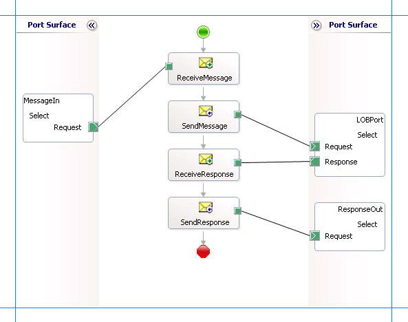

# Insert, update, delete, or select operations using BizTalk Server with the SQL adapter
The [!INCLUDE[adaptersql](../../includes/adaptersql-md.md)] surfaces a set of standard operations on SQL Server database tables and views. These are called data manipulation language (DML) operations. By using DML operations, you can perform simple Insert, Update, Select, and Delete operations on tables and views. For more information about how the adapter supports these operations, see [Insert, Update, Delete, and Select Operations on Tables and Views with the SQL adapter](../../adapters-and-accelerators/adapter-sql/insert-update-delete-and-select-on-tables-and-views-with-the-sql-adapter.md). For information about the structure of the SOAP message for these operations, see [Message Schemas for Insert, Update, Delete, and Select Operations on Tables and Views](../../adapters-and-accelerators/adapter-sql/message-schemas-for-insert-update-delete-and-select-on-tables-and-views.md).  
  
> [!NOTE]
>  If you are performing operation on tables that have columns of user-defined types, make sure you refer to [Operations on Tables and Views with User-Defined Types using the SQL adapter](../../adapters-and-accelerators/adapter-sql/operations-on-tables-and-views-with-user-defined-types-using-the-sql-adapter.md) before you start developing your application.  
  
## How to Perform Basic Operations on a SQL Server Database  
 Performing an operation on a SQL Server database by using [!INCLUDE[adaptersqlshort](../../includes/adaptersqlshort-md.md)] with [!INCLUDE[btsBizTalkServerNoVersion](../../includes/btsbiztalkservernoversion-md.md)] involves procedural tasks described in [Building blocks to develop BizTalk applications with the SQL adapter](../../adapters-and-accelerators/adapter-sql/building-blocks-to-develop-biztalk-applications-with-the-sql-adapter.md). To perform Insert, Update, Delete, or Select operations on tables and views in SQL Server, these tasks are:  
  
1. Create a BizTalk project, and generate schema for the operation you want to invoke on a SQL Server database table or view.  
  
2. Create messages in the BizTalk project for sending and receiving messages from the SQL Server database.  
  
3. Create an orchestration to invoke the operation on the SQL Server database table or view.  
  
4. Build and deploy the BizTalk project.  
  
5. Configure the BizTalk application by creating physical send and receive ports.  
  
6. Start the BizTalk application.  
  
   This topic provides instructions to perform these tasks.  
  
## Sample Based On This Topic  
 A sample, SelectTable, based on this topic is provided with the [!INCLUDE[adapterpacknoversion](../../includes/adapterpacknoversion-md.md)]. For more information, see [Samples for the SQL adapter](../../adapters-and-accelerators/adapter-sql/samples-for-the-sql-adapter.md).  
  
## Generating Schema  
 This topic demonstrates how to perform basic DML operations by selecting records from the EMPLOYEE table in the SQL Server database. Run the scripts provided with the samples to create the EMPLOYEE table. For more information about the samples, see [Schema Samples](../../adapters-and-accelerators/accelerator-rosettanet/schema-samples.md).  
  
 To demonstrate how to select records, schema is generated for the Select operation for the EMPLOYEE table. You must create a BizTalk project and use the [!INCLUDE[consumeadapterservshort](../../includes/consumeadapterservshort-md.md)] to generate the schema. See [Retrieving Metadata for SQL Server Operations in Visual Studio using the SQL adapter](../../adapters-and-accelerators/adapter-sql/get-metadata-for-sql-server-operations-in-visual-studio-using-the-sql-adapter.md) for more information about how to generate schemas.  
  
> [!IMPORTANT]
>  If you are generating metadata for operations on a table that has columns of user-defined types (UDTs), make sure the respective assemblies of the UDTs are available at the same location as the [!INCLUDE[btsVStudioNoVersion](../../includes/btsvstudionoversion-md.md)] executable, devenv.exe. The executable is typically available at `<installation drive>:\Program Files\Microsoft Visual Studio <version>\Common7\IDE`. In this example, the EMPLOYEE table has a UDT (Point) column. Make sure you copy the respective assembly at the same location as the [!INCLUDE[btsVStudioNoVersion](../../includes/btsvstudionoversion-md.md)] executable.  
> 
>  For information about how to create a UDT, see [Create a User-Defined Type](https://msdn.microsoft.com/library/ms131106.aspx). For information about how to register a UDT in SQL Server, see [Registering User-Defined Types in SQL Server](https://msdn.microsoft.com/library/eybzcxe6(v=vs.85).aspx).  
  
## Defining Messages and Message Types  
 The schema that you generated earlier describes the “types” required for the messages in the orchestration. A message is typically a variable, the type for which defined by the corresponding schema. You must now create messages for the orchestration and link them to schemas you generated in the previous step.  
  
1.  Add an orchestration to the BizTalk project. From Solution Explorer, right-click the BizTalk project name, point to **Add**, and then click **New Item**. Type a name for the BizTalk orchestration, and then click **Add**.  
  
2.  Open the Orchestration View window of the BizTalk project, if it is not already open. To do so, click **View**, point to **Other Windows**, and then click **Orchestration View**.  
  
3.  In Orchestration View, right-click **Messages**, and then click **New Message**.  
  
4.  Right-click the newly created message, and then select **Properties Window**.  
  
5.  In the **Properties** pane for the **Message_1**, do the following:  
  
    |Use this|To do this|  
    |--------------|----------------|  
    |Identifier|Type `Request`|  
    |Message Type|From the drop-down list, expand **Schemas**, and then select *SelectTable.TableOperation_dbo_Employee.Select*, where SelectTable is the name of your BizTalk project. TableOperation_dbo_Employee is the schema generated for the Select operation on the EMPLOYEE table.|  
  
6.  Repeat step 2 to create a new message. In the **Properties** pane for the new message, do the following:  
  
    |Use this|To do this|  
    |--------------|----------------|  
    |Identifier|Type `Response`|  
    |Message Type|From the drop-down list, expand **Schemas**, and then select *SelectTable.TableOperation_dbo_Employee.SelectResponse*.|  
  
## Setting up the Orchestration  
 You must create a BizTalk orchestration to use [!INCLUDE[btsBizTalkServerNoVersion](../../includes/btsbiztalkservernoversion-md.md)] for performing an operation on SQL Server. In this orchestration, you drop a request message at a defined receive location. The [!INCLUDE[adaptersqlshort](../../includes/adaptersqlshort-md.md)] consumes this message and passes it on to SQL Server. The response from SQL Server is saved to another location. You must include Send and Receive shapes to send messages to SQL Server and to receive responses, respectively. A sample orchestration for the Select operation resembles the following:  
  
   
  
### Adding Message Shapes  
 Make sure you specify the following properties for each of the message shapes. The names listed in the Shape column are the names of the message shapes as displayed in the just-mentioned orchestration.  
  
|Shape|Shape Type|Properties|  
|-----------|----------------|----------------|  
|ReceiveMessage|Receive|-   Set **Name** to *ReceiveMessage*<br />-   Set **Activate** to *True*|  
|SendMessage|Send|-   Set **Name** to *SendMessage*|  
|ReceiveResponse|Receive|-   Set **Name** to *ReceiveResponse*<br />-   Set **Activate** to *False*|  
|SendResponse|Send|-   Set **Name** to *SendResponse*|  
  
### Adding Ports  
 Make sure you specify the following properties for each of the logical ports. The names listed in the Port column are the names of the ports as displayed in the orchestration.  
  
|Port|Properties|  
|----------|----------------|  
|MessageIn|-   Set **Identifier** to *MessageIn*<br />-   Set **Type** to *MessageInType*<br />-   Set **Communication Pattern** to *One-Way*<br />-   Set **Communication Direction** to *Receive*|  
|LOBPort|-   Set **Identifier** to *LOBPort*<br />-   Set **Type** to *LOBPortType*<br />-   Set **Communication Pattern** to *Request-Response*<br />-   Set **Communication Direction** to *Send-Receive*|  
|ResponseOut|-   Set **Identifier** to *ResponseOut*<br />-   Set **Type** to *ResponseOutType*<br />-   Set **Communication Pattern** to *One-Way*<br />-   Set **Communication Direction** to *Send*|  
  
### Specify Messages for Action Shapes, and Connect Them to Ports  
 The following table specifies the properties and their values that you should set to specify messages for action shapes and to link the messages to the ports. The names listed in the Shape column are the names of the message shapes as displayed in the orchestration mentioned earlier.  
  
|Shape|Properties|  
|-----------|----------------|  
|ReceiveMessage|-   Set **Message** to *Request*<br />-   Set **Operation** to *MessageIn.Select.Request*|  
|SendMessage|-   Set **Message** to *Request*<br />-   Set **Operation** to *LOBPort.Select.Request*|  
|ReceiveResponse|-   Set **Message** to *Response*<br />-   Set **Operation** to *LOBPort.Select.Response*|  
|SendResponse|-   Set **Message** to *Response*<br />-   Set **Operation** to *ResponseOut.Select.Request*|  
  
 After you have specified these properties, the message shapes and ports are connected, and your orchestration is complete.  
  
 You must now build the BizTalk solution and deploy it to BizTalk Server. For more information, see [Building and Running Orchestrations](../../core/building-and-running-orchestrations.md).  
  
## Configuring the BizTalk Application  
 After you have deployed the BizTalk project, the orchestration you created earlier is listed under the Orchestrations pane in the [!INCLUDE[btsBizTalkServerNoVersion](../../includes/btsbiztalkservernoversion-md.md)] Administration console. You must use the [!INCLUDE[btsBizTalkServerNoVersion](../../includes/btsbiztalkservernoversion-md.md)] Administration console to configure the application. For a walkthrough, see [Walkthrough: Deploying a Basic BizTalk Application](Walkthrough:%20Deploying%20a%20Basic%20BizTalk%20Application.md).
  
 Configuring an application involves:  
  
- Selecting a host for the application.  
  
- Mapping the ports that you created in your orchestration to physical ports in the [!INCLUDE[btsBizTalkServerNoVersion](../../includes/btsbiztalkservernoversion-md.md)] Administration console. For this orchestration you must:  
  
  - Define a location on the hard disk and a corresponding file port where you will drop a request message. The BizTalk orchestration will consume the request message and send it to the SQL Server database.  
  
  - Define a location on the hard disk and a corresponding file port where the BizTalk orchestration will drop the response message containing the response from the SQL Server database.  
  
  - Define a physical WCF-Custom or WCF-SQL send port to send messages to the SQL Server database. You must also specify the action in the send port. For information about how to create ports, see [Manually configure a physical port binding to the SQL adapter](../../adapters-and-accelerators/adapter-sql/manually-configure-a-physical-port-binding-to-the-sql-adapter.md).
  
    > [!NOTE]
    >  Generating the schema using the [!INCLUDE[consumeadapterservlong](../../includes/consumeadapterservlong-md.md)] also creates a binding file that contains information about the ports and the actions to be set for those ports. You can import this binding file from the [!INCLUDE[btsBizTalkServerNoVersion](../../includes/btsbiztalkservernoversion-md.md)] Administration console to create send ports (for outbound calls) or receive ports (for inbound calls). For more information, see [Configure a physical port binding using a port binding file to use the SQL adapter](../../adapters-and-accelerators/adapter-sql/configure-a-physical-port-binding-using-a-port-binding-file-to-sql-adapter.md).
  
## Starting the Application  
 You must start the BizTalk application for selecting records from a SQL Server database table. For the steps to start a BizTalk application, see [How to Start an Orchestration](../../core/how-to-start-an-orchestration.md).
  
 At this stage, make sure:  
  
-   The FILE receive port to receive request messages for the orchestration is running.  
  
-   The FILE send port to receive the response messages from the orchestration is running.  
  
-   The WCF-Custom or WCF-SQL send port to send messages to the SQL Server database is running.  
  
-   The BizTalk orchestration for the operation is running.  
  
> [!IMPORTANT]
>  If you are performing operations on a table that has columns of user-defined types (UDTs), make sure the respective assemblies of the UDTs are available at the same location as the [!INCLUDE[btsBizTalkServerNoVersion](../../includes/btsbiztalkservernoversion-md.md)] executable, btsntsvc.exe. The executable is typically available at `<installation drive>:\Program Files\Microsoft BizTalk Server <version>`. In this example, the EMPLOYEE table has a UDT (Point) column. Make sure you copy the respective assembly at the same location as the [!INCLUDE[btsBizTalkServerNoVersion](../../includes/btsbiztalkservernoversion-md.md)] executable.  
> 
>  For information about how to create a UDT, see [Create a User-Defined Type](https://msdn.microsoft.com/library/ms131106.aspx). For information about how to register a UDT in SQL Server, see [Register User-Defined Types in SQL Server](https://msdn.microsoft.com/library/ms131079.aspx).  
  
## Executing the Operation  
 After you run the application, you must drop a request message to the FILE receive location. The schema for the request message must conform to the schema for the Select operation that you generated earlier. For example, the request message to select all records from the EMPLOYEE table is:  
  
```  
<Select xmlns="http://schemas.microsoft.com/Sql/2008/05/TableOp/dbo/Employee">  
  <Columns>*</Columns>  
  <Query>where Employee_ID=10001</Query>  
</Select>  
```  
  
 This request message will retrieve records from the Employee table that satisfy the condition specified in the `<Query>` element. If you want to retrieve specific columns from the table, you must specify them in the <Columns\> element, separated by comma, in the same sequence as they appear in the table definition. If you do not want to specify a condition to retrieve data, leave the `<Query>` element blank. See [Message Schemas for Insert, Update, Delete, and Select Operations on Tables and Views](../../adapters-and-accelerators/adapter-sql/message-schemas-for-insert-update-delete-and-select-on-tables-and-views.md) for more information about the request message schema for performing basic DML operations on SQL Server database tables and views using the [!INCLUDE[adaptersqlshort](../../includes/adaptersqlshort-md.md)].  
  
 The orchestration consumes the message and sends it to SQL Server database. The response from SQL Server database is saved at the other FILE location defined as part of the orchestration. For example, the response from SQL Server database for the preceding request message is:  
  
```  
<?xml version="1.0" encoding="utf-8" ?>   
<SelectResponse xmlns="mssql://Microsoft.LobServices.Sql/2008/01/TVOp/dbo/Employee">  
  <SelectResult>  
    <Employee xmlns="mssql://Microsoft.LobServices.Sql/2008/01/Types/Tables/dbo">  
      <Employee_ID>10001</Employee_ID>  
      <Name>John</Name>  
      <DOJ>1983-12-31T00:00:00Z</DOJ>  
      <Designation>Manager</Designation>  
      <Job_Description>Management</Job_Description>  
      <Photo>EjRVYzRFVQ==</Photo>  
      <Rating>1,2</Rating>  
      <Salary>100000.00</Salary>  
      <Last_Modified>AAAAAAAAD6I=</Last_Modified>  
    </Employee>  
  </SelectResult>  
</SelectResponse>  
```  
  
## Best Practices  
  
-   After you have deployed and configured the BizTalk project, you can export configuration settings to an XML file called the binding file. Once you generate a binding file, you can import the configuration settings from the file, so that you do not need to create items such as the send ports and receive ports for the same orchestration. For more information about binding files, see [Reuse SQL adapter bindings](../../adapters-and-accelerators/adapter-sql/reuse-sql-adapter-bindings.md).
  
-   If you are inserting, updating, or deleting large volumes of data make sure you set the right timeout values for the WCF adapter and for the MSDTC transaction. For more information, see “The adapter fails to insert, update, or delete large volumes of data in a single operation using BizTalk Server” issue in [Troubleshoot Operational Issues with the SQL adapter](../../adapters-and-accelerators/adapter-sql/troubleshoot-operational-issues-with-the-sql-adapter.md).  
  
## See Also  
[Develop BizTalk applications using the SQL adapter](../../adapters-and-accelerators/adapter-sql/develop-biztalk-applications-using-the-sql-adapter.md)