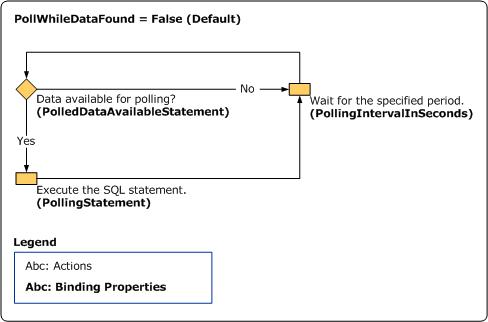
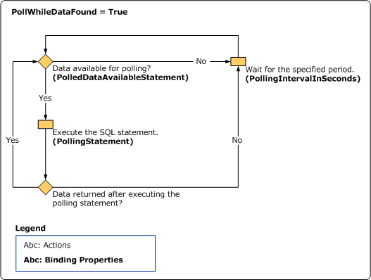

# Polling in SQL Server using the SQL adapter
[!INCLUDE[adaptersql](../../includes/adaptersql-md.md)] enables adapter clients to receive data-change messages from the SQL Server database. The [!INCLUDE[adaptersqlshort](../../includes/adaptersqlshort-md.md)] supports receiving "polling-based" messages wherein the adapter executes a specified SQL statement (SELECT statement or stored procedure), retrieves or updates the data, and provides the result to the adapter client at regular intervals of time.  
  
 The [!INCLUDE[adaptersqlshort](../../includes/adaptersqlshort-md.md)] exposes the following operations for polling:  
  
- **Polling**: Enables you to receive periodic data-change messages for SQL Server tables or views. The messages are not strongly-typed.  
  
- **TypedPolling**: Enables you to receive strongly-typed messages from the SQL Server database. You must use this operation if you intend to map the elements in the polling message to any other schema.  
  
- **XmlPolling**. Enables you to use SELECT statements or stored procedures that use a FOR XML clause and return data as XML messages. This operation returns the polling message as an XML message.  
  
   For more information about FOR XML clause, see [http://go.microsoft.com/fwlink/?LinkId=131402](http://go.microsoft.com/fwlink/?LinkId=131402).  
  
  For more information about polling in the [!INCLUDE[adaptersqlshort](../../includes/adaptersqlshort-md.md)], see [Receive Polling-based Data-changed Messages from SQL Server by Using BizTalk Server](../../adapters-and-accelerators/adapter-sql/receive-polling-based-data-changed-messages-from-sql-server-using-biztalk.md).  
  
## Polling  
 A typical polling operation using the [!INCLUDE[adaptersqlshort](../../includes/adaptersqlshort-md.md)] involves the following:  
  
1. The adapter clients must specify `Polling` as the inbound operation in the **InboundOperationType** binding property. The default value for this binding property is `Polling`.  
  
2. The adapter clients must specify a SQL statement for the **PolledDataAvailableStatement** binding property that determines whether there is data available for polling. The first column of the first row of the first result set returned on executing this statement contains an integer value. If there is no data available for polling, the return value is 0 (zero). If there is data available, the return value is greater than zero.  
  
3. The adapter clients must specify a polling interval for the **PollingIntervalInSeconds** binding property to define the interval at which the statement in the **PolledDataAvailableStatement** binding property is executed. At the end of every polling interval, the polled data available statement is executed, and the result set is returned.  
  
4. The adapter clients must specify a polling SQL statement (SELECT statement or stored procedure) for the **PollingStatement** binding property. If there is data available for polling (determined by the **PolledDataAvailableStatement** binding property), the adapter executes the polling statement to obtain and update (if applicable) the data in the SQL Server database. When the [!INCLUDE[adaptersqlshort](../../includes/adaptersqlshort-md.md)] is used with [!INCLUDE[btsBizTalkServerNoVersion](../../includes/btsbiztalkservernoversion-md.md)], the same transaction is also used to submit the message to [!INCLUDE[btsBizTalkServerNoVersion](../../includes/btsbiztalkservernoversion-md.md)].  
  
5. The adapter clients can use the **PollWhileDataFound** binding property to ignore the polling interval, and continuously poll data, as and when available.  
  
6. The result sets that are returned as a result of executing the polling statement are sent to the adapter client as the inbound message.  
  
> [!NOTE]
>  An XmlPolling operation involves the same steps as the Polling operation.  
  
## Strongly-Typed Polling  
 A typical strongly-typed polling operation using the [!INCLUDE[adaptersqlshort](../../includes/adaptersqlshort-md.md)] involves the following:  
  
1. The adapter clients must specify `TypedPolling` as the inbound operation in the **InboundOperationType** binding property. The default value for this binding property is `Polling`.  
  
2. The adapter clients must specify an inbound ID as part of the connection URI. The inbound ID could be any string and is appended to the standard namespace of the TypedPolling operation to prevent namespace collisions.  
  
3. The rest of the steps are same as steps 2–6 listed in the Polling operation described in the preceding section.  
  
   For detailed information about the binding properties related to polling and strongly-typed polling, see [Read about BizTalk Adapter for SQL Server adapter  Binding Properties](../../adapters-and-accelerators/adapter-sql/read-about-the-biztalk-adapter-for-sql-server-adapter-binding-properties.md).  
  
> [!NOTE]
>  Multiple result sets can be returned as a result of executing the polling statement. If the result sets do not contain any rows, no messages are sent to the adapter client.  
  
 The illustration below provides information about the polling workflow in [!INCLUDE[adaptersqlshort](../../includes/adaptersqlshort-md.md)]. Two scenarios for the polling workflow are illustrated:  
  
1. When the value of the **PollWhileDataFound** is set to “False” (default setting).  
  
2. When the value of the **PollWhileDataFound** is set to “True.”  
  
      
  
## Differences between Polling and Query Notification  
 Though polling and query notification are both inbound operations, and inform the adapter clients about the data changes in the SQL Server database, the following table lists some differences between the two. The following differences will help you decide on an operation depending on your requirements:  
  
|Polling|Query Notification|  
|-------------|------------------------|  
|Polling is initiated by the adapter. The adapter executes a statement to validate whether data is available for polling, and then initiates polling by executing the polling statement if some data is available for polling.|Query notification is initiated by SQL Server. The notification statement issued by the adapter just instructs the database to initiate notification in case there is a change in the result set of the statement.|  
|You can use the polling statement to read or update data in a SQL Server database table.|You can use the query notification statement to only read data in a SQL Server database table.|  
|Polling informs you about the actual data that has changed.|Query notification only informs about the type of change in the data such as Insert, Update, and Delete.|  
|The data-change notification depends on the polling interval, and the adapter clients are informed about the data changes at the end of every polling interval. **Tip:**  Polling can give you better throughput in scenarios where the data changes are happening continuously, and you do not want to be notified of each change as and when it happens. Instead, you specify a polling interval after which you want to be notified of all the changes that have happened since the last data-change notification.|The data-change notification is instantaneous.|  
  
 For more information about query notification in [!INCLUDE[adaptersql](../../includes/adaptersql-md.md)], see [Receive SQL Query Notifications by Using BizTalk Server](../../adapters-and-accelerators/adapter-sql/receive-sql-query-notifications-using-biztalk-server.md).  
  
## See Also  
 [What Operations Can be Performed Using the Adapter?](https://msdn.microsoft.com/library/cc185435(v=bts.10).aspx)