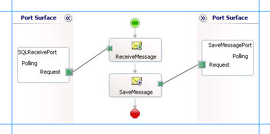

# Receive Polling-based Data-changed Messages from SQL Server using BizTalk Server
You can configure the [!INCLUDE[adaptersqlshort](../../includes/adaptersqlshort-md.md)] to receive periodic data-change messages for SQL Server tables or views. You can specify a polling statement that the adapter executes to poll the database. The polling statement can be a SELECT statement or a stored procedure that returns a result set.  

  
 For more information on how the adapter supports polling, see [Support for Polling](https://msdn.microsoft.com/library/dd788416.aspx). For information about the structure of the SOAP message for polling operations, see [Message Schemas for the Polling and TypedPolling Operations](../../adapters-and-accelerators/adapter-sql/message-schemas-for-the-polling-and-typedpolling-operations.md).  
  
> [!NOTE]
>  This topic demonstrates how to use the **Polling** inbound operation to use polling messages. The message for the Polling operation is not strongly-typed and schema of the object being polled is retrieved along with the message at run-time. If you want to get strongly-typed polling message, you must use the **TypedPolling** operation. You must also use the **TypedPolling** operation to have multiple polling operations in a single BizTalk application. For instructions on how to perform **TypedPolling** operation, see [Receive Strongly-typed Polling-based Data-changed Messages from SQL Server Using BizTalk Server](../../adapters-and-accelerators/adapter-sql/receive-strongly-typed-polling-based-data-changed-messages-from-sql-in-biztalk.md).  
  
> [!IMPORTANT]
>  If you want to have more than one polling operation in a single BizTalk application, you must specify an **InboundID** connection property as part of the connection URI to make it unique. With a unique connection URI, you can create multiple receive ports that poll the same database, or even the same table in a database. For more information, see [Receive Polling Messages Across Multiple Receive Ports from SQL using BizTalk Server](../../adapters-and-accelerators/adapter-sql/receive-polling-messages-across-multiple-receive-ports-from-sql-using-biztalk.md).  
  
## How This Topic Demonstrates Polling  
 In this topic, to demonstrate how the [!INCLUDE[adaptersqlshort](../../includes/adaptersqlshort-md.md)] supports receiving data change messages, create a BizTalk project and generate schema for the **Polling** operation. If you want to specify the polling related binding properties at design time, specify the **PolledDataAvailableStatement** as:  
  
```  
SELECT COUNT(*) FROM Employee  
```  
  
 The **PolledDataAvailableStatement** must return a result set with the first cell containing a positive value. If the first cell does not contain a positive value, the adapter does not execute the polling statement.  
  
 As part of the polling statement, perform the following operations:  
  
- Select all the rows from the Employee table.  
  
- Execute a stored procedure (MOVE_EMP_DATA) to move all the records from the Employee table to an EmployeeHistory table.  
  
- Execute a stored procedure (ADD_EMP_DETAILS) to add a new record to the Employee table. This procedure takes the employee name, designation, and salary as parameters.  
  
  To perform these operations, you must specify the following for the **PollingStatement** binding property:  
  
```  
SELECT * FROM Employee;EXEC MOVE_EMP_DATA;EXEC ADD_EMP_DETAILS John, Tester, 100000   
```  
  
 After the polling statement is executed, all the records from the Employee table are selected and the message from SQL Server is dropped to a receive location. Once the MOVE_EMP_DATA stored procedure is executed by the adapter, all the records are moved to the EmployeeHistory table. Then, the ADD_EMP_DETAILS stored procedure is executed to add a new record to the Employee table. The next polling execution will only return a single record. This cycle continues until you disable the receive port that polls SQL Server.  
  
## Configuring a Polling Query with the SQL Adapter Binding Properties  
 The following table summarizes the [!INCLUDE[adaptersqlshort](../../includes/adaptersqlshort-md.md)] binding properties that you use to configure the adapter to receive data-change messages. You must specify these binding properties while configuring the receive port in the [!INCLUDE[btsBizTalkServerNoVersion](../../includes/btsbiztalkservernoversion-md.md)] Administration console.  
  
> [!NOTE]
>  You may choose to specify these binding properties when generating the schema for the **Polling** operation, even though it is not mandatory. If you do so, the port binding file that the [!INCLUDE[consumeadapterservshort](../../includes/consumeadapterservshort-md.md)] generates as part of the metadata generation also contains the values you specify for the binding properties. You can later import this binding file in the [!INCLUDE[btsBizTalkServerNoVersion](../../includes/btsbiztalkservernoversion-md.md)] Administration console to create the WCF-custom or WCF-SQL receive port with the binding properties already set. For more information about creating a port using the binding file, see [Configure a physical port binding using a port binding file to use the SQL adapter](../../adapters-and-accelerators/adapter-sql/configure-a-physical-port-binding-using-a-port-binding-file-to-sql-adapter.md).  
  
|         Binding Property         |                                                                                                                                                                                                                                         Description                                                                                                                                                                                                                                          |
|----------------------------------|----------------------------------------------------------------------------------------------------------------------------------------------------------------------------------------------------------------------------------------------------------------------------------------------------------------------------------------------------------------------------------------------------------------------------------------------------------------------------------------------|
|     **InboundOperationType**     |                                                                                                                                                                             Specifies whether you want to perform **Polling**, **TypedPolling**, or **Notification** inbound operation. Default is **Polling**.                                                                                                                                                                              |
| **PolledDataAvailableStatement** |                                                                                       Specifies the SQL statement that the adapter executes to determine whether any data is available for polling. The SQL statement must return a result set consisting of rows and columns. Only if a row is available, the SQL statement specified for the **PollingStatement** binding property will be executed.                                                                                       |
|   **PollingIntervalInSeconds**   |                         Specifies the interval, in seconds, at which the [!INCLUDE[adaptersqlshort](../../includes/adaptersqlshort-md.md)] executes the statement specified for the **PolledDataAvailableStatement** binding property. The default is 30 seconds. The polling interval determines the time interval between successive polls. If the statement is executed within the specified interval, the adapter waits for the remaining time in the interval.                          |
|       **PollingStatement**       | Specifies the SQL statement to poll the SQL Server database table. You can specify a simple SELECT statement or a stored procedure for the polling statement. The default is null. You must specify a value for **PollingStatement** to enable polling. The polling statement is executed only if there is data available for polling, which is determined by the **PolledDataAvailableStatement** binding property. You can specify any number of SQL statements separated by a semi-colon. |
|      **PollWhileDataFound**      |                            Specifies whether the [!INCLUDE[adaptersqlshort](../../includes/adaptersqlshort-md.md)] ignores the polling interval and continuously executes the SQL statement specified for the **PolledDataAvailableStatement** binding property, if data is available in the table being polled. If no data is available in the table, the adapter reverts to execute the SQL statement at the specified polling interval. Default is **false**.                             |
  
 For a more complete description of these properties, see [Read about the BizTalk Adapter for SQL Server adapter Binding Properties](../../adapters-and-accelerators/adapter-sql/read-about-the-biztalk-adapter-for-sql-server-adapter-binding-properties.md). For a complete description of how to use the [!INCLUDE[adaptersqlshort](../../includes/adaptersqlshort-md.md)] to poll SQL Server, read further.  
  
## How to Receive Data-change Messages from the SQL Server Database  
 Performing an operation on the SQL Server database using [!INCLUDE[adaptersqlshort](../../includes/adaptersqlshort-md.md)] with [!INCLUDE[btsBizTalkServerNoVersion](../../includes/btsbiztalkservernoversion-md.md)] involves the procedural tasks described in [Building blocks to develop BizTalk applications with the SQL adapter](../../adapters-and-accelerators/adapter-sql/building-blocks-to-develop-biztalk-applications-with-the-sql-adapter.md). To configure the adapter to receive data-change messages, these tasks are:  
  
1. Create a BizTalk project, and then generate schema for the **Polling** operation. Optionally, you can specify values for the **PolledDataAvailableStatement** and **PollingStatement** binding properties.  
  
2. Create a message in the BizTalk project for receiving messages from the SQL Server database.  
  
3. Create an orchestration to receive messages from the SQL Server database and to save them to a folder.  
  
4. Build and deploy the BizTalk project.  
  
5. Configure the BizTalk application by creating physical send and receive ports.  
  
   > [!IMPORTANT]
   >  For inbound polling scenarios you must always configure a one-way WCF-Custom or WCF-SQL receive port. Two-way WCF-Custom or WCF-SQL receive ports are not supported for inbound operations.  
  
6. Start the BizTalk application.  
  
   This topic provides instructions to perform these tasks.  
  
## Generating Schema  
 You must generate the schema for the **Polling** operation. See [Retrieving Metadata for SQL Server Operations in Visual Studio using the SQL adapter](../../adapters-and-accelerators/adapter-sql/get-metadata-for-sql-server-operations-in-visual-studio-using-the-sql-adapter.md) for more information about how to generate the schema. Perform the following tasks when generating the schema. Skip the first step if you do not want to specify the binding properties at design-time.  
  
1.  Specify a value for **PolledDataAvailableStatement** and **PollingStatement** binding properties while generating the schema. For more information about this binding property, see [Read about the BizTalk Adapter for SQL Server adapter Binding Properties](../../adapters-and-accelerators/adapter-sql/read-about-the-biztalk-adapter-for-sql-server-adapter-binding-properties.md).  
  
     For instructions on how to specify binding properties, see [Configure the binding properties for the SQL adapter](../../adapters-and-accelerators/adapter-sql/configure-the-binding-properties-for-the-sql-adapter.md).  
  
2.  Select the contract type as **Service (Inbound operation)**.  
  
3.  Generate schema for the **Polling** operation.  
  
## Defining Messages and Message Types  
 The schema that you generated earlier describes the "types" required for the messages in the orchestration. A message is typically a variable, the type for which is defined by the corresponding schema. Once the schema is generated, you must link it to the messages from the Orchestration view of the BizTalk project.  
  
 For this topic, you must create one message to receive messages from the SQL Server database.  
  
 Perform the following steps to create messages and link them to schema.  
  
#### To create messages and link to schema  
  
1.  Add an orchestration to the BizTalk project. From the Solution Explorer, right-click the BizTalk project name, point to **Add**, and then click **New Item**. Type a name for the BizTalk orchestration and then click **Add**.  
  
2.  Open the orchestration view window of the BizTalk project, if it is not already open. Click **View**, point to **Other Windows**, and then click **Orchestration View**.  
  
3.  In the **Orchestration View**, right-click **Messages**, and then click **New Message**.  
  
4.  Right-click the newly created message, and then select **Properties Window**.  
  
5.  In the **Properties** pane for **Message_1**, do the following:  
  
    |Use this|To do this|  
    |--------------|----------------|  
    |Identifier|Type **Receive**.|  
    |Message Type|From the drop-down list, expand **Schemas**, and select *PollingQuery.Polling*, where *PollingQuery* is the name of your BizTalk project. *Polling* is the schema generated for the **Polling** operation.|  
  
## Setting up the Orchestration  
 You must create a BizTalk orchestration to use [!INCLUDE[btsBizTalkServerNoVersion](../../includes/btsbiztalkservernoversion-md.md)] for receiving polling-based data-change messages from the SQL Server database. In this orchestration, the adapter receives the response of the select statement specified for the **PollingStatement** binding property. The response for the SELECT statement is saved to a FILE location. A typical orchestration for polling a SQL Server database would contain:  
  
- Receive and Send shapes to receive messages from SQL Server and send to a FILE port, respectively.  
  
- A one-way receive port to receive messages from SQL Server.  
  
  > [!IMPORTANT]
  >  For inbound polling scenarios you must always configure a one-way receive port. Two-way receive ports are not supported for inbound operations.  
  
- A one-way send port to send polling responses from a SQL Server database to a folder.  
  
  A sample orchestration resembles the following.  
  
    
  
### Adding Message Shapes  
 Make sure you specify the following properties for each of the message shapes. The names listed in the Shape column are the names of the message shapes as displayed in the just-mentioned orchestration.  
  
|Shape|Shape Type|Properties|  
|-----------|----------------|----------------|  
|ReceiveMessage|Receive|- Set **Name** to *ReceiveMessage*<br /><br /> - Set **Activate** to *True*|  
|SaveMessage|Send|- Set **Name** to *SaveMessage*|  
  
### Adding Ports  
 Make sure you specify the following properties for each of the logical ports. The names listed in the Port column are the names of the ports as displayed in the orchestration.  
  
|Port|Properties|  
|----------|----------------|  
|SQLReceivePort|- Set **Identifier** to *SQLReceivePort*<br /><br /> - Set **Type** to *SQLReceivePortType*<br /><br /> - Set **Communication Pattern** to *One-Way*<br /><br /> - Set **Communication Direction** to *Receive*|  
|SaveMessagePort|- Set **Identifier** to *SaveMessagePort*<br /><br /> - Set **Type** to *SaveMessagePortType*<br /><br /> - Set **Communication Pattern** to *One-Way*<br /><br /> - Set **Communication Direction** to *Send*|  
  
### Specify Messages for Action Shapes and Connect to Ports  
 The following table specifies the properties and their values that you should set to specify messages for action shapes and to link the messages to the ports. The names listed in the Shape column are the names of the message shapes as displayed in the orchestration mentioned earlier.  
  
|Shape|Properties|  
|-----------|----------------|  
|ReceiveMessage|- Set **Message** to *Receive*<br /><br /> - Set **Operation** to *SQLReceivePort.Polling.Request*|  
|SaveMessage|- Set **Message** to *Receive*<br /><br /> - Set **Operation** to *SaveMessagePort.Polling.Request*|  
  
 After you have specified these properties, the message shapes and ports are connected and your orchestration is complete.  
  
 You must now build the BizTalk solution and deploy it to a [!INCLUDE[btsBizTalkServerNoVersion](../../includes/btsbiztalkservernoversion-md.md)]. For more information, see [Building and Running Orchestrations](../../core/building-and-running-orchestrations.md). 
  
## Configuring the BizTalk Application  
 After you have deployed the BizTalk project, the orchestration you created earlier is listed under the **Orchestrations** pane in the BizTalk Server Administration console. You must use the BizTalk Server Administration console to configure the application. For a walkthrough, see [Walkthrough: Deploying a Basic BizTalk Application](Walkthrough:%20Deploying%20a%20Basic%20BizTalk%20Application.md).  
  
 Configuring an application involves:  
  
- Selecting a host for the application.  
  
- Mapping the ports that you created in your orchestration to physical ports in the BizTalk Server Administration console. For this orchestration you must:  
  
  - Define a location on the hard disk and a corresponding file port where the BizTalk orchestration will drop the messages from the SQL Server database. These messages will be in response to the polling statement that you specify for the receive port.  
  
  - Define a physical WCF-Custom or WCF-SQL one-way receive port. This port polls the SQL Server database with the polling statement you specify for the port. For information about how to create ports, see [Manually configure a physical port binding to the SQL adapter](../../adapters-and-accelerators/adapter-sql/manually-configure-a-physical-port-binding-to-the-sql-adapter.md). Make sure you specify the following binding properties for the receive port.  
  
    > [!IMPORTANT]
    >  You do not need to perform this step if you specified the binding properties at design-time. In such a case, you can create a WCF-custom or WCF-SQL receive port, with the required binding properties set, by importing the binding file created by the [!INCLUDE[consumeadapterservshort](../../includes/consumeadapterservshort-md.md)]. For more information see [Configure a physical port binding using a port binding file to use the SQL adapter](../../adapters-and-accelerators/adapter-sql/configure-a-physical-port-binding-using-a-port-binding-file-to-sql-adapter.md).  
  
    |Binding Property|Value|  
    |----------------------|-----------|  
    |**InboundOperationType**|Make sure you set this to **Polling**.|  
    |**PolledDataAvailableStatement**|Make sure you specify a SQL statement. For this topic, specify:<br /><br /> `SELECT COUNT(*) FROM Employee`|  
    |**PollingStatement**|Make sure you specify the polling statement. For this topic, specify:<br /><br /> `SELECT * FROM Employee;EXEC MOVE_EMP_DATA;EXEC ADD_EMP_DETAILS John, Tester, 100000`|  
  
     For more information about the different binding properties, see [Read about the BizTalk Adapter for SQL Server adapter Binding Properties](../../adapters-and-accelerators/adapter-sql/read-about-the-biztalk-adapter-for-sql-server-adapter-binding-properties.md).  
  
    > [!NOTE]
    >  We recommend configuring the transaction isolation level and the transaction timeout while performing inbound operations using the [!INCLUDE[adaptersqlshort](../../includes/adaptersqlshort-md.md)]. You can do so by adding the service behavior while configuring the WCF-Custom or WCF-SQL receive port. For instruction on how to add the service behavior, see [Configure Transaction Isolation Level and Transaction Timeout with SQL](../../adapters-and-accelerators/adapter-sql/configure-transaction-isolation-level-and-transaction-timeout-with-sql.md).  
  
## Starting the Application  
 You must start the BizTalk application for receiving messages from the SQL Server database. For instructions on starting a BizTalk application, see [How to Start an Orchestration](../../core/how-to-start-an-orchestration.md).  
  
 At this stage, make sure:  
  
-   The WCF-Custom or WCF-SQL one-way receive port, which polls the SQL Server database using the statements specified for the **PollingStatement** binding property, is running.  
  
-   The FILE send port, which receives messages from SQL Server, is running.  
  
-   The BizTalk orchestration for the operation is running.  
  
## Executing the Operation  
 After you run the application, the following set of actions take place, in the same sequence:  
  
- The adapter executes the **PolledDataAvailableStatement** on the Employee table and determines that the table has records for polling.  
  
- The adapter executes the polling statement. Because the polling statement consists of a SELECT statement and stored procedures, the adapter will execute all the statements one after the other.  
  
  - The adapter first executes the SELECT statement that returns all the records in the Employee table.  
  
  - The adapter then executes the MOVE_EMP_DATA stored procedure that moves all data from the Employee table to the EmployeeHistory table. This stored procedure does not return any value.  
  
  - The adapter then executes the ADD_EMP_DETAILS stored procedure that adds one record to the Employee table. This stored procedure returns the Employee ID for the inserted record.  
  
    So, the message received from SQL Server will contain multiple result sets (for SELECT statement and for ADD_EMP_DETAILS stored procedure), and will resemble the following:  
  
  ```  
  <?xml version="1.0" encoding="utf-8" ?>   
  <Polling xmlns="http://schemas.microsoft.com/Sql/2008/05/Polling/">  
    <PolledData>  
      <DataSet xmlns="http://schemas.datacontract.org/2004/07/System.Data">  
        <xs:schema id="NewDataSet" xmlns:xs="http://www.w3.org/2001/XMLSchema" xmlns:msdata="urn:schemas-microsoft-com:xml-msdata">  
          <xs:element msdata:IsDataSet="true" name="NewDataSet">  
            <xs:complexType>  
              <xs:sequence>  
                <xs:element minOccurs="0" maxOccurs="unbounded" name="NewTable">  
                  <xs:complexType>  
                    <xs:sequence>  
                      <xs:element minOccurs="0" name="Employee_ID" type="xs:int" />   
                      <xs:element minOccurs="0" name="Name" type="xs:string" />   
                      <xs:element minOccurs="0" name="DOJ" type="xs:dateTime" />   
                      <xs:element minOccurs="0" name="Designation" type="xs:string" />   
                      <xs:element minOccurs="0" name="Job_Description" type="xs:string" />   
                      <xs:element minOccurs="0" name="Photo" type="xs:base64Binary" />   
                      <xs:element minOccurs="0" name="Rating" type="xs:string" />   
                      <xs:element minOccurs="0" name="Salary" type="xs:decimal" />   
                      <xs:element minOccurs="0" name="Last_Modified" type="xs:base64Binary" />   
                    </xs:sequence>  
                  </xs:complexType>  
                </xs:element>  
              </xs:sequence>  
            </xs:complexType>  
          </xs:element>  
        </xs:schema>  
        <diffgr:diffgram xmlns:diffgr="urn:schemas-microsoft-com:xml-diffgram-v1">  
          <NewDataSet xmlns="">  
            <NewTable>  
              <Employee_ID>10001</Employee_ID>   
              <Name>John</Name>   
              <Designation>Tester</Designation>   
              <Salary>100000.00</Salary>   
              <Last_Modified>AAAAAAAAF34=</Last_Modified>   
            </NewTable>  
            ........  
            ........  
            <NewTable>  
              <Employee_ID>10005</Employee_ID>   
              <Name>Wilson</Name>   
              <Designation>Tester3</Designation>   
              <Salary>100000.00</Salary>   
              <Last_Modified>AAAAAAAAF4E=</Last_Modified>   
            </NewTable>  
          </NewDataSet>  
        </diffgr:diffgram>  
      </DataSet>  
      <DataSet xmlns="http://schemas.datacontract.org/2004/07/System.Data">  
        <xs:schema id="NewDataSet" xmlns:xs="http://www.w3.org/2001/XMLSchema" xmlns:msdata="urn:schemas-microsoft-com:xml-msdata">  
          <xs:element msdata:IsDataSet="true" name="NewDataSet">  
            <xs:complexType>  
              <xs:sequence>  
                <xs:element minOccurs="0" maxOccurs="unbounded" name="NewTable">  
                  <xs:complexType>  
                    <xs:sequence>  
                      <xs:element minOccurs="0" name="Employee_ID" type="xs:int" />   
                    </xs:sequence>  
                  </xs:complexType>  
                </xs:element>  
              </xs:sequence>  
            </xs:complexType>  
          </xs:element>  
        </xs:schema>  
        <diffgr:diffgram xmlns:diffgr="urn:schemas-microsoft-com:xml-diffgram-v1">  
          <NewDataSet xmlns="">  
            <NewTable>  
              <Employee_ID>10006</Employee_ID>  
            </NewTable>  
          </NewDataSet>  
        </diffgr:diffgram>  
      </DataSet>  
    </PolledData>  
  </Polling>  
  ```  
  
   The preceding response contains two data sets. The first data set contains the response for the SELECT statement. The SELECT statement selects all the records in the Employee table. The second data set is for the ADD_EMP_DETAILS stored procedure. This stored procedure adds a record to the Employee table and returns the employee ID for the new record.  
  
  > [!NOTE]
  >  The MOVE_EMP_DATA stored procedure does not return a result set. So, there is no corresponding data set in the response message.  
  
- When the adapter executes the **PollDataAvailableStatement** again, it finds one record that was inserted by the ADD_EMP_DETAILS stored procedure. The adapter then executes all three statements that are specified for the **PollingStatement** binding property. This time, the response from SQL Server contains just one record for the SELECT statement and one record for the ADD_EMP_DETAILS stored procedure. All subsequent polls will return similar responses.  
  
> [!NOTE]
>  The [!INCLUDE[adaptersqlshort](../../includes/adaptersqlshort-md.md)] will continue to poll until you explicitly disable the receive port from the [!INCLUDE[btsBizTalkServerNoVersion](../../includes/btsbiztalkservernoversion-md.md)] Administration console.  
  
## Best Practices  
 After you have deployed and configured the BizTalk project, you can export configuration settings to an XML file called the binding file. Once you generate a binding file, you can import the configuration settings from the file, so that you do not need to create the send ports and receive ports for the same orchestration. For more information about binding files, see [Reuse adapter bindings](../../adapters-and-accelerators/adapter-sql/reuse-sql-adapter-bindings.md).
  
## See Also  
 [Poll SQL Server using the SQL Adapter with BizTalk Server](../../adapters-and-accelerators/adapter-sql/poll-sql-server-using-the-sql-adapter-with-biztalk-server.md)