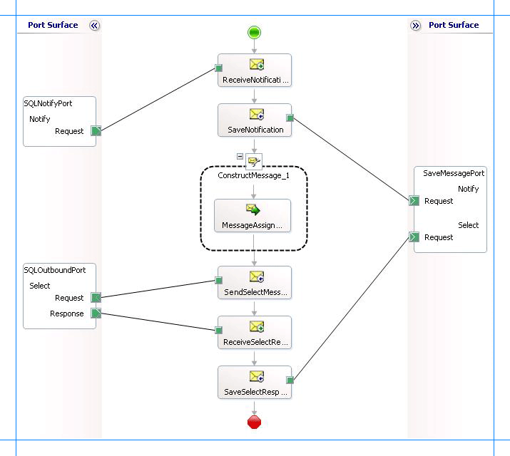

# Receive Query Notifications Incrementally from SQL using BizTalk Server
> [!IMPORTANT]
>  For the sake of brevity, this topic only describes how to receive notifications incrementally. In business scenarios, the orchestration must ideally include the logic to extract the kind of notification message received and then perform any subsequent operations. In other words, the orchestration described in this topic must be built on top of the orchestration described in [Process notification messages to complete specific tasks in SQL using BizTalk Server](../../adapters-and-accelerators/adapter-sql/process-notification-messages-to-complete-specific-tasks-in-sql-using-biztalk.md).  
  
 This topic demonstrates how to configure the [!INCLUDE[adaptersqlshort](../../includes/adaptersqlshort-md.md)] to receive incremental query notification messages from a SQL Server database. To demonstrate incremental notifications, consider a table, Employee, with a “Status” column. When a new record is inserted to this table, the value of the Status column is set to 0. You can configure the adapter to receive incremental notifications by doing the following:  
  
- Register for notifications using a SQL statement that retrieves all records that have Status column as 0. You can do so by specifying the SQL statement for the **NotificationStatement** binding property.  
  
- For rows for which notification messages have been received, update the Status column to 1.  
  
  This topic demonstrates how to create a BizTalk orchestration and configure a BizTalk application to achieve this.  
  
## Configuring Notifications with the SQL Adapter Binding Properties  
 The following table summarizes the [!INCLUDE[adaptersqlshort](../../includes/adaptersqlshort-md.md)] binding properties that you use to configure receiving notifications from SQL Server. You must specify these binding properties while configuring the receive port in the [!INCLUDE[btsBizTalkServerNoVersion](../../includes/btsbiztalkservernoversion-md.md)] Administration console.  
  
> [!NOTE]
>  You may choose to specify these binding properties when generating the schema for the **Notification** operation, even though it is not mandatory. If you do so, the port binding file that the [!INCLUDE[consumeadapterservshort](../../includes/consumeadapterservshort-md.md)] generates as part of the metadata generation also contains the values you specify for the binding properties. You can later import this binding file in the [!INCLUDE[btsBizTalkServerNoVersion](../../includes/btsbiztalkservernoversion-md.md)] Administration console to create the WCF-custom or WCF-SQL receive port with the binding properties already set. For more information about creating a port using the binding file, see [Configure a physical port binding using a port binding file to use the SQL adapter](../../adapters-and-accelerators/adapter-sql/configure-a-physical-port-binding-using-a-port-binding-file-to-sql-adapter.md).  
  
|Binding Property|Description|  
|----------------------|-----------------|  
|**InboundOperationType**|Specifies the inbound operation that you want to perform. To receive notification messages, set this to **Notification**.|  
|**NotificationStatement**|Specifies the SQL statement (SELECT or EXEC \<stored procedure\>) used to register for query notifications. The adapter gets a notification message from SQL Server only when the result set for the specified SQL statement changes.|  
|**NotifyOnListenerStart**|Specifies whether the adapter sends a notification to the adapter clients when the listener is started.|  
  
 For a more complete description of these properties, see [Read about the BizTalk Adapter for SQL Server adapter binding properties](../../adapters-and-accelerators/adapter-sql/read-about-the-biztalk-adapter-for-sql-server-adapter-binding-properties.md). For a complete description of how to use the [!INCLUDE[adaptersqlshort](../../includes/adaptersqlshort-md.md)] to receive notifications from SQL Server, read further.  
  
## How This Topic Demonstrates Receiving Notification Messages  
 To demonstrate how the [!INCLUDE[adaptersqlshort](../../includes/adaptersqlshort-md.md)] supports receiving notification messages from SQL Server, this topic will demonstrate how to configure the adapter to receive notifications for changes to an Employee table. Assume that the Employee table has columns Employee_ID, Name, and Status. Whenever a new employee is added, the value of the Status column is set to 0.  
  
 To demonstrate receiving notifications, do the following:  
  
-   Generate schema for the **Notification** (inbound operation), and **Select** (outbound operation) on the Employee table.  
  
-   Create an orchestration that has the following:  
  
    -   A receive location to receive notification messages. You can configure for notification by specifying the SELECT statement as:  
  
        ```  
        SELECT Employee_ID, Name FROM dbo.Employee WHERE Status=0  
        ```  
  
        > [!NOTE]
        >  You must specifically specify the column names in the statement as shown in this SELECT statement. Also, you must always specify the table name along with the schema name. For example, `dbo.Employee`.  
  
    -   A send port to update the rows for which notification has already been sent. You do so by setting the value in the Status column to 1. You can do this as part of the Select operation by sending the following message to the adapter.  
  
        ```  
        <Select xmlns="http://schemas.microsoft.com/Sql/2008/05/TableOp/dbo/Employee">  
          <Columns>Employee_ID,Name,Status</Columns>  
          <Query>where Status=0;UPDATE Employee SET Status=1 WHERE Status=0</Query>  
        </Select>  
        ```  
  
         In this message, as part of the `<Query>` element, you specify the UPDATE statement to update the Status column. Note that this operation must be executed after receiving the notification messages so that the processed rows are updated. To do away with the overhead of waiting to get the notification response and then manually dropping a request message to update the rows, you will generate the request message for updating the rows within the orchestration itself. You can do so by using the **Construct Message** shape within an orchestration.  
  
## How to Receive Notification Messages from the SQL Server Database  
 Performing an operation on the SQL Server database using [!INCLUDE[adaptersqlshort](../../includes/adaptersqlshort-md.md)] with [!INCLUDE[btsBizTalkServerNoVersion](../../includes/btsbiztalkservernoversion-md.md)] involves the procedural tasks described in [Building blocks to develop BizTalk applications with the SQL adapter](../../adapters-and-accelerators/adapter-sql/building-blocks-to-develop-biztalk-applications-with-the-sql-adapter.md). To configure the adapter to receive notification messages, these tasks are:  
  
1. Create a BizTalk project, and then generate schema for the **Notification** (inbound operation) and **Select** (outbound operation) on the Employee table. Optionally, you can specify values for the **InboundOperationType** and **NotificationStatement** binding properties.  
  
2. Create a message in the BizTalk project for receiving notification from the SQL Server database.  
  
3. Create messages in the BizTalk project for performing the Select information on the SQL Server database and receiving response messages.  
  
4. Create an orchestration that does the following:  
  
   -   Receives notification message from SQL Server.  
  
   -   Creates a message to select and update the rows for which notification is received.  
  
   -   Sends this message to the SQL Server to update the rows and receives a response.  
  
5. Build and deploy the BizTalk project.  
  
6. Configure the BizTalk application by creating physical send and receive ports.  
  
   > [!NOTE]
   >  For inbound operations, like receiving notification messages, you must only configure a one-way WCF-Custom or WCF-SQL receive port. Two-way WCF-Custom or WCF-SQL receive ports are not supported for inbound operations.  
  
7. Start the BizTalk application.  
  
   This topic provides instructions to perform these tasks.  
  
## Sample Based on This Topic  
 A sample, IncrementalNotification, based on this topic is provided with the [!INCLUDE[adapterpacknoversion](../../includes/adapterpacknoversion-md.md)]. For more information, see [Samples for the SQL adapter](../../adapters-and-accelerators/adapter-sql/samples-for-the-sql-adapter.md).  
  
## Generating Schema  
 You must generate the schema for the **Notification** operation and **Select** operation on Employee table. See [Get metadata for SQL Server operations in Visual Studio using the SQL adapter](../../adapters-and-accelerators/adapter-sql/get-metadata-for-sql-server-operations-in-visual-studio-using-the-sql-adapter.md) for more information about how to generate the schema. Perform the following tasks when generating the schema. Skip the first step if you do not want to specify the binding properties at design time.  
  
1.  Specify a value for **InboundOperationType** and **NotificationStatement** binding properties while generating the schema. For more information about this binding property, see [Read about the BizTalk Adapter for SQL Server adapter binding properties](../../adapters-and-accelerators/adapter-sql/read-about-the-biztalk-adapter-for-sql-server-adapter-binding-properties.md). For instructions on how to specify binding properties, see [Configure the binding properties for the SQL adapter](../../adapters-and-accelerators/adapter-sql/configure-the-binding-properties-for-the-sql-adapter.md).  
  
2.  Select the contract type as **Service (Inbound operations)**.  
  
3.  Generate schema for the **Notification** operation.  
  
4.  Select the contract type as **Client (Outbound operations)**.  
  
5.  Generate schema for the **Select** operation on **Employee** table.  
  
## Defining Messages and Message Types  
 The schema that you generated earlier describes the "types" required for the messages in the orchestration. A message is typically a variable, the type for which is defined by the corresponding schema. Once the schema is generated, you must link it to the messages from the Orchestration view of the BizTalk project.  
  
 For this topic, you must create three messages—one to receive notifications from the SQL Server database, one to perform the Select operation, and one to receive the response for Select operation.  
  
 Perform the following steps to create messages and link them to schema.  
  
#### To create messages and link to schema  
  
1.  Add an orchestration to the BizTalk project. From the Solution Explorer, right-click the BizTalk project name, point to **Add**, and then click **New Item**. Type a name for the BizTalk orchestration and then click **Add**.  
  
2.  Open the orchestration view window of the BizTalk project, if it is not already open. Click **View**, point to **Other Windows**, and then click **Orchestration View**.  
  
3.  In the **Orchestration View**, right-click **Messages**, and then click **New Message**.  
  
4.  Right-click the newly created message, and then select **Properties Window**.  
  
5.  In the **Properties** pane for **Message_1**, do the following:  
  
    |Use this|To do this|  
    |--------------|----------------|  
    |Identifier|Type `NotifyReceive`.|  
    |Message Type|From the drop-down list, expand **Schemas**, and select *SQLNotify.Notification*, where *SQLNotify* is the name of your BizTalk project. *Notification* is the schema generated for the **Notification** operation.|  
  
6.  Repeat step 3 to create two new messages. In the **Properties** pane for the new message, do the following:  
  
    |Set Identifier to|Set Message Type to|  
    |-----------------------|-------------------------|  
    |Select|*SQLNotify.TableOperation_dbo_Employee.Select*, where  *TableOperation_dbo_Employee* is the schema generated for the **Select** operation|  
    |SelectResponse|*SQLNotify.TableOperation_dbo_Employee.SelectResponse*|  
  
## Setting up the Orchestration  
 You must create a BizTalk orchestration to use [!INCLUDE[btsBizTalkServerNoVersion](../../includes/btsbiztalkservernoversion-md.md)] for receiving notification messages from the SQL Server database and then updating the rows for which notification was received. In this orchestration, the adapter receives the notification message based on the SELECT statement specified for the **NotificationStatement** binding property. The notification message is received at a FILE location. Once the response is received, the orchestration constructs a message that will be used to update the rows for which notification is received. The response for this message is also received at the same FILE location.  
  
 So, your orchestration must contain the following:  
  
- A one-way receive port to receive notification messages.  
  
- A two-way send port to send messages to update rows and receive response for the same.  
  
- A **Construct Message** shape to construct messages, to execute the Update operation, within the orchestration.  
  
- A FILE send port to save the response for the Update operation.  
  
- Receive and send shapes.  
  
  A sample orchestration resembles the following.  
  
    
  
### Adding Message Shapes  
 Make sure you specify the following properties for each of the message shapes. The names listed in the Shape column are the names of the message shapes as displayed in the just-mentioned orchestration.  
  
|Shape|Shape Type|Properties|  
|-----------|----------------|----------------|  
|ReceiveNotification|Receive|- Set **Name** to *ReceiveNotification*<br /><br /> - Set **Activate** to *True*|  
|SaveNotification|Send|- Set **Name** to *SaveNotification*|  
|SendSelectMessage|Send|- Set **Name** to *SendSelectMessage*|  
|ReceiveSelectResponse|Receive|- Set **Name** to *ReceiveSelectResponse*|  
|SaveSelectResponse|Send|- Set **Name** to *SaveSelectResponse*|  
  
### Adding Construct Message Shape  
 You can use the **Construct Message** shape to generate a request message within the operation to perform the Select operation. To do so, you must add a **Construct Message** shape and within that a **Message Assignment** shape to your orchestration. For this example, the **Message Assignment** shape invokes code that generates a message that is sent to SQL Server to perform the Select operation. The **Message Assignment** shape also sets the action for the message to be sent to SQL Server.  
  
 For the construct message shape, set the **Message Constructed** property to **Select**.  
  
 The code to generate the response could be part of the same Visual Studio solution as your BizTalk project. A sample code for generating a response message looks like this.  
  
```  
namespace SampleMessageCreator  
{  
    public class SampleMessageCreator  
    {  
        private static XmlDocument Message;  
        private static string XmlFileLocation;  
        private static string ResponseDoc;  
        public static XmlDocument XMLMessageCreator()  
        {  
            XmlFileLocation = "C:\\TestLocation\\CreateMessage";  
            try  
            {  
                ResponseDoc = (Directory.GetFiles(XmlFileLocation, "*.xml", SearchOption.TopDirectoryOnly))[0];  
            }  
            catch (Exception ex)  
            {  
                Console.WriteLine("Trying to get XML from: " + XmlFileLocation);  
                Console.WriteLine("EXCEPTION: " + ex.ToString());  
                throw ex;  
            }  
            //Create Message From XML  
            Message = new XmlDocument();  
            Message.PreserveWhitespace = true;  
            Message.Load(ResponseDoc);  
            return Message;  
        }   
    }  
}  
```  
  
 For the preceding code excerpt to be able to generate a request message, you must have an XML request message (for the Select operation on the Employee table) in the location specified for the `XmlFileLocation` variable.  
  
> [!NOTE]
>  After you build the project, SampleMessageCreator.dll will be created in the project directory. You must add this DLL to the global assembly cache (GAC). Also, you must add the SampleMessageCreator.dll as a reference in the BizTalk project.  
  
 Add the following expression to invoke this code from the **Message Assignment** shape and to set the action for message. To add an expression, double-click the **Message Assignment** shape to open the Expression Editor.  
  
```  
Select = SampleMessageCreator.SampleMessageCreator.XMLMessageCreator();  
Select(WCF.Action) = "TableOp/Select/dbo/Employee";  
```  
  
### Adding Ports  
 Make sure you specify the following properties for each of the logical ports. The names listed in the Port column are the names of the ports as displayed in the orchestration.  
  
|Port|Properties|  
|----------|----------------|  
|SQLNotifyPort|- Set **Identifier** to *SQLNotifyPort*<br /><br /> - Set **Type** to *SQLNotifyPortType*<br /><br /> - Set **Communication Pattern** to *One-Way*<br /><br /> - Set **Communication Direction** to *Receive*|  
|SaveMessagePort|- Set **Identifier** to *SaveMessagePort*<br /><br /> - Set **Type** to *SaveMessagePortType*<br /><br /> - Set **Communication Pattern** to *One-Way*<br /><br /> - Set **Communication Direction** to *Send*<br /><br /> - Create an operation *Notify*. This operation is used for notification messages.<br /><br /> - Create an operation *Select*. This operation is used for select response messages.|  
|SQLOutboundPort|- Set **Identifier** to *SQLOutboundPort*<br /><br /> - Set **Type** to *SQLOutboundPortType*<br /><br /> - Set **Communication Pattern** to *Request-Response*<br /><br /> - Set **Communication Direction** to *Send-Receive*|  
  
### Specify Messages for Action Shapes and Connect to Ports  
 The following table specifies the properties and their values that you should set to specify messages for action shapes and to link the messages to the ports. The names listed in the Shape column are the names of the message shapes as displayed in the orchestration mentioned earlier.  
  
|Shape|Properties|  
|-----------|----------------|  
|ReceiveNotification|- Set **Message** to *NotifyReceive*<br /><br /> - Set **Operation** to *SQLNotifyPort.Notify.Request*|  
|SaveNotification|- Set **Message** to *NotifyReceive*<br /><br /> - Set **Operation** to *SaveMessagePort.Notify.Request*|  
|SendSelectMessage|- Set **Message** to *Select*<br /><br /> - Set **Operation** to *SQLOutboundPort.Select.Request*|  
|ReceiveSelectResponse|- Set **Message** to *SelectResponse*<br /><br /> - Set **Operation** to *SQLOutboundPort.Select.Response*|  
|SaveSelectResponse|- Set **Message** to *SelectResponse*<br /><br /> - Set **Operation** to *SaveMessagePort.Select.Request*|  
  
 After you have specified these properties, the message shapes and ports are connected and your orchestration is complete.  
  
 You must now build the BizTalk solution and deploy it to a [!INCLUDE[btsBizTalkServerNoVersion](../../includes/btsbiztalkservernoversion-md.md)]. For more information, see [Building and Running Orchestrations](../../core/building-and-running-orchestrations.md).
  
## Configuring the BizTalk Application  
 After you have deployed the BizTalk project, the orchestration you created earlier is listed under the **Orchestrations** pane in the BizTalk Server Administration console. You must use the BizTalk Server Administration console to configure the application. For a walkthrough, see [Walkthrough: Deploying a Basic BizTalk Application](Walkthrough:%20Deploying%20a%20Basic%20BizTalk%20Application.md).
  
 Configuring an application involves:  
  
- Selecting a host for the application.  
  
- Mapping the ports that you created in your orchestration to physical ports in the BizTalk Server Administration console. For this orchestration you must:  
  
  - Define a physical WCF-Custom or WCF-SQL one-way receive port. This port listens for notifications coming from the SQL Server database. For information about how to create ports, see [Manually configure a physical port binding to the SQL adapter](../../adapters-and-accelerators/adapter-sql/manually-configure-a-physical-port-binding-to-the-sql-adapter.md). Make sure you specify the following binding properties for the receive port.  
  
    > [!IMPORTANT]
    >  You do not need to perform this step if you specified the binding properties at design time. In such a case, you can create a WCF-custom or WCF-SQL receive port, with the required binding properties set, by importing the binding file created by the [!INCLUDE[consumeadapterservshort](../../includes/consumeadapterservshort-md.md)]. For more information see [Configure a physical port binding using a port binding file to use the SQL adapter](../../adapters-and-accelerators/adapter-sql/configure-a-physical-port-binding-using-a-port-binding-file-to-sql-adapter.md).  
  
    |Binding Property|Value|  
    |----------------------|-----------|  
    |**InboundOperationType**|Set this to **Notification**.|  
    |**NotificationStatement**|Set this to:<br /><br /> `SELECT Employee_ID, Name FROM dbo.Employee WHERE Status=0`<br /><br /> **Note:** You must specifically specify the column names in the statement as shown in this SELECT statement. Also, you must always specify the table name along with the schema name. For example, `dbo.Employee`.|  
    |**NotifyOnListenerStart**|Set this to **True**.|  
  
     For more information about the different binding properties, see [Read about the BizTalk Adapter for SQL Server adapter binding properties](../../adapters-and-accelerators/adapter-sql/read-about-the-biztalk-adapter-for-sql-server-adapter-binding-properties.md).  
  
    > [!NOTE]
    >  We recommend configuring the transaction isolation level and the transaction timeout while performing inbound operations using the [!INCLUDE[adaptersqlshort](../../includes/adaptersqlshort-md.md)]. You can do so by adding the service behavior while configuring the WCF-Custom or WCF-SQL receive port. For instruction on how to add the service behavior, see [Configure Transaction Isolation Level and Transaction Timeout with SQL](../../adapters-and-accelerators/adapter-sql/configure-transaction-isolation-level-and-transaction-timeout-with-sql.md).  
  
  - Define a physical WCF-Custom or WCF-SQL send port to send messages to the SQL Server database. You must also specify the action in the send port.  
  
  - Define a location on the hard disk and a corresponding file port where the BizTalk orchestration will drop the messages from the SQL Server database. These will be the notification messages received from SQL Server and messages for the Select and Update operation you perform through the WCF-Custom or WCF-SQL send port.  
  
## Starting the Application  
 You must start the BizTalk application for receiving notification messages from the SQL Server database and for performing the subsequent Select and Update operations. For instructions on starting a BizTalk application, see [How to Start an Orchestration](../../core/how-to-start-an-orchestration.md).
  
 At this stage, make sure:  
  
-   The WCF-Custom or WCF-SQL one-way receive port, which receives the notification messages from the SQL Server database is running.  
  
-   The WCF-Custom or WCF-SQL send port to perform Select and Update operations on the Employee table is running.  
  
-   The FILE send port, which receives messages from SQL Server, is running.  
  
-   The BizTalk orchestration for the operation is running.  
  
## Executing the Operation  
 To execute this operation, you must insert a record into the Employee table. Let us assume you insert a record with following details:  
  
```  
Name = John Smith  
Designation = Manager  
Salary = 100000  
```  
  
 Also, make sure the XML message to perform Select and Update operations is available at C:\TestLocation\MessageIn. The XML file should resemble the following:  
  
```  
<Select xmlns="http://schemas.microsoft.com/Sql/2008/05/TableOp/dbo/Employee">  
  <Columns>Employee_ID,Name,Status</Columns>  
  <Query>where Status=0;UPDATE Employee SET Status=1 WHERE Status=0</Query>  
</Select>  
```  
  
 Once the record is inserted, the following set of actions take place, in the same sequence:  
  
-   The adapter receives a notification message that resembles the following:  
  
    ```  
    <?xml version="1.0" encoding="utf-8" ?>   
    <Notification xmlns="http://schemas.microsoft.com/Sql/2008/05/Notification/">  
      <Info>Insert</Info>   
      <Source>Data</Source>   
      <Type>Change</Type>   
    </Notification>  
    ```  
  
     This message notifies that a record was inserted in the Employee table. Note that the value for the `<Info>` element is “Insert”.  
  
-   The adapter executes the Select operation. Because the Select operation XML also includes an Update statement, the Update statement is also executed. The next response from SQL Server is for the Select statement.  
  
    ```  
    <?xml version="1.0" encoding="utf-8" ?>   
    <SelectResponse xmlns="http://schemas.microsoft.com/Sql/2008/05/TableOp/dbo/Employee">  
      <SelectResult>  
        <Employee xmlns="http://schemas.microsoft.com/Sql/2008/05/Types/Tables/dbo">  
          <Employee_ID>10006</Employee_ID>   
          <Name>John</Name>   
          <Status>0</Status>  
        </Employee>  
      </SelectResult>  
    </SelectResponse>  
    ```  
  
     This response shows that a record was inserted into the Employee table and the Status for that record is 0.  
  
-   As part of the Select statement, the Update statement is also executed and the Status column for the new record is changed to 1. This again triggers another notification from SQL Server and the adapter receives a corresponding notification message, that resembles the following:  
  
    ```  
    <?xml version="1.0" encoding="utf-8" ?>   
    <Notification xmlns="http://schemas.microsoft.com/Sql/2008/05/Notification/">  
      <Info>Update</Info>   
      <Source>Data</Source>   
      <Type>Change</Type>   
    </Notification>  
    ```  
  
     This message notifies that a record was updated in the Employee table. Note that the value for the `<Info>` element is “Update”.  
  
-   After the second notification, the adapter executes the Select statement. However, because there are no records now that have Status as 0, the adapter gets an empty response resembling the following.  
  
    ```  
    <?xml version="1.0" encoding="utf-8" ?>   
    <SelectResponse xmlns="http://schemas.microsoft.com/Sql/2008/05/TableOp/dbo/Employee">  
      <SelectResult />   
    </SelectResponse>  
    ```  
  
## Best Practices  
 After you have deployed and configured the BizTalk project, you can export configuration settings to an XML file called the binding file. Once you generate a binding file, you can import the configuration settings from the file, so that you do not need to create the send ports and receive ports for the same orchestration. For more information about binding files, see [Reuse SQL adapter bindings](../../adapters-and-accelerators/adapter-sql/reuse-sql-adapter-bindings.md).
  
## See Also  
 [Receive SQL Query Notifications using BizTalk Server](../../adapters-and-accelerators/adapter-sql/receive-sql-query-notifications-using-biztalk-server.md)