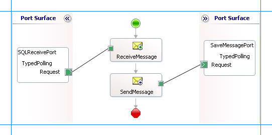
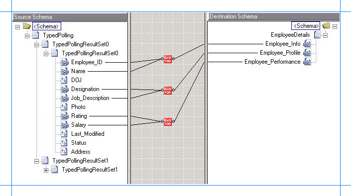
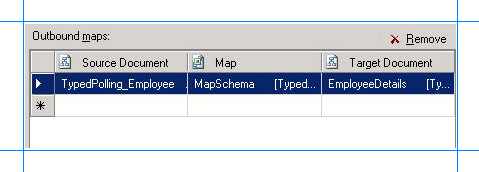

# Receive strongly-typed polling-based data-changed messages from SQL Server using BizTalk Server
You can configure the [!INCLUDE[adaptersqlshort](../../includes/adaptersqlshort-md.md)] to receive strongly-typed polling messages from SQL Server. You can specify a polling statement that the adapter executes to poll the database. The polling statement can be a SELECT statement or a stored procedure that returns a result set.  
  
 You must use strongly-typed polling in a scenario where you want to map the elements in the polling message to any other schema. The schema you want to map to could be for another operation on SQL Server. For example, you could map certain elements in the polling message to the schema for an Insert operation on another table. So, the values in the polling message serve as parameters for the Insert operation. In a simpler scenario, you could map the schema for strongly-typed polling message to a schema file that just stores information.  
  
> [!IMPORTANT]
>  If you want to have more than one polling operation in a single BizTalk application, you must specify an **InboundID** connection property as part of the connection URI to make it unique. With a unique connection URI, you can create multiple receive ports that poll the same database, or even the same table in a database. For more information, see [Receive Polling Messages Across Multiple Receive Ports from SQL using Biztalk Server](../../adapters-and-accelerators/adapter-sql/receive-polling-messages-across-multiple-receive-ports-from-sql-using-biztalk.md).  
  
 For more information about how the adapter supports strongly-typed polling, see [Support for Polling](https://msdn.microsoft.com/library/dd788416.aspx). For more information about the message schema for strongly-typed polling, see [Message Schemas for the Polling and TypedPolling Operations](../../adapters-and-accelerators/adapter-sql/message-schemas-for-the-polling-and-typedpolling-operations.md).  
  
## How this Topic Demonstrates Strongly-typed Polling  
 This topic demonstrates how to use strongly-typed polling to map the polling message to another schema. This topic shows how to create a BizTalk project and generate schema for **TypedPolling** operation. Before generating schema for **TypedPolling** operation, you must do the following:  
  
- You must specify an **InboundID** as part of the connection URI.  
  
- You must specify a polling statement for the **PollingStatement** binding property.  
  
  As part of the polling statement, perform the following operations:  
  
- Select all the rows from the Employee table.  
  
- Execute a stored procedure (MOVE_EMP_DATA) to move all the records from the Employee table to an EmployeeHistory table.  
  
- Execute a stored procedure (ADD_EMP_DETAILS) to add a new record to the Employee table. This procedure takes the employee name, designation, and salary as parameters.  
  
  To perform these operations, you must specify the following for the **PollingStatement** binding property:  
  
```  
SELECT * FROM Employee;EXEC MOVE_EMP_DATA;EXEC ADD_EMP_DETAILS John, Tester, 100000   
```  
  
 Because you generate schema for the **TypedPolling** operation, the schema is strongly-typed and contains all the elements that will be included in the polling message.  
  
 As part of the same BizTalk project, you add another schema file, for example EmployeeDetails.xsd. The schema for EmployeeDetails.xsd resembles the following:  
  
```  
<?xml version="1.0" encoding="utf-16" ?>   
<xs:schema xmlns:b="http://schemas.microsoft.com/BizTalk/2003" xmlns="http://Typed_Polling.EmployeeDetails" elementFormDefault="qualified" targetNamespace="http://Typed_Polling.EmployeeDetails" xmlns:xs="http://www.w3.org/2001/XMLSchema">  
  <xs:element name="EmployeeDetails">  
    <xs:complexType>  
      <xs:sequence>  
        <xs:element name="Employee_Info" type="xs:string" />   
        <xs:element name="Employee_Profile" type="xs:string" />   
        <xs:element name="Employee_Performance" type="xs:string" />   
      </xs:sequence>  
    </xs:complexType>  
  </xs:element>  
</xs:schema>  
```  
  
 You also add a BizTalk Mapper to the project to map the elements from the Employee table (received as polling message) to the elements in the EmployeeDetails.xsd schema. As part of the map, you combine one or more elements from the polling message and map it to a single element in the EmployeeDetails schema. You can do so by using the **String Concatenate** functoid.  
  
 Finally, as part of the BizTalk project, a file conforming to the EmployeeDetails.xsd schema is dropped to a FILE send port.  
  
## Configure Typed Polling with the SQL Adapter Binding Properties  
 The following table summarizes the [!INCLUDE[adaptersqlshort](../../includes/adaptersqlshort-md.md)] binding properties that you use to configure the adapter to receive data-change messages. Other than the **PollingStatement** binding property, all the other binding properties listed in this section are required while configuring the receive port in the [!INCLUDE[btsBizTalkServerNoVersion](../../includes/btsbiztalkservernoversion-md.md)] Administration console. You must specify the **PollingStatement** binding property before generating schema for the **TypedPolling** operation.  
  
> [!NOTE]
>  For typed polling, you must specify the **PollingStatement** biding property while generating the schema. You can choose to specify the other binding properties as well while generating the schema, even though they are not mandatory. If you do specify the binding properties, the port binding file that the [!INCLUDE[consumeadapterservshort](../../includes/consumeadapterservshort-md.md)] generates as part of the metadata generation also contains the values you specify for the binding properties. You can later import this binding file in the [!INCLUDE[btsBizTalkServerNoVersion](../../includes/btsbiztalkservernoversion-md.md)] Administration console to create the WCF-custom or WCF-SQL receive port with the binding properties already set. For more information about creating a port using the binding file, see [Configure a physical port binding using a port binding file to use the SQL adapter](../../adapters-and-accelerators/adapter-sql/configure-a-physical-port-binding-using-a-port-binding-file-to-sql-adapter.md).  
  
|         Binding Property         |                                                                                                                                                                                                                                                                                                   Description                                                                                                                                                                                                                                                                                                    |
|----------------------------------|------------------------------------------------------------------------------------------------------------------------------------------------------------------------------------------------------------------------------------------------------------------------------------------------------------------------------------------------------------------------------------------------------------------------------------------------------------------------------------------------------------------------------------------------------------------------------------------------------------------|
|     **InboundOperationType**     |                                                                                                                                                                                                  Specifies whether you want to perform **Polling**, **TypedPolling**, or **Notification** inbound operation. Default is **Polling**. To receive strongly-typed polling messages, set this to **TypedPolling**.                                                                                                                                                                                                   |
| **PolledDataAvailableStatement** |                                                                                                                                                 Specifies the SQL statement that the adapter executes to determine whether any data is available for polling. The SQL statement must return a result set consisting of rows and columns. Only if a row is available, the SQL statement specified for the **PollingStatement** binding property will be executed.                                                                                                                                                 |
|   **PollingIntervalInSeconds**   |                                                                                   Specifies the interval, in seconds, at which the [!INCLUDE[adaptersqlshort](../../includes/adaptersqlshort-md.md)] executes the statement specified for the **PolledDataAvailableStatement** binding property. The default is 30 seconds. The polling interval determines the time interval between successive polls. If the statement is executed within the specified interval, the adapter waits for the remaining time in the interval.                                                                                    |
|       **PollingStatement**       | Specifies the SQL statement to poll the SQL Server database table. You can specify a simple SELECT statement or a stored procedure for the polling statement. The default is null. You must specify a value for **PollingStatement** to enable polling. The polling statement is executed only if there is data available for polling, which is determined by the **PolledDataAvailableStatement** binding property. You can specify any number of SQL statements separated by a semi-colon.<br /><br /> **Important:** For **TypedPolling**, you must specify this binding property before generating metadata. |
|      **PollWhileDataFound**      |                                                                                      Specifies whether the [!INCLUDE[adaptersqlshort](../../includes/adaptersqlshort-md.md)] ignores the polling interval and continuously executes the SQL statement specified for the **PolledDataAvailableStatement** binding property, if data is available in the table being polled. If no data is available in the table, the adapter reverts to execute the SQL statement at the specified polling interval. Default is **false**.                                                                                       |
  
 For a more complete description of these properties, see [Read about the BizTalk Adapter for SQL Server adapter Binding Properties](../../adapters-and-accelerators/adapter-sql/read-about-the-biztalk-adapter-for-sql-server-adapter-binding-properties.md). For a complete description of how to use the [!INCLUDE[adaptersqlshort](../../includes/adaptersqlshort-md.md)] to poll SQL Server, read further.  
  
## How to Receive Strongly-typed Data-change Messages from the SQL Server Database  
 Performing an operation on the SQL Server database using [!INCLUDE[adaptersqlshort](../../includes/adaptersqlshort-md.md)] with [!INCLUDE[btsBizTalkServerNoVersion](../../includes/btsbiztalkservernoversion-md.md)] involves the procedural tasks described in [Building blocks to develop BizTalk applications with the SQL adapter](../../adapters-and-accelerators/adapter-sql/building-blocks-to-develop-biztalk-applications-with-the-sql-adapter.md). To configure the adapter to receive strongly-typed data-change messages, these tasks are:  
  
1. Create a BizTalk project, and then generate schema for the **TypedPolling** operation. You must specify the **InboundID** connection property and the **PollingStatement** binding property while generating schema. For example, a connection URI with the inbound ID specified resembles the following:  
  
   ```  
   mssql://mysqlserver//mysqldatabase?InboundID=mydatabaseId  
   ```  
  
2. Create a message in the BizTalk project for receiving messages from the SQL Server database.  
  
3. Create an orchestration to receive messages from the SQL Server database and to save them to a folder.  
  
4. Add a schema, for example, EmployeeDetails.xsd, in the BizTalk project.  
  
5. Add a BizTalk Mapper to map the schema for the polling message to EmployeeDetails.xsd schema.  
  
6. Build and deploy the BizTalk project.  
  
7. Configure the BizTalk application by creating physical send and receive ports.  
  
   > [!IMPORTANT]
   >  For inbound polling scenarios you must always configure a one-way WCF-Custom or WCF-SQL receive port. Two-way WCF-Custom or WCF-SQL receive ports are not supported for inbound operations.  
  
8. Start the BizTalk application.  
  
   This topic provides instructions to perform these tasks.  
  
## Sample Based on This Topic  
 A sample, TypedPolling, based on this topic is provided with the [!INCLUDE[adapterpacknoversion](../../includes/adapterpacknoversion-md.md)]. For more information, see [Samples for the SQL adapter](../../adapters-and-accelerators/adapter-sql/samples-for-the-sql-adapter.md).  
  
## Generate Schema  
 You must generate the schema for the **TypedPolling** operation. See [Retrieving Metadata for SQL Server Operations in Visual Studio using the SQL adapter](../../adapters-and-accelerators/adapter-sql/get-metadata-for-sql-server-operations-in-visual-studio-using-the-sql-adapter.md) for more information about how to generate the schema. Perform the following tasks when generating the schema.  
  
1.  Specify the **InboundID** connection property while specifying the connection URI. For this topic, you can specify the **InboundID** as **Employee**. For more information about the connection URI, see [Create the SQL Server Connection URI](../../adapters-and-accelerators/adapter-sql/create-the-sql-server-connection-uri.md).  
  
2.  Specify a value for the **PollingStatement** binding property. For more information about this binding property, see [Read about the BizTalk Adapter for SQL Server adapter Binding Properties](../../adapters-and-accelerators/adapter-sql/read-about-the-biztalk-adapter-for-sql-server-adapter-binding-properties.md).  
  
     For instructions on how to specify binding properties, see [Configure the binding properties for the SQL adapter](../../adapters-and-accelerators/adapter-sql/configure-the-binding-properties-for-the-sql-adapter.md).  
  
3.  Select the contract type as **Service (Inbound operation)**.  
  
4.  Generate schema for the **TypedPolling** operation.  
  
## Define Messages and Message Types  
 The schema that you generated earlier describes the "types" required for the messages in the orchestration. A message is typically a variable, the type for which is defined by the corresponding schema. Once the schema is generated, you must link it to the messages from the Orchestration view of the BizTalk project.  
  
 For this topic, you must create one message to receive messages from the SQL Server database.  
  
 Perform the following steps to create messages and link them to schema.  
  
#### Create messages and link to schema  
  
1.  Add an orchestration to the BizTalk project. From the Solution Explorer, right-click the BizTalk project name, point to **Add**, and then click **New Item**. Type a name for the BizTalk orchestration and then click **Add**.  
  
2.  Open the orchestration view window of the BizTalk project, if it is not already open. Click **View**, point to **Other Windows**, and then click **Orchestration View**.  
  
3.  In the **Orchestration View**, right-click **Messages**, and then click **New Message**.  
  
4.  Right-click the newly created message, and then select **Properties Window**.  
  
5.  In the **Properties** pane for **Message_1**, do the following:  
  
    |Use this|To do this|  
    |--------------|----------------|  
    |Identifier|Type **PollingMessage**.|  
    |Message Type|From the drop-down list, expand **Schemas**, and select *Typed_Polling.TypedPolling_Employee.TypedPolling*, where *Typed_Polling* is the name of your BizTalk project. *TypedPolling_Employee* is the schema generated for the **TypedPolling** operation.|  
  
## Set up the Orchestration  
 You must create a BizTalk orchestration to use [!INCLUDE[btsBizTalkServerNoVersion](../../includes/btsbiztalkservernoversion-md.md)] for receiving polling-based data-change messages from the SQL Server database. In this orchestration, the adapter receives the polling message for the specified polling statement. The BizTalk Mapper then maps the polling message schema to the EmployeeDetails.xsd schema. The mapped message is then saved to a FILE location. A typical orchestration for receiving strongly-typed polling message from a SQL Server database would contain:  
  
- Receive and Send shapes to receive messages from SQL Server and send to a FILE port, respectively.  
  
- A one-way receive port to receive messages from SQL Server.  
  
  > [!IMPORTANT]
  >  For inbound polling scenarios you must always configure a one-way receive port. Two-way receive ports are not supported for inbound operations.  
  
- A one-way send port to send polling responses from a SQL Server database to a folder.  
  
- A BizTalk Mapper to map the schema of the polling message to any other schema.  
  
  A sample orchestration resembles the following.  
  
    
  
### Add Message Shapes  
 Make sure you specify the following properties for each of the message shapes. The names listed in the Shape column are the names of the message shapes as displayed in the just-mentioned orchestration.  
  
|Shape|Shape Type|Properties|  
|-----------|----------------|----------------|  
|ReceiveMessage|Receive|- Set **Name** to *ReceiveMessage*<br /><br /> - Set **Activate** to *True*|  
|SaveMessage|Send|- Set **Name** to *SaveMessage*|  
  
### Add Ports  
 Make sure you specify the following properties for each of the logical ports. The names listed in the Port column are the names of the ports as displayed in the orchestration.  
  
|Port|Properties|  
|----------|----------------|  
|SQLReceivePort|- Set **Identifier** to *SQLReceivePort*<br /><br /> - Set **Type** to *SQLReceivePortType*<br /><br /> - Set **Communication Pattern** to *One-Way*<br /><br /> - Set **Communication Direction** to *Receive*|  
|SaveMessagePort|- Set **Identifier** to *SaveMessagePort*<br /><br /> - Set **Type** to *SaveMessagePortType*<br /><br /> - Set **Communication Pattern** to *One-Way*<br /><br /> - Set **Communication Direction** to *Send*|  
  
### Enter Messages for Action Shapes and Connect to Ports  
 The following table specifies the properties and their values that you should set to specify messages for action shapes and to link the messages to the ports. The names listed in the Shape column are the names of the message shapes as displayed in the orchestration mentioned earlier.  
  
|Shape|Properties|  
|-----------|----------------|  
|ReceiveMessage|Set **Message** to *PollingMessage*<br /><br /> Set **Operation** to *SQLReceivePort.TypedPolling.Request*|  
|SaveMessage|Set **Message** to *PollingMessage*<br /><br /> Set **Operation** to *SaveMessagePort.TypedPolling.Request*|  
  
 After you have specified these properties, the message shapes and ports are connected.  
  
### Add a BizTalk Mapper  
 You must add a BizTalk Mapper to the orchestration to map the polling message schema to the EmployeeDetails.xsd schema. In the [!INCLUDE[btsBizTalkServerNoVersion](../../includes/btsbiztalkservernoversion-md.md)] Administration console, you will use this Mapper to map the schema for the polling message to the EmployeeDetails.xsd schema.  
  

1. Add a BizTalk Mapper to the BizTalk project. Right-click the BizTalk project, point to **Add**, and click **New Item**.  
  
    In the **Add New Item** dialog box, from the left pane, select **Map Files**. From the right pane, select **Map**. Specify a name for the map, such as `MapSchema.btm`. Click **Add**.  
  
2. From the Source Schema pane, click **Open Source Schema**.  
  
3. In the **BizTalk Type Picker** dialog box, expand the project name, expand **Schemas**, and select the schema for the polling message. For this topic, select Typed_Polling.TypedPolling_Employee. Click **OK**.  
  
4. In the **Root Node for Source Schema** dialog box, select TypedPolling and click **OK**.  
  
5. From the Destination Schema pane, click **Open Destination Schema**.  
  
6. In the **BizTalk Type Picker** dialog box, expand the project name, expand **Schemas**, and select the schema for EmployeeDetails. For this topic, select Typed_Polling.EmployeeDetails. Click **OK**.  
  
7. In the source schema of polling message, expand the TypedPollingResultSet0 node and the subsequent nodes to see the elements that are returned in the polling message. In the destination schema, expand the EmployeeDetails node to see the different elements in the schema. For this topic, you must map the schemas in such a way that:  
  
   - **Employee_ID** and **Name** in the source schema must map to **Employee_Info** in the destination schema.  
  
   - **Designation** and **Job_Description** in the source schema must map to **Employee_Profile** in the destination schema.  
  
   - **Rating** and **Salary** in the source schema must map to **Employee_Performance** in the destination schema.  
  
     To combine more than one node in source schema and map them to a single node in the destination schema, you must use the **String Concatenate functoid**. Details [!INCLUDE[ui-guidance-developers-reference](../../includes/ui-guidance-developers-reference.md)].
  
8. To use the String Concatenate functoid:  
  
   1.  From the **Toolbox**, drag the **String Concatenate** functoid and drop it on the Mapper grid.  
  
   2.  Connect the **Employee_ID** and **Name** elements in the source schema to the functoid.  
  
   3.  Connect the functoid to the **Employee_Info** element in the destination schema.  
  
   4.  Repeat these steps for all the elements that you want to map. A finished map will resemble the following:  
  
          
  
   5.  Save the map.  
  
   The orchestration is complete after you create the Mapper. You must now build the BizTalk solution and deploy it to a [!INCLUDE[btsBizTalkServerNoVersion](../../includes/btsbiztalkservernoversion-md.md)]. For more information, see [Building and Running Orchestrations](../../core/building-and-running-orchestrations.md).
  
## Configure the BizTalk Application  
 After you have deployed the BizTalk project, the orchestration you created earlier is listed under the **Orchestrations** pane in the BizTalk Server Administration console. You must use the BizTalk Server Administration console to configure the application. For a walkthrough, see [Walkthrough: Deploying a Basic BizTalk Application](Walkthrough:%20Deploying%20a%20Basic%20BizTalk%20Application.md).
  
 Configuring an application involves:  
  
- Selecting a host for the application.  
  
- Mapping the ports that you created in your orchestration to physical ports in the BizTalk Server Administration console. For this orchestration you must:  
  
  - Define a physical WCF-Custom or WCF-SQL one-way receive port. This port polls the SQL Server database with the polling statement you specify for the port. For information about how to create ports, see [Manually configure a physical port binding to the SQL adapter](../../adapters-and-accelerators/adapter-sql/manually-configure-a-physical-port-binding-to-the-sql-adapter.md). Make sure you specify the following binding properties for the receive port.  
  
    > [!IMPORTANT]
    >  Make sure you specify the **InboundID** as part of the connection URI. The inbound ID must be the same you specified while generating the schema.  
    > 
    > [!IMPORTANT]
    >  You do not need to perform this step if you specified the binding properties at design-time. In such a case, you can create a WCF-custom or WCF-SQL receive port, with the required binding properties set, by importing the binding file created by the [!INCLUDE[consumeadapterservshort](../../includes/consumeadapterservshort-md.md)]. For more information see [Configure a physical port binding using a port binding file to use the SQL adapter](../../adapters-and-accelerators/adapter-sql/configure-a-physical-port-binding-using-a-port-binding-file-to-sql-adapter.md).  
  
    |Binding Property|Value|  
    |----------------------|-----------|  
    |**InboundOperationType**|Make sure you set this to **TypedPolling**.|  
    |**PolledDataAvailableStatement**|Make sure you specify the same SQL statement you specified while generating the schema, which is:<br /><br /> `SELECT COUNT(*) FROM Employee`|  
    |**PollingStatement**|Make sure you provide the same polling statement you specified while generating the schema, which is:<br /><br /> `SELECT * FROM Employee;EXEC MOVE_EMP_DATA;EXEC ADD_EMP_DETAILS John, Tester, 100000`|  
  
     For more information about the different binding properties, see [Read about the BizTalk Adapter for SQL Server adapter Binding Properties](../../adapters-and-accelerators/adapter-sql/read-about-the-biztalk-adapter-for-sql-server-adapter-binding-properties.md).  
  
    > [!NOTE]
    >  We recommend configuring the transaction isolation level and the transaction timeout while performing inbound operations using the [!INCLUDE[adaptersqlshort](../../includes/adaptersqlshort-md.md)]. You can do so by adding the service behavior while configuring the WCF-Custom or WCF-SQL receive port. For instruction on how to add the service behavior, see [Configure Transaction Isolation Level and Transaction Timeout with SQL](../../adapters-and-accelerators/adapter-sql/configure-transaction-isolation-level-and-transaction-timeout-with-sql.md).  
  
  - Define a FILE send port where the adapter will drop the message. This send port will also use the map you created in the orchestration to map the polling message to a message conforming to the EmployeeDetails.xsd schema. Perform the following steps to configure the FILE send port to use the map.  
  
    1.  Create a FILE send port.  
  
    2.  From the left pane of the send port properties dialog box, click **Outbound Maps**. From the right pane, click the field under the **Map** column, and from the drop-down select **MapSchema**. Click **OK**.  
  
           
  
## Start the Application  
 You must start the BizTalk application for receiving messages from the SQL Server database. For instructions on starting a BizTalk application, see [How to Start an Orchestration](../../core/how-to-start-an-orchestration.md).
  
 At this stage, make sure:  
  
-   The WCF-Custom or WCF-SQL one-way receive port, which polls the SQL Server database using the statements specified for the **PollingStatement** binding property, is running.  
  
-   The FILE send port, which will map the polling message to the EmployeeDetails schema, is running.  
  
-   The BizTalk orchestration for the operation is running.  
  
## Execute the Operation  
 After you run the application, the following set of actions take place, in the same sequence:  
  
- The adapter executes the **PolledDataAvailableStatement** on the Employee table and determines that the table has records for polling.  
  
- The adapter executes the polling statement. Because the polling statement consists of a SELECT statement and stored procedures, the adapter will execute all the statements one after the other.  
  
  - The adapter first executes the SELECT statement that returns all the records in the Employee table.  
  
  - The adapter then executes the MOVE_EMP_DATA stored procedure that moves all data from the Employee table to the EmployeeHistory table. This stored procedure does not return any value.  
  
  - The adapter then executes the ADD_EMP_DETAILS stored procedure that adds one record to the Employee table. This stored procedure returns the Employee ID for the inserted record.  
  
    After the polling statement is executed and the message is received, the polling message gets send to the FILE send port. Here, the outbound map (**MapSchema**)configured on the send port maps the polling message to the EmployeeDetails schema and drops the message to a file location. The message resembles the following:  
  
  ```  
  <?xml version="1.0" encoding="utf-8" ?>   
  <EmployeeDetails xmlns="http://Typed_Polling.EmployeeDetails">  
    <Employee_Info>10751John</Employee_Info>   
    <Employee_Profile>TesterManagesTesting</Employee_Profile>   
    <Employee_Performance>100000</EmployeePerformance>  
  </EmployeeDetails>  
  ```  
  
   In the preceding response, you can notice that the Employee_Info element contains a combination of employee ID (10751) and employee name (John). The other elements also contain combinations as mapped in the Mapper you created as part of the orchestration.  
  
> [!NOTE]
>  The [!INCLUDE[adaptersqlshort](../../includes/adaptersqlshort-md.md)] will continue to poll until you explicitly disable the receive port from the [!INCLUDE[btsBizTalkServerNoVersion](../../includes/btsbiztalkservernoversion-md.md)] Administration console.  
  
## Best Practices  
 After you have deployed and configured the BizTalk project, you can export configuration settings to an XML file called the binding file. Once you generate a binding file, you can import the configuration settings from the file, so that you do not need to create the send ports and receive ports for the same orchestration. For more information about binding files, see [Reuse adapter bindings](../../adapters-and-accelerators/adapter-sql/reuse-sql-adapter-bindings.md).
  
## See Also  
 [Poll SQL Server by Using the SQL Adapter with BizTalk Server](../../adapters-and-accelerators/adapter-sql/poll-sql-server-using-the-sql-adapter-with-biztalk-server.md)