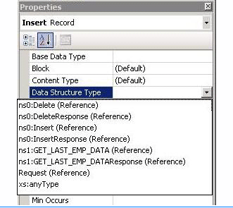

# Run composite operations on SQL Server using BizTalk Server
The [!INCLUDE[adaptersqlshort](../../includes/adaptersqlshort-md.md)] enables adapter clients to perform composite operations on the SQL Server database. A composite operation can include:  
  
- Insert, Update, and Delete operations. A Select operation is not supported as part of a composite operation.  
  
- Stored procedures executed as operations.  
  
  A single composite operation can have any number of these operations, in any order. For example, you can have two Insert operations followed by a Delete operation, and finally a stored procedure execution. Also, you can have different operations targeting different database tables or views. For more information about how the adapter supports composite operations, see [Run composite operations in SQL Server using the SQL adapter](../../adapters-and-accelerators/adapter-sql/run-composite-operations-in-sql-server-using-the-sql-adapter.md). For information about the structure of the SOAP message for composite operations, see [Message Schemas for Composite Operations](../../adapters-and-accelerators/adapter-sql/message-schemas-for-composite-operations.md).  
  
> [!NOTE]
>  If you are performing operation on tables that have columns of user-defined types, make sure you refer to [Operations on Tables and Views with User-Defined Types using the SQL adapter](../../adapters-and-accelerators/adapter-sql/operations-on-tables-and-views-with-user-defined-types-using-the-sql-adapter.md) before you start developing your application.  
  
## How to Perform Composite Operations on SQL Server  
 Performing an operation on SQL Server using the [!INCLUDE[adaptersqlshort](../../includes/adaptersqlshort-md.md)] with [!INCLUDE[btsBizTalkServerNoVersion](../../includes/btsbiztalkservernoversion-md.md)] involves procedural tasks described in [Building blocks to develop BizTalk applications with the SQL adapter](../../adapters-and-accelerators/adapter-sql/building-blocks-to-develop-biztalk-applications-with-the-sql-adapter.md). To perform composite operations on the SQL Server database, these tasks are:  
  
1. Create a BizTalk project, and generate schema for all the operations you want to invoke.  
  
2. Manually create a schema file that includes references to all the schemas you generated in the previous step.  
  
3. Create messages in the BizTalk project for sending and receiving messages from the SQL Server database. These messages must conform to the request and response schema you created in the previous step.  
  
4. Create an orchestration to invoke the composite operation on the SQL Server database.  
  
5. Build and deploy the BizTalk project.  
  
6. Configure the BizTalk application by creating physical send and receive ports.  
  
7. Start the BizTalk application.  
  
   This topic provides instructions on how to perform these tasks.  
  
## Sample Based on This Topic  
 A sample, CompositeOperations, based on this topic is provided with the [!INCLUDE[adapterpacknoversion](../../includes/adapterpacknoversion-md.md)]. For more information, see [Samples for the SQL adapter](../../adapters-and-accelerators/adapter-sql/samples-for-the-sql-adapter.md).  
  
## Generating Schema  
 In this topic, to demonstrate how to perform composite operations, the following tasks will be performed in the order specified:  
  
- Insert record into the EMPLOYEE table.  
  
- Retrieve all the columns for the last inserted record by invoking the GET_LAST_EMP_DATA stored procedure.  
  
- Delete the record from the EMPLOYEE table.  
  
  Run the scripts provided with the samples to create the EMPLOYEE table. For more information about the samples, see [Schema Samples](../../adapters-and-accelerators/accelerator-rosettanet/schema-samples.md).  
  
  You must create a BizTalk project and use the [!INCLUDE[consumeadapterservshort](../../includes/consumeadapterservshort-md.md)] to generate the schema for these operations. See [Retrieving Metadata for SQL Server Operations in Visual Studio using the SQL adapter](../../adapters-and-accelerators/adapter-sql/get-metadata-for-sql-server-operations-in-visual-studio-using-the-sql-adapter.md) for more information about how to generate schemas.  
  
## Creating a Composite Schema Definition  
 You must now create a composite schema that references the schemas you created for the individual operations. Perform the following steps to create a composite schema definition.  
  
#### To add a composite schema definition  
  
1. Add a schema file to the BizTalk project. Right-click the project name, point to **Add**, and then click **New Item**. In the **Add New Item** dialog box, from the **Categories** box, click **Schema Files**. From the **Templates** box, click **Schema**. Specify a name for the schema file, and then click **OK**.  
  
    For this example, specify the schema file name as `CompositeSchema.xsd`.  
  
2. Add references to the schema generated for the different operations that you want to perform. In this example, the different schemas generated for operations are:  
  
   - TableOperation.dbo.Employee.xsd, for Insert and Delete operations.  
  
   - Procedure.dbo.xsd, for the GET_LAST_EMP_DATA stored procedure.  
  
     To add references:  
  
   1.  Right-click the root **\<Schema\>** node in the CompositeSchema.xsd, and click **Properties**.  
  
   2.  In the **Property** box, click the ellipsis button **(…)** against the **Imports** property.  
  
          
  
   3.  In the **Imports** dialog box, from the **Import new schema as** list, select **XSD Import**, and then click **Add**.  
  
   4.  In the **BizTalk Type Picker** dialog box, expand the BizTalk project name node, expand **Schemas**, and then select the schema you want to import. For this example, select <BizTalk_project_name>.TableOperation_dbo_Employee. Click **OK**.  
  
        Repeat this step to import <BizTalk_project_name>.Procedure_dbo too.  
  
   5.  In the **Imports** dialog box, click **OK**.  
  
3. Add two child nodes to the root schema node. One child node corresponds to the request schema for performing the composite operation. The other child node corresponds to the response schema. The node that corresponds to the request schema can have any name. The node that corresponds to the response schema must be called <request_schema_node>Response. For this example, we will call the request schema node as **Request**. So, the response schema node is called **RequestResponse**.  
  
   > [!NOTE]
   >  By default, a **Root** node is also added to a new schema file. You can rename the **Root** node to **Request**. To rename a node, right-click the node name and click **Rename**.  
  
    To add a node under the **\<Schema\>** node:  
  
   1.  Right-click the **\<Schema\>** node, point to **Insert Schema Node**, and click **Child Record**.  
  
   2.  Rename the new node to **RequestResponse**.  
  
4. Add child nodes under the **Request** node that correspond to the request schema for each operation that you will perform as part of the composite operation. For this example, you must add child nodes corresponding to the following:  
  
   -   Insert and Delete operations on the EMPLOYEE table.  
  
   -   GET_LAST_EMP_DATA stored procedure.  
  
   > [!IMPORTANT]
   >  You must add the nodes in the same order in which you want to perform the operations. For example, if you want to insert a record, then execute a stored procedure, and then delete a record you must first add a node for the Insert operation, followed by a node for the stored procedure, and finally a node for the Delete operation.  
  
    To add child nodes to the **Request** node:  
  
   1.  Right-click the **Request** node, point to **Insert Schema Node**, and then click  **Child Record**.  
  
          
  
   2.  Rename the record to correspond to a request schema for an operation that you perform as part of the composite operation. For example, rename the node to “Insert”.  
  
   3.  Map the **Insert** node to the request schema for the Insert operation on the EMPLOYEE table. To do so, right-click the **Insert** node, and click **Properties**. In the **Properties** box, from the **Data Structure Type** list, select **Insert (Reference)**.  
  
          
  
   4.  Repeat these steps to add nodes for the request schemas for GET_LAST_EMP_DATA stored procedure and the Delete operation. Specify the node names and map them to the corresponding schema as mentioned in the following table.  
  
       |Node name|Mapped to schema|  
       |---------------|----------------------|  
       |GET_LAST_EMP_DATA|GET_LAST_EMP_DATA (Reference)|  
       |Delete|Delete (Reference)|  
  
5. Add child nodes under the **RequestResponse** node that correspond to the response schema for each operation that you will perform as part of the composite operation. For this example, you must add child nodes corresponding to the following:  
  
   -   Insert and Delete operations on the EMPLOYEE table.  
  
   -   GET_LAST_EMP_DATA stored procedure.  
  
   > [!IMPORTANT]
   >  You must add the child nodes in the same order as the child nodes under the **Request** node.  
  
    To add child nodes to the **RequestResponse** node:  
  
   1.  Right-click the **RequestResponse** node, point to **Insert Schema Node**, and click **Child Record**.  
  
   2.  Rename the record to correspond to a response schema for an operation that you perform as part of the composite operation. For example, rename the node to “InsertResponse”.  
  
   3.  Map the **InsertResponse** node to the response schema for the Insert operation on the EMPLOYEE table. To do so, right-click the **InsertResponse** node, and click **Properties**. In the **Properties** box, from the **Data Structure Type** list, select **InsertResponse (Reference)**.  
  
   4.  Repeat these steps to add nodes for the response schemas for the GET_LAST_EMP_DATA stored procedure and the Delete operation. Specify the node names and map them to the corresponding schema as mentioned in the following table.  
  
       |Node name|Mapped to schema|  
       |---------------|----------------------|  
       |GET_LAST_EMP_DATAResponse|GET_LAST_EMP_DATAResponse (Reference)|  
       |DeleteResponse|DeleteResponse (Reference)|  
  
6. Save the **CompositeSchema.xsd** file.  
  
## Defining Messages and Message Types  
 The composite schema that you created in the last step describes the “types” required for the messages in an orchestration. A message is typically a variable, the type for which is defined by the corresponding schema. You must now create messages for the orchestration and link them to schema you created in the previous step.  
  
#### To create messages and link to schema  
  
1.  Add an orchestration to the BizTalk project. From Solution Explorer, right-click the BizTalk project name, point to **Add**, and then click **New Item**. Type a name for the BizTalk orchestration, and then click **Add**.  
  
2.  Open the Orchestration View window of the BizTalk project, if it is not already open. To do so, click **View**, point to **Other Windows**, and then click **Orchestration View**.  
  
3.  In Orchestration View, right-click **Messages**, and then click **New Message**.  
  
4.  Right-click the newly created message, and then select **Properties Window**.  
  
5.  In the **Properties** pane for the **Message_1**, do the following:  
  
    |Use this|To do this|  
    |--------------|----------------|  
    |Identifier|Type `Request`|  
    |Message Type|From the drop-down list, expand **Schemas**, and then select *CompositeOp.CompositeSchema.Request*, where CompositeOp is the name of your BizTalk project. CompositeSchema is the schema you created manually for the composite operations.|  
  
6.  Repeat step 2 to create a new message. In the **Properties** pane for the new message, do the following:  
  
    |Use this|To do this|  
    |--------------|----------------|  
    |Identifier|Type `Response`|  
    |Message Type|From the drop-down list, expand **Schemas**, and then select *CompositeOp.CompositeSchema.RequestResponse*.|  
  
## Setting up the Orchestration  
 You must create a BizTalk orchestration to use [!INCLUDE[btsBizTalkServerNoVersion](../../includes/btsbiztalkservernoversion-md.md)] for performing composite operations on SQL Server. In this orchestration, you drop a request message at a defined receive location. The request message must conform to the composite schema you created earlier. The [!INCLUDE[adaptersqlshort](../../includes/adaptersqlshort-md.md)] consumes this message and passes it on to SQL Server. The response from SQL Server is saved to another location. You must include Send and Receive shapes to send messages to SQL Server and receive responses, respectively. A basic orchestration for performing composite operations resembles the following:  
  
   
  
### Adding Message Shapes  
 Make sure you specify the following properties for each of the message shapes. The names listed in the Shape column are the names of the message shapes as displayed in the just-mentioned orchestration.  
  
|Shape|Shape Type|Properties|  
|-----------|----------------|----------------|  
|ReceiveMessage|Receive|-   Set **Name** to *ReceiveMessage*<br />-   Set **Activate** to *True*|  
|SendMessage|Send|-   Set **Name** to *SendMessage*|  
|ReceiveResponse|Receive|-   Set **Name** to *ReceiveResponse*<br />-   Set **Activate** to *False*|  
|SendResponse|Send|-   Set **Name** to *SendResponse*|  
  
### Adding Ports  
 Make sure you specify the following properties for each of the logical ports. The names listed in the Port column are the names of the ports as displayed in the orchestration.  
  
|Port|Properties|  
|----------|----------------|  
|MessageIn|-   Set **Identifier** to *MessageIn*<br />-   Set **Type** to *MessageInType*<br />-   Set **Communication Pattern** to *One-Way*<br />-   Set **Communication Direction** to *Receive*|  
|LOBPort|-   Set **Identifier** to *LOBPort*<br />-   Set **Type** to *LOBPortType*<br />-   Set **Communication Pattern** to *Request-Response*<br />-   Set **Communication Direction** to *Send-Receive*|  
|ResponseOut|-   Set **Identifier** to *ResponseOut*<br />-   Set **Type** to *ResponseOutType*<br />-   Set **Communication Pattern** to *One-Way*<br />-   Set **Communication Direction** to *Send*|  
  
### Specify Messages for Action Shapes, and Connect Them to Ports  
 The following table specifies the properties and their values that you should set to specify messages for action shapes and to link the messages to the ports. The names listed in the Shape column are the names of the message shapes as displayed in the orchestration mentioned earlier.  
  
|Shape|Properties|  
|-----------|----------------|  
|ReceiveMessage|-   Set **Message** to *Request*<br />-   Set **Operation** to *MessageIn.CompositeOp.Request*|  
|SendMessage|-   Set **Message** to *Request*<br />-   Set **Operation** to *LOBPort.CompositeOp.Request*|  
|ReceiveResponse|-   Set **Message** to *Response*<br />-   Set **Operation** to *LOBPort.CompositeOp.Response*|  
|SendResponse|-   Set **Message** to *Response*<br />-   Set **Operation** to *ResponseOut.CompositeOp.Request*|  
  
 After you have specified these properties, the message shapes and ports are connected and your orchestration is complete.  
  
 You must now build the BizTalk solution and deploy it to a [!INCLUDE[btsBizTalkServerNoVersion](../../includes/btsbiztalkservernoversion-md.md)]. For more information, see [Building and Running Orchestrations](../../core/building-and-running-orchestrations.md).
  
## Configuring the BizTalk Application  
 After you have deployed the BizTalk project, the orchestration you created earlier is listed under the Orchestrations pane in the [!INCLUDE[btsBizTalkServerNoVersion](../../includes/btsbiztalkservernoversion-md.md)] Administration console. You must use the [!INCLUDE[btsBizTalkServerNoVersion](../../includes/btsbiztalkservernoversion-md.md)] Administration console to configure the application. For a walkthrough, see [Walkthrough: Deploying a Basic BizTalk Application](Walkthrough:%20Deploying%20a%20Basic%20BizTalk%20Application.md).
  
 Configuring an application involves:  
  
- Selecting a host for the application.  
  
- Mapping the ports that you created in your orchestration to physical ports in the [!INCLUDE[btsBizTalkServerNoVersion](../../includes/btsbiztalkservernoversion-md.md)] Administration console. For this orchestration you must:  
  
  - Define a location on the hard disk and a corresponding file port where you will drop a request message. The BizTalk orchestration will consume the request message and send it to the SQL Server database.  
  
  - Define a location on the hard disk and a corresponding file port where the BizTalk orchestration will drop the response message containing the response from the SQL Server database.  
  
  - Define a physical WCF-Custom or WCF-SQL send port to send messages to the SQL Server database. Because the operations that are being as part of the composite operation are executed in a single transaction, make sure the **UseAmbientTransaction** binding property is set to **True**.  
  
     You must also specify the action in the send port. The action for a composite operation is “**CompositeOperation**”. For information about how to create ports, see [Manually configure a physical port binding to the SQL adapter](../../adapters-and-accelerators/adapter-sql/manually-configure-a-physical-port-binding-to-the-sql-adapter.md). For more information about how to specify actions for ports, see [Configure the SOAP action for the SQL adapter](../../adapters-and-accelerators/adapter-sql/configure-the-soap-action-for-the-sql-adapter.md).
  
    > [!NOTE]
    >  Generating the schema using the [!INCLUDE[consumeadapterservlong](../../includes/consumeadapterservlong-md.md)] also creates a binding file that contains information about the ports and the actions to be set for those ports. You can import this binding file from the [!INCLUDE[btsBizTalkServerNoVersion](../../includes/btsbiztalkservernoversion-md.md)] Administration console to create send ports (for outbound calls) or receive ports (for inbound calls). For more information, see [Configure a physical port binding using a port binding file to use the SQL adapter](../../adapters-and-accelerators/adapter-sql/configure-a-physical-port-binding-using-a-port-binding-file-to-sql-adapter.md). If you import this binding file, the action on the WCF-Custom or WCF-SQL send port is set to a dynamic action involving all the operations you selected in the [!INCLUDE[consumeadapterservshort](../../includes/consumeadapterservshort-md.md)] while generating the schema. For a composite operation, you must replace the dynamic action with “CompositeOperation”.  
  
## Starting the Application  
 You must start the BizTalk application for performing composite operations on the SQL Server database. For instructions on starting a BizTalk application, see [How to Start an Orchestration](../../core/how-to-start-an-orchestration.md).
  
 At this stage, make sure:  
  
-   The FILE receive port to receive request messages for the orchestration is running.  
  
-   The FILE send port to receive the response messages from the orchestration is running.  
  
-   The WCF-Custom or WCF-SQL send port to send messages to the SQL Server database is running.  
  
-   The BizTalk orchestration for the operation is running.  
  
## Executing the Operation  
 After you run the application, you must drop a request message to the FILE receive location. The schema for the request message must conform to the schema for the composite operations you created earlier. For example, a request message that inserts a record in the EMPLOYEE table, invokes the GET_LAST_EMP_DATA stored procedure, and deletes a record from the EMPLOYEE table is:  
  
```  
<Request xmlns="http://CompositeTest.CompositeSchema">  
  <Insert xmlns="http://schemas.microsoft.com/Sql/2008/05/TableOp/dbo/Employee">  
    <Rows>  
      <Employee xmlns="http://schemas.microsoft.com/Sql/2008/05/Types/Tables/dbo">  
        <Name>John</Name>  
        <Designation>Manager</Designation>  
        <Salary>100000</Salary>  
      </Employee>  
    </Rows>  
  </Insert>  
  <GET_LAST_EMP_DATA xmlns="http://schemas.microsoft.com/Sql/2008/05/Procedures/dbo" />  
  <Delete xmlns="http://schemas.microsoft.com/Sql/2008/05/TableOp/dbo/Employee">  
    <Rows>  
      <Employee xmlns="http://schemas.microsoft.com/Sql/2008/05/Types/Tables/dbo">  
        <Name>John</Name>  
      </Employee>  
    </Rows>  
  </Delete>  
</Request>  
```  
  
 See [Message Schemas for Composite Operations](../../adapters-and-accelerators/adapter-sql/message-schemas-for-composite-operations.md) for more information about the request message schema for performing composite operations on the SQL Server database using the [!INCLUDE[adaptersqlshort](../../includes/adaptersqlshort-md.md)].  
  
 The orchestration consumes the message and sends it to the SQL Server database. The response from the SQL Server database is saved at the other FILE location defined as part of the orchestration. For example, the response from the SQL Server database for the preceding request message is:  
  
```  
<?xml version="1.0" encoding="utf-8" ?>   
<RequestResponse xmlns="http://CompositeTest.CompositeSchema">  
  <InsertResponse xmlns="http://schemas.microsoft.com/Sql/2008/05/TableOp/dbo/Employee">  
    <InsertResult>  
      <long xmlns="http://schemas.microsoft.com/2003/10/Serialization/Arrays">10080</long>   
    </InsertResult>  
  </InsertResponse>  
  <GET_LAST_EMP_DATAResponse xmlns="http://schemas.microsoft.com/Sql/2008/05/Procedures/dbo">  
    <GET_LAST_EMP_DATAResult>  
      <DataSet xmlns="http://schemas.datacontract.org/2004/07/System.Data">  
        <xs:schema id="NewDataSet" xmlns:xs="http://www.w3.org/2001/XMLSchema" xmlns:msdata="urn:schemas-microsoft-com:xml-msdata">  
          <xs:element msdata:IsDataSet="true" name="NewDataSet">  
            <xs:complexType>  
              <xs:sequence>  
                <xs:element minOccurs="0" maxOccurs="unbounded" name="NewTable">  
                  <xs:complexType>  
                    <xs:sequence>  
                      <xs:element minOccurs="0" name="Employee_ID" type="xs:int" />   
                      <xs:element minOccurs="0" name="Name" type="xs:string" />   
                      <xs:element minOccurs="0" name="DOJ" type="xs:dateTime" />   
                      <xs:element minOccurs="0" name="Designation" type="xs:string" />   
                      <xs:element minOccurs="0" name="Job_Description" type="xs:string" />   
                      <xs:element minOccurs="0" name="Photo" type="xs:base64Binary" />   
                      <xs:element minOccurs="0" name="Rating" type="xs:string" />   
                      <xs:element minOccurs="0" name="Salary" type="xs:decimal" />   
                      <xs:element minOccurs="0" name="Last_Modified" type="xs:base64Binary" />   
                    </xs:sequence>  
                  </xs:complexType>  
                </xs:element>  
              </xs:sequence>  
            </xs:complexType>  
          </xs:element>  
        </xs:schema>  
        <diffgr:diffgram xmlns:diffgr="urn:schemas-microsoft-com:xml-diffgram-v1">  
          <NewDataSet xmlns="">  
            <NewTable>  
              <Employee_ID>10080</Employee_ID>   
              <Name>John</Name>   
              <Designation>Manager</Designation>   
              <Salary>100000.00</Salary>   
              <Last_Modified>AAAAAAAAF40=</Last_Modified>   
            </NewTable>  
          </NewDataSet>  
        </diffgr:diffgram>  
      </DataSet>  
    </GET_LAST_EMP_DATAResult>  
    <ReturnValue>0</ReturnValue>   
  </GET_LAST_EMP_DATAResponse>  
  <DeleteResponse xmlns="http://schemas.microsoft.com/Sql/2008/05/TableOp/dbo/Employee">  
    <DeleteResult>1</DeleteResult>   
  </DeleteResponse>  
</RequestResponse>  
```  
  
 The preceding response contains multiple result sets corresponding the different operations performed as part of the composite operation. For example, the `InsertResult` element contains 10080, which is the unique identifier for the newly added record.  
  
## Best Practices  
 After you have deployed and configured the BizTalk project, you can export configuration settings to an XML file called the binding file. Once you generate a binding file, you can import the configuration settings from the file, so that you do not need to create items such as send ports and receive ports for the same orchestration. For more information about binding files, see [Reuse adapter bindings](../../adapters-and-accelerators/adapter-sql/reuse-sql-adapter-bindings.md).
  
## See Also  
[Develop BizTalk applications using the SQL adapter](../../adapters-and-accelerators/adapter-sql/develop-biztalk-applications-using-the-sql-adapter.md)