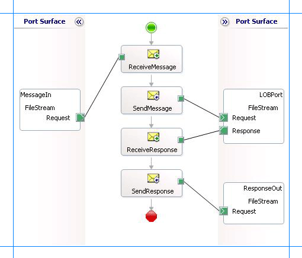

# Run operations on tables and views with large data types using the SQL adapter
The [!INCLUDE[adaptersqlshort](../../includes/adaptersqlshort-md.md)] enables adapter clients to read and update data in columns of large data types, that is, varchar(max), nvarchar(max), or varbinary(max). To read data from such columns, adapter clients can use the Select operation. To insert or update data into such columns, the adapter exposes a Set<column_name> operation, where <column_name> is the name of the column of type varchar(max), nvarchar(max), or varbinary(max).  
  
 Additionally, in SQL Server 2008, you can have the varbinay(max) column store unstructured data such as text documents and images. Such unstructured data is called FILESTREAM data. FILESTREAM data can be stored as files on the file system. The [!INCLUDE[adaptersqlshort](../../includes/adaptersqlshort-md.md)] enables the client to enter FILESTREAM data into columns of type varbinary(max). For more information about FILESTREAM storage, see [FILESTREAM Overview](https://msdn.microsoft.com/library/bb933993(SQL.100).aspx).  
  
 This topic provides information about certain tasks you must perform on the computer running SQL Server and the computer running the adapter client to be able to insert or update FILESTREAM data. This topic also provides instructions on performing Set<column_name> operations to insert FILESTREAM data.  
  
> [!NOTE]
>  If you are performing operation on tables that have columns of user-defined types, make sure you refer to [Operations on Tables and Views with User-Defined Types using the SQL adapter](../../adapters-and-accelerators/adapter-sql/operations-on-tables-and-views-with-user-defined-types-using-the-sql-adapter.md) before you start developing your application.  
  
## Prerequisites  
 You must perform the following tasks on the computer running SQL Server and the computer running the adapter client.  

  
- **On the computer running SQL Server**  
  
  -   You must enable FILESTREAM on the SQL Server instance. For more information, see [http://go.microsoft.com/fwlink/?LinkId=122486](http://go.microsoft.com/fwlink/?LinkId=122486).  
  
  -   You must create a FILESTREAM-enabled database. For more information, see [http://go.microsoft.com/fwlink/?LinkId=122487](http://go.microsoft.com/fwlink/?LinkId=122487).  
  
  -   You must have a table for storing FILESTREAM data. For more information, see [http://go.microsoft.com/fwlink/?LinkId=122488](http://go.microsoft.com/fwlink/?LinkId=122488).  
  
  -   You must configure MSDTC on the computer hosting the SQL Server database. For instruction on how to configure MSDTC, see [Configure MSDTC on SQL Server and adapter client](../../adapters-and-accelerators/adapter-sql/configure-msdtc-on-sql-server-and-adapter-client.md).  
  
- **On the computer running the adapter client**  
  
  -   You must have the SQL Client Connectivity SDK installed. You can install the SQL Client Connectivity SDK by running the SQL Server 2008 setup and selecting **SQL Client Connectivity SDK** in the **Feature Selection** page of the wizard. The adapter uses the sqlncli10.dll, installed with the SQL Client Connectivity SDK, to perform FILESTREAM operations.  
  
  -   You must configure MSDTC on the computer running the adapter client. For instruction on how to configure MSDTC, see [Configure MSDTC on SQL Server and adapter client](../../adapters-and-accelerators/adapter-sql/configure-msdtc-on-sql-server-and-adapter-client.md).  
  
  After you have completed these tasks, you are all set to insert or update FILESTREAM data in SQL Server 2008 database tables.  
  
## How This Topic Demonstrates Operations on Large Data Types  
 To demonstrate how to perform Set<column_name> operations on tables with large data types, take a table, Records, that has columns Id and Document. The Id column is of type uniqueidentifier and takes a GUID. The Document column is of type VARBINARY(MAX). Assume that the Id column already has a GUID ‘`438B7B4C-5491-409F-BCC1-78817C399EC3`’. To update the Document column, the adapter exposes the SetDocument operation.  
  
> [!NOTE]
>  For SQL Server 2008, to demonstrate FILESTREAM operations, assume that the Document column can store FILESTREAM data.  
  
## How to Perform Operations on a SQL Server Database  
 Performing an operation on a SQL Server database by using [!INCLUDE[adaptersqlshort](../../includes/adaptersqlshort-md.md)] with [!INCLUDE[btsBizTalkServerNoVersion](../../includes/btsbiztalkservernoversion-md.md)] involves procedural tasks described in [Building blocks to develop BizTalk applications with the SQL adapter](../../adapters-and-accelerators/adapter-sql/building-blocks-to-develop-biztalk-applications-with-the-sql-adapter.md). To perform operations on tables with large data types, these tasks are:  
  
1. Create a BizTalk project, and generate schema for the Set<column_name> operation. For this topic, generate schema for the **SetDocument** operation for the **Records** table.  
  
2. Create messages in the BizTalk project for sending and receiving messages from the SQL Server database.  
  
3. Create an orchestration to invoke the SetDocument operation on the Records table.  
  
4. Build and deploy the BizTalk project.  
  
5. Configure the BizTalk application by creating physical send and receive ports.  
  
6. Start the BizTalk application.  
  
   This topic provides instructions to perform these tasks.  
  
## Sample Based on This Topic  
 A sample, FILESTREAMOperation, based on this topic is provided with the [!INCLUDE[adapterpacknoversion](../../includes/adapterpacknoversion-md.md)]. For more information, see [Samples for the SQL adapter](../../adapters-and-accelerators/adapter-sql/samples-for-the-sql-adapter.md).  
  
## Generating Schema  
 To demonstrate how to update values in columns of large data types, generate schema for the SetDocument operation of the Records table. You must create a BizTalk project and use the [!INCLUDE[consumeadapterservshort](../../includes/consumeadapterservshort-md.md)] to generate the schema. See [Retrieving Metadata for SQL Server Operations in Visual Studio using the SQL adapter](../../adapters-and-accelerators/adapter-sql/get-metadata-for-sql-server-operations-in-visual-studio-using-the-sql-adapter.md) for more information about how to generate schema.  
  
## Defining Messages and Message Types  
 The schema that you generated earlier describes the “types” required for the messages in the orchestration. A message is typically a variable, the type for which is defined by the corresponding schema. You must now create messages for the orchestration and link them to schemas you generated in the previous step.  
  
#### To create messages and link to schema  
  
1.  Add an orchestration to the BizTalk project. From Solution Explorer, right-click the BizTalk project name, point to **Add**, and then click **New Item**. Type a name for the BizTalk orchestration, and then click **Add**.  
  
2.  Open the Orchestration View window of the BizTalk project, if it is not already open. To do so, click **View**, point to **Other Windows**, and then click **Orchestration View**.  
  
3.  In Orchestration View, right-click **Messages**, and then click **New Message**.  
  
4.  Right-click the newly created message, and then select **Properties Window**.  
  
5.  In the **Properties** pane for the **Message_1**, do the following:  
  
    |Use this|To do this|  
    |--------------|----------------|  
    |Identifier|Type `Request`|  
    |Message Type|From the drop-down list, expand **Schemas**, and then select *SetOperation.TableOperation_dbo_Records.SetDocument*, where SetOperation is the name of your BizTalk project. TableOperation_dbo_Records is the schema generated for the SetDocument operation on the Records table.|  
  
6.  Repeat step 2 to create a new message. In the **Properties** pane for the new message, do the following:  
  
    |Use this|To do this|  
    |--------------|----------------|  
    |Identifier|Type `Response`|  
    |Message Type|From the drop-down list, expand **Schemas**, and then select *SetOperation.TableOperation_dbo_Records.SetDocumentResponse*.|  
  
## Setting up the Orchestration  
 You must create a BizTalk orchestration to use [!INCLUDE[btsBizTalkServerNoVersion](../../includes/btsbiztalkservernoversion-md.md)] for performing an operation on SQL Server. In this orchestration, you drop a request message at a defined receive location. The [!INCLUDE[adaptersqlshort](../../includes/adaptersqlshort-md.md)] consumes this message and passes it on to SQL Server. The response from SQL Server is saved to another location. You must include Send and Receive shapes to send messages to SQL Server and to receive responses, respectively. A sample orchestration for the SetDocument operation resembles the following:  
  
   
  
### Adding Message Shapes  
 Make sure you specify the following properties for each of the message shapes. The names listed in the Shape column are the names of the message shapes as displayed in the just-mentioned orchestration.  
  
|Shape|Shape Type|Properties|  
|-----------|----------------|----------------|  
|ReceiveMessage|Receive|-   Set **Name** to *ReceiveMessage*<br />-   Set **Activate** to *True*|  
|SendMessage|Send|-   Set **Name** to *SendMessage*|  
|ReceiveResponse|Receive|-   Set **Name** to *ReceiveResponse*<br />-   Set **Activate** to *False*|  
|SendResponse|Send|-   Set **Name** to *SendResponse*|  
  
### Adding Ports  
 Make sure you specify the following properties for each of the logical ports. The names listed in the Port column are the names of the ports as displayed in the orchestration.  
  
|Port|Properties|  
|----------|----------------|  
|MessageIn|-   Set **Identifier** to *MessageIn*<br />-   Set **Type** to *MessageInType*<br />-   Set **Communication Pattern** to *One-Way*<br />-   Set **Communication Direction** to *Receive*|  
|LOBPort|-   Set **Identifier** to *LOBPort*<br />-   Set **Type** to *LOBPortType*<br />-   Set **Communication Pattern** to *Request-Response*<br />-   Set **Communication Direction** to *Send-Receive*|  
|ResponseOut|-   Set **Identifier** to *ResponseOut*<br />-   Set **Type** to *ResponseOutType*<br />-   Set **Communication Pattern** to *One-Way*<br />-   Set **Communication Direction** to *Send*|  
  
### Specify Messages for Action Shapes, and Connect Them to Ports  
 The following table specifies the properties and their values that you should set to specify messages for action shapes and to link the messages to the ports. The names listed in the Shape column are the names of the message shapes as displayed in the orchestration mentioned earlier.  
  
|Shape|Properties|  
|-----------|----------------|  
|ReceiveMessage|-   Set **Message** to *Request*<br />-   Set **Operation** to *MessageIn.FileStream.Request*|  
|SendMessage|-   Set **Message** to *Request*<br />-   Set **Operation** to *LOBPort.FileStream.Request*|  
|ReceiveResponse|-   Set **Message** to *Response*<br />-   Set **Operation** to *LOBPort.FileStream.Response*|  
|SendResponse|-   Set **Message** to *Response*<br />-   Set **Operation** to *ResponseOut.FileStream.Request*|  
  
 After you have specified these properties, the message shapes and ports are connected, and your orchestration is complete.  
  
 You must now build the BizTalk solution and deploy it to BizTalk Server. For more information, see [Building and Running Orchestrations](../../core/building-and-running-orchestrations.md).
  
## Configuring the BizTalk Application  
 After you have deployed the BizTalk project, the orchestration you created earlier is listed under the Orchestrations pane in the [!INCLUDE[btsBizTalkServerNoVersion](../../includes/btsbiztalkservernoversion-md.md)] Administration console. You must use the [!INCLUDE[btsBizTalkServerNoVersion](../../includes/btsbiztalkservernoversion-md.md)] Administration console to configure the application. For a walkthrough, see [Walkthrough: Deploying a Basic BizTalk Application](Walkthrough:%20Deploying%20a%20Basic%20BizTalk%20Application.md).
  
 Configuring an application involves:  
  
- Selecting a host for the application.  
  
- Mapping the ports that you created in your orchestration to physical ports in the [!INCLUDE[btsBizTalkServerNoVersion](../../includes/btsbiztalkservernoversion-md.md)] Administration console. For this orchestration you must:  
  
  - Define a location on the hard disk and a corresponding file port where you will drop a request message. The BizTalk orchestration will consume the request message and send it to the SQL Server database.  
  
  - Define a location on the hard disk and a corresponding file port where the BizTalk orchestration will drop the response message containing the response from the SQL Server database.  
  
  - Define a physical WCF-Custom or WCF-SQL send port to send messages to the SQL Server database. You must also specify the action in the send port. For information about how to create ports, see [Manually configure a physical port binding to the SQL adapter](../../adapters-and-accelerators/adapter-sql/manually-configure-a-physical-port-binding-to-the-sql-adapter.md).
  
    > [!IMPORTANT]
    >  The operation to enter FILESTREAM data must be performed within a transaction. So, make sure the **UseAmbientTransaction** binding property is set to **True** on the WCF-Custom or WCF-SQL send port. For more information about the binding property, see [Read about the BizTalk Adapter for SQL Server adapter Binding Properties](../../adapters-and-accelerators/adapter-sql/read-about-the-biztalk-adapter-for-sql-server-adapter-binding-properties.md).  
    > 
    > [!IMPORTANT]
    >  For performing an operation to insert FILESTREAM data you must always use Windows Authentication to connect to SQL Server on the WCF-Custom or WCF-SQL send port. So, in the **Credentials** tab in the port properties dialog box, select the **Do not use single Sign-On** option, and leave the user name and password blank.  
    > 
    > [!NOTE]
    >  Generating the schema using the [!INCLUDE[consumeadapterservlong](../../includes/consumeadapterservlong-md.md)] also creates a binding file that contains information about the ports and the actions to be set for those ports. You can import this binding file from the [!INCLUDE[btsBizTalkServerNoVersion](../../includes/btsbiztalkservernoversion-md.md)] Administration console to create send ports (for outbound calls) or receive ports (for inbound calls). For more information, see [Configure a physical port binding using a port binding file to use the SQL adapter](../../adapters-and-accelerators/adapter-sql/configure-a-physical-port-binding-using-a-port-binding-file-to-sql-adapter.md).
  
## Starting the Application  
 You must start the BizTalk application for performing the **SetDocument** operation on the **Records** table. For instructions on starting a BizTalk application, see [How to Start an Orchestration](../../core/how-to-start-an-orchestration.md).
  
 At this stage, make sure:  
  
-   The FILE receive port to receive request messages for the orchestration is running.  
  
-   The FILE send port to receive the response messages from the orchestration is running.  
  
-   The WCF-Custom or WCF-SQL send port to send messages to the SQL Server database is running.  
  
-   The BizTalk orchestration for the operation is running.  
  
## Executing the Operation  
 After you run the application, you must drop a request message to the FILE receive location. The schema for the request message must conform to the schema for the SetDocument operation that you generated earlier. For example, the request message to update the Document column is:  
  
```  
<SetDocument xmlns="http://schemas.microsoft.com/Sql/2008/05/TableOp/dbo/Records">  
  <Filter>WHERE Id='438B7B4C-5491-409F-BCC1-78817C399EC3'</Filter>  
  <Data>UwBlAHQAdgBfAHYAYQByAGIAaQBuAGEAcgB5AE0AQQBYAA==</Data>  
</SetDocument>  
```  
  
> [!IMPORTANT]
>  The `Filter` element must contain the WHERE clause based on which the adapter updates the records. The `Data` element must contain a base64 encoded value that you want to insert into the Document column.  
  
 This request message updates the Document column with the specified value. The orchestration consumes the message and sends it to the SQL Server database. The response from the SQL Server database is saved at the other FILE location defined as part of the orchestration. For example, the response from the SQL Server database for the preceding request message is:  
  
```  
<?xml version="1.0" encoding="utf-8" ?>   
<SetDocumentResponse xmlns="http://schemas.microsoft.com/Sql/2008/05/TableOp/dbo/Records" />  
```  
  
 The adapter sends an empty response for the **Set<column_name>** operation.  
  
## Best Practices  
 After you have deployed and configured the BizTalk project, you can export configuration settings to an XML file called the binding file. Once you generate a binding file, you can import the configuration settings from the file, so that you do not need to create items such as the send ports and receive ports for the same orchestration. For more information about binding files, see [Reuse adapter bindings](../../adapters-and-accelerators/adapter-sql/reuse-sql-adapter-bindings.md).
  
## See Also  
[Develop BizTalk applications using the SQL adapter](../../adapters-and-accelerators/adapter-sql/develop-biztalk-applications-using-the-sql-adapter.md)