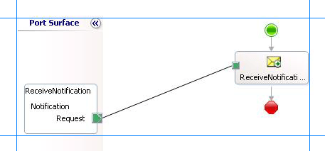

# Step 1: Add Orchestration Shapes to Receive Notification
  
  
 **Time to complete:** 5 minutes  
  
 **Objective:** In this step, you add orchestration shapes to receive notification for changes to the **Employee** table.  
  
## Prerequisites  
 You must have completed the steps in [Lesson 1: Generate Schemas and Create Messages](../../adapters-and-accelerators/adapter-sql/lesson-1-generate-schemas-and-create-messages.md).  
  
### To receive notification messages  
  
1.  Open the BizTalk orchestration, **EmployeeOrch.odx**, you added in [Step 2: Create Messages for BizTalk Orchestrations](../../adapters-and-accelerators/adapter-sql/step-2-create-messages-for-biztalk-orchestrations.md).  
  
2.  Add a **Receive** shape to the orchestration. From the orchestration Toolbox, drag the **Receive** shape to the orchestration design surface, and drop it into the space indicated between the **Begin** (green circle) and **End** (red octagon) shapes.  
  
    |Set this property|To this value|  
    |-----------------------|-------------------|  
    |**Activate**|True|  
    |**Message**|NotifyReceive|  
    |**Name**|ReceiveNotification|  
  
3.  Add a one-way receive port to the orchestration. You will use this port to receive notification messages from the SQL Server database. Set the following properties for the port.  
  
    |Set this property|To this value|  
    |-----------------------|-------------------|  
    |**Communication Direction**|Receive|  
    |**Communication Pattern**|One-Way|  
    |**Identifier**|ReceiveNotification|  
  
     Also, change the operation name from Operation_1 to **Notification**.  
  
4.  Connect the **ReceiveNotification** port to the **ReceiveNotification** action shape. In Orchestration Designer, on the design surface, drag the green arrow-shaped handle for the port to the corresponding green handle of the action shape.  
  
    > [!NOTE]
    >  In this step, you use the drag-and-drop method to connect ports to action shapes. You could instead use the operation property of an action shape to connect the action shape to a port.  
  
5.  The following figure shows the in-progress orchestration.  
  
       
  
## What did I just do?  
 In this step, you added orchestration shapes and receive port to receive notification from the SQL Server database.  
  
## Next Steps  
 You add an expression shape to the orchestration to extract the type of notification received from the SQL Server database, as described in [Step 2: Extract Notification Type from Notification Message](../../adapters-and-accelerators/adapter-sql/step-2-extract-notification-type-from-notification-message.md).  
  
## See Also  
 [Step 2: Extract Notification Type from Notification Message](../../adapters-and-accelerators/adapter-sql/step-2-extract-notification-type-from-notification-message.md)   
 [Lesson 2: Receive and Filter Notifications](../../adapters-and-accelerators/adapter-sql/lesson-2-receive-and-filter-notifications.md)