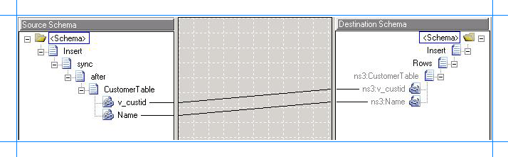
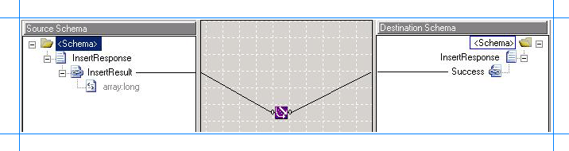

# Step 1: Modify the vPrev BizTalk Project using the SQL adapter
  
  
 **Time to complete:** 10 minutes  
  
 **Objective:** In this step, you make the following changes to the existing vPrev BizTalk project:  
  
- Generate metadata for the Insert operation on the Customer table using the WCF-based [!INCLUDE[adaptersqlshort](../../includes/adaptersqlshort-md.md)].  
  
- Map the request message for performing an Insert operation using the vPrev SQL adapter to a request message for performing an Insert operation using the WCF-based [!INCLUDE[adaptersqlshort](../../includes/adaptersqlshort-md.md)].  
  
- Map the response message received using the WCF-based [!INCLUDE[adaptersqlshort](../../includes/adaptersqlshort-md.md)] to the response message received using the vPrev SQL adapter.  
  
## Prerequisites  
 You must have a vPrev BizTalk project to perform an Insert operation on the Customer table in the SQL Server database.  
  
### To modify the vPrev BizTalk project  
  
1. Generate metadata for the Insert operation on the Customer table using the WCF-based [!INCLUDE[adaptersqlshort](../../includes/adaptersqlshort-md.md)]. You can use the [!INCLUDE[consumeadapterservlong](../../includes/consumeadapterservlong-md.md)] to generate metadata.  
  
    For instructions on how to generate metadata, see [Get Metadata for SQL Server Operations in Visual Studio using the SQL adapter](../../adapters-and-accelerators/adapter-sql/get-metadata-for-sql-server-operations-in-visual-studio-using-the-sql-adapter.md). After the schema is generated, a file with the name similar to *TableOperation.dbo.Customer.xsd* is added to the BizTalk project. This file contains the schema for sending a message to perform an Insert operation on the Customer table in the SQL Server database using the WCF-based [!INCLUDE[adaptersqlshort](../../includes/adaptersqlshort-md.md)].  
  
2. Generating the metadata for the Insert operation also creates a port binding file. In the next step, this binding file will be used to create a WCF-Custom send port to send messages to the SQL Server database. The SOAP action for the operation is also set to the operation for which you generated metadata. For example, if you generate metadata for the Insert operation, the operation name in the SOAP action on the send port will be “Insert”. However, the operation name on the logical send port that you create as part of the orchestration could be different, for example, “Operation_1”. As a result, when you send messages to the SQL Server database using the send port, you get an error. To prevent this, make sure the operation name on the logical send port in your orchestration is the same as the operation name for which you generated metadata.  
  
    So, in case of this tutorial, because you generate metadata for the Insert operation, change the name of the logical send port operation to “Insert”.  
  
3. For the request message, map the schema generated using vPrev SQL database adapter to the schema generated using the WCF-based [!INCLUDE[adaptersqlshort](../../includes/adaptersqlshort-md.md)].  
  
   1. Add a BizTalk Mapper to the BizTalk project. Right-click the BizTalk project, point to **Add**, and then click **New Item**.  
  
       In the **Add New Item** dialog box, from the left pane, select **Map Files**. From the right pane, select **Map**. Specify a name for the map, such as **RequestMap.btm**. Click **Add**.  
  
   2. From the Source Schema pane, click **Open Source Schema**.  
  
   3. In the **BizTalk Type Picker** dialog box, expand the project name, expand **Schemas**, and then select the schema for the request message for the vPrev SQL adapter. For this tutorial, select *New_Migration.InsertCustomerService*, and then click **OK**.  
  
   4. In the **Root Node for Source Schema** dialog box, select *Insert*, and then click **OK**.  
  
   5. From the Destination Schema pane, click **Open Destination Schema**.  
  
   6. In the **BizTalk Type Picker** dialog box, expand the project name, expand **Schemas**, and then select the schema for the request message for the WCF-based [!INCLUDE[adaptersqlshort](../../includes/adaptersqlshort-md.md)]. For this tutorial, select *New_Migration.TableOperation.dbo.Customer*, and then click **OK**.  
  
   7. In the **Root Node for Target Schema** dialog box, select *Insert*, and then click **OK**.  
  
   8. Map the respective elements in both the schemas as illustrated in the following figure.  
  
         
  
   9. Save the map.  
  
4. For the response message, map the schema generated using vPrev SQL adapter to the schema generated using the WCF-based [!INCLUDE[adaptersqlshort](../../includes/adaptersqlshort-md.md)].  
  
   1. Add a BizTalk Mapper to the BizTalk project. Right-click the BizTalk project, point to **Add**, and click **New Item**.  
  
       In the **Add New Item** dialog box, from the left pane, select **Map Files**. From the right pane, select **Map**. Specify a name for the map, such as **ResponseMap.btm**, and then click **Add**.  
  
   2. From the Source Schema pane, click **Open Source Schema**.  
  
   3. In the **BizTalk Type Picker** dialog box, expand the project name, expand **Schemas**, and then select the schema for the response message for the WCF-based [!INCLUDE[adaptersqlshort](../../includes/adaptersqlshort-md.md)]. For this tutorial, select *New_Migration.TableOperation.dbo.Customer*, and then click **OK**.  
  
   4. In the **Root Node for Source Schema** dialog box, select *InsertResponse*, and then click **OK**.  
  
   5. From the Destination Schema pane, click **Open Destination Schema**.  
  
   6. In the **BizTalk Type Picker** dialog box, expand the project name, expand **Schemas**, and then select the schema for the response message for the vPrev [!INCLUDE[adaptersqlshort](../../includes/adaptersqlshort-md.md)]. For this tutorial, select *New_Migration.InsertCustomerService*, and then click **OK**.  
  
   7. In the **Root Node for Target Schema** dialog box, select *InsertResponse*, and then click **OK**.  
  
   8. You will notice a few differences between the response schemas for generated by the two adapters. These differences can be explained as follows:  
  
      - Using the WCF-based [!INCLUDE[adaptersqlshort](../../includes/adaptersqlshort-md.md)], if you insert a record into a table that contains a primary key (and is also an identity field) the response for the Insert operation returns the value for the identity field for the inserted row. So, the schema for the response message conforming to the WCF-based [!INCLUDE[adaptersqlshort](../../includes/adaptersqlshort-md.md)] contains an additional *InsertResult* element. This element contains an array, which in turn contains the identity fields for the inserted rows.  
  
      - Using the vPrev [!INCLUDE[adaptersqlshort](../../includes/adaptersqlshort-md.md)], if you insert a record into a table, the adapter only returns an empty “Success” element as part of the response message.  
  
        So, the schemas are mapped in such a way that the response from the WCF-based [!INCLUDE[adaptersqlshort](../../includes/adaptersqlshort-md.md)] containing the value for the identity fields is “copied” as part of the “Success” element, which is part of the response message from the vPrev [!INCLUDE[adaptersqlshort](../../includes/adaptersqlshort-md.md)]. You can use the Mass Copy functoid to copy elements from one schema into another.  
  
        To use the Mass Copy functoid, from the **Toolbox**, drag the Mass Copy functoid and drop it on the Mapper grid. Connect the **InsertResult** element in the source schema to the functoid. Similarly, connect the **Success** element in the destination schema to the functoid. The following figure illustrates how the two elements are mapped via the functoid.  
  
          
  
      > [!NOTE]
      >  For more information about the Mass Copy functoid, see [http://go.microsoft.com/fwlink/?LinkId=119749](http://go.microsoft.com/fwlink/?LinkId=119749).  
  
   9. Save the map.  
  
5. Save and build the BizTalk solution. Right-click the solution, and then click **Build Solution**.  
  
6. Deploy the solution. Right-click the solution, and then click **Deploy Solution**.  
  
## Next Steps  
 Create a WCF-custom send port, and configure it to use the maps you created in this step, as described in [Step 2: Configure the Orchestration in BizTalk Server Administration Console using the SQL adapter](../../adapters-and-accelerators/adapter-sql/step-2-configure-the-orchestration-to-use-the-sql-adapter-in-biztalk-server.md).  
  
## See Also  
 [Tutorial 1: Migrate BizTalk Projects to the SQL adapter](../../adapters-and-accelerators/adapter-sql/tutorial-1-migrate-biztalk-projects-to-the-sql-adapter.md)