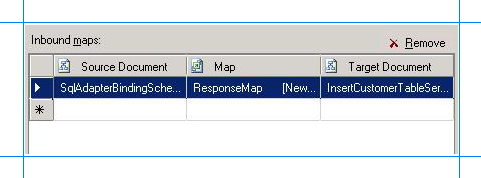
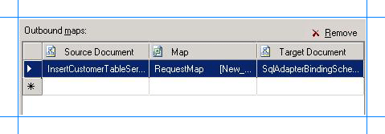

# Step 2: Configure the Orchestration in BizTalk Server Administration Console using the SQL adapter
  
  
 **Time to complete:** 10 minutes  
  
 **Objective:** In this step, you perform the following tasks:  
  
- Create a WCF-Custom send-receive port to send and receive messages from the SQL Server database using the [!INCLUDE[adaptersqlshort](../../includes/adaptersqlshort-md.md)]. Configure this port to use the maps you created in the previous step.  
  
- Configure the orchestration you deployed in the previous step to use the WCF-Custom port.  
  
## Prerequisites  
 You should have deployed the BizTalk orchestration for which you want to configure the WCF-Custom port as described in [Step 1: Modify the vPrev BizTalk Project using the SQL adapter](../../adapters-and-accelerators/adapter-sql/step-1-modify-the-vprev-biztalk-project-using-the-sql-adapter.md).  
  
### To create a WCF-Custom port  
  
1. When you generate schema for an operation on the SQL Server database using [!INCLUDE[consumeadapterservlong](../../includes/consumeadapterservlong-md.md)], a binding file is also added to the BizTalk project. You can import this binding file into your BizTalk application to create a WCF-Custom send-receive port. For instructions on importing a binding file, see [Importing Bindings](http://msdn.microsoft.com/library/48de3a04-4ce8-4ba9-91b6-7e125689fd53).  
  
2. After you import the binding file, a send port is created under the **Send Ports** folder in the [!INCLUDE[btsBizTalkServerNoVersion](../../includes/btsbiztalkservernoversion-md.md)] Administration console.  
  
3. Right-click the WCF-Custom port, and then click **Properties**.  
  
4. From the left pane of the send port properties dialog box, click the **General** tab. From the right pane, click **Configure**.  
  
5. In the **WCF-Custom Transport Properties** dialog box, click the **Credentials** tab, specify the credentials to connect to a SQL Server database, and then click **OK**.  
  
6. From the left pane of the send port properties dialog box, click **Inbound Maps**. From the right pane, click the field under the **Map** column, and from the drop-down select **ResponseMap**.  
  
      
  
7. From the left pane of the send port properties dialog box, click **Outbound Maps**. From the right pane, click the field under the **Map** column, and from the drop-down select **RequestMap**.  
  
      
  
8. Click **OK**.  
  
### To configure the BizTalk application  
  
1. In the BizTalk Server Administration console, expand **BizTalk Group**, expand **Applications**, and then expand the BizTalk Application where the orchestration is deployed.  
  
2. Right-click the BizTalk application, and then select **Configure**.  
  
3. From the left pane, click the orchestration to configure. From the right pane, from the **Host** drop-down list, select a BizTalk host instance.  
  
4. Under the **Bindings** box, map the logical ports of the BizTalk orchestration to the physical ports in the [!INCLUDE[btsBizTalkServerNoVersion](../../includes/btsbiztalkservernoversion-md.md)] Administration console.  
  
   1.  Select the file port where you will drop a request message. The BizTalk orchestration will consume the request message and send it to the SQL Server database.  
  
   2.  Select the file port where the BizTalk orchestration will drop the response message containing the response from the SQL Server database.  
  
   3.  Select the WCF-Custom send port you created earlier in this topic.  
  
   4.  Click **OK**.  
  
## Next Steps  
 You have now completed migration of your vPrev BizTalk project to a BizTalk project that sends messages to the SQL Server database using the WCF-based [!INCLUDE[adaptersqlshort](../../includes/adaptersqlshort-md.md)]. You must now test the migrated BizTalk application by sending a request message to perform an Insert operation on the SQL Server database, as described in [Step 3: Test the Migrated Application that uses the SQL adapter](../../adapters-and-accelerators/adapter-sql/step-3-test-the-migrated-application-that-uses-the-sql-adapter.md).  
  
## See Also  
 [Tutorial 1: Migrate BizTalk Projects to the SQL adapter](../../adapters-and-accelerators/adapter-sql/tutorial-1-migrate-biztalk-projects-to-the-sql-adapter.md)