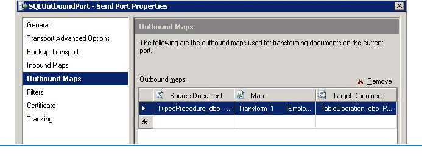

# Step 2: Configure the Ports
  
  
 **Time to complete:** 15 minutes  
  
 **Objective:** In this step, you create the physical ports in [!INCLUDE[btsBizTalkServerNoVersion](../../includes/btsbiztalkservernoversion-md.md)] Administration console. You create a physical port for each logical port you created in the orchestration. You will create the following ports:  
  
- A one-way WCF-Custom receive port to receive notification messages for changes to **Employee** table in a SQL Server database.  
  
- A request-response WCF-Custom send port to send request messages and receive response for invoking the **UPDATE_EMPLOYEE** stored procedure and for performing the Insert operation on the **Purchase_Order** table. In the orchestration, you used the same send port to perform both the operations. Similarly, in the [!INCLUDE[btsBizTalkServerNoVersion](../../includes/btsbiztalkservernoversion-md.md)] Administration console, you will use a single send port for both operations.  
  
- A one-way send port to send the response for the Insert operation. In this tutorial, because you need to inform the Purchases department through an e-mail, you create this send port as an SMTP port.  
  
## Prerequisites  
 You must have completed [Step 1: Deploy the Orchestration](../../adapters-and-accelerators/adapter-sql/step-1-deploy-the-orchestration.md)).  
  
### To create a physical one-way receive port  
  
1. Start the [!INCLUDE[btsBizTalkServerNoVersion](../../includes/btsbiztalkservernoversion-md.md)] Administration console.  
  
2. In the console tree on the left hand side, expand **BizTalk Server Administration**, right-click **BizTalk Group**, and then click **Refresh**.  
  
3. Expand **BizTalk Group**, expand **Applications**, and expand **SampleApplication**. For this tutorial, you create all the ports and application within the SampleApplication application.  
  
4. Follow the instructions under the “Deploying Adapters for Receiving Messages from SQL Server” section of [Configure a port using the WCF-custom adapter and SQL adapter](../../adapters-and-accelerators/adapter-sql/configure-a-port-using-the-wcf-custom-adapter-and-sql-adapter.md). Name the port as **NotifyReceivePort**.  
  
5. Make sure you set the following binding properties to configure the adapter to receive notifications for changes to the **Employee** table.  
  
   |Binding property|Value|  
   |----------------------|-----------|  
   |**InboundOperationType**|Set this to **Notification**.|  
   |**NotificationStatement**|Set this to:<br /><br /> `SELECT Employee_ID, Name FROM dbo.Employee WHERE Status=0`<br /><br /> **Note:** You must specifically specify the column names in the statement as shown in this Select statement. Also, you must always specify the table name along with the schema name, for example, `dbo.Employee`.|  
   |**NotifyOnListenerStart**|Set this to **True**.|  
  
    For more information about the different binding properties, see [Read about the BizTalk Adapter for SQL Server adapter binding properties](../../adapters-and-accelerators/adapter-sql/read-about-the-biztalk-adapter-for-sql-server-adapter-binding-properties.md).  
  
### To create a request-response send port for two operations  
  
1. Follow the instructions under the “Deploying Adapters for Sending Messages to SQL Server” section of [Configure a port using the WCF-custom adapter and SQL adapter](../../adapters-and-accelerators/adapter-sql/configure-a-port-using-the-wcf-custom-adapter-and-sql-adapter.md). Name the port as **SQLOutboundPort**.  
  
2. Because you are performing two operations using the same send port, you must use dynamic action mapping to specify the action for the operation. While configuring the port, in the **Action** box, specify the action mapping in the following manner:  
  
   ```  
   <BtsActionMapping xmlns:xsi="http://www.w3.org/2001/XMLSchema-instance" xmlns:xsd="http://www.w3.org/2001/XMLSchema">  
     <Operation Name="UpdateEmp" Action="TypedProcedure/dbo/UPDATE_EMPLOYEE" />  
     <Operation Name="InsertPO" Action="TableOp/Insert/dbo/Purchase_Order" />  
   </BtsActionMapping>  
   ```  
  
    Note that in the orchestration, you created two operations for the request-response send port: **UpdateEmp** and **InsertPO**. So, in the physical port configuration you provide the same operation names in the dynamic action mapping. In the above excerpt, the action for **UpdateEmp** operation is `TypedProcedure/dbo/UPDATE_EMPLOYEE`. Similarly, the action for **InsertPO** operation is `TableOp/Insert/dbo/Purchase_Order`.  
  
3. You must also configure the send port to use the Mapper you created in the orchestration to map the response message of **UPDATE_EMPLOYEE** stored procedure to the request message for the Insert operation on **Purchase_Order** table. To do so:  
  
   1. Right-click the SQLOutboundPort in [!INCLUDE[btsBizTalkServerNoVersion](../../includes/btsbiztalkservernoversion-md.md)] Administration console, and then click **Properties**.  
  
   2. From the **SQLOutboundPort – Send Port Properties** dialog box, from the left pane, click **Outbound Maps**.  
  
   3. From the right-pane, in the **Outbound Maps** box, click the cell under the **Map** column, and from the drop-down list, select **Transform_1**. This is the name of the map you created in the BizTalk orchestration in [!INCLUDE[btsVStudioNoVersion](../../includes/btsvstudionoversion-md.md)].  
  
       Click **OK**.  
  
         
  
### To create an SMTP send port  
  
1. Follow the instructions under the “How to Configure an SMTP Send Port with the [!INCLUDE[btsBizTalkServerNoVersion](../../includes/btsbiztalkservernoversion-md.md)] Administration Console” section at [http://go.microsoft.com/fwlink/?LinkId=141549](http://go.microsoft.com/fwlink/?LinkId=141549). Name the port as **EmailResponse**.  
  
2. As part of the port configuration, specify the e-mail address for the Purchases department for the **To** property.  
  
## What did I just do?  
 In this step you created a WCF-Custom receive port for receiving notifications from SQL Server, WCF-Custom send port for performing operations on SQL Server, and an SMTP port for sending the response from SQL Server as an e-mail to the Purchases department.  
  
## Next Steps  
 You configure and start the BizTalk application, as described in [Step 3: Configure and Start the Application](../../adapters-and-accelerators/adapter-sql/step-3-configure-and-start-the-application.md).  
  
## See Also  
 [Step 1: Deploy the Orchestration](../../adapters-and-accelerators/adapter-sql/step-1-deploy-the-orchestration.md)   
 [Step 3: Configure and Start the Application](../../adapters-and-accelerators/adapter-sql/step-3-configure-and-start-the-application.md)   
 [Lesson 5: Deploy the Solution](../../adapters-and-accelerators/adapter-sql/lesson-5-deploy-the-solution.md)