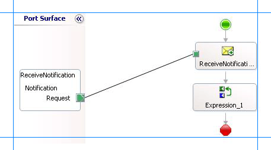

# Step 2: Extract Notification Type from Notification Message
  
  
 **Time to complete:** 5 minutes  
  
 **Objective:** In this step, you add an expression shape to extract the type of notification received from the SQL Server database.  
  
## Prerequisites  
 You must have completed [Step 1: Add Orchestration Shapes to Receive Notification](../../adapters-and-accelerators/adapter-sql/step-1-add-orchestration-shapes-to-receive-notification.md).  
  
### To extract the notification type from the notification message  
  
1.  Add a variable to the BizTalk orchestration you created in [Step 1: Add Orchestration Shapes to Receive Notification](../../adapters-and-accelerators/adapter-sql/step-1-add-orchestration-shapes-to-receive-notification.md).  
  
    1.  From the Orchestration View, right-click **Variables**, and then click **New Variable**.  
  
    2.  Right-click the new variable, **Variable_1**, and click **Properties Window**. Set the following properties for the variable.  
  
        |Set this property|To this value|  
        |-----------------------|-------------------|  
        |**Identifier**|NotificationType|  
        |**Type**|System.String|  
  
2.  Add an **Expression** shape to the BizTalk orchestration. From the orchestration Toolbox, drag the **Expression** shape to the orchestration design surface, and drop it after the **Receive** shape  
  
     Within the **Expression** shape, you will add an xpath query to extract the type of notification message received from SQL Server. Before creating an xpath query, let us look at the format of a notification message. A typical notification message resembles the following:  
  
    ```  
    <Notification xmlns="http://schemas.microsoft.com/Sql/2008/05/Notification/">  
      <Info>Insert</Info>   
      <Source>Data</Source>   
      <Type>Change</Type>   
    </Notification>  
    ```  
  
3.  As you see, the information about the type of the notification is available within the `<info>` tag, within the parent `<Notification>` tag. So, add the following xpath query within the **Expression** shape:  
  
    ```  
    NotificationType = xpath(NotifyReceive,"string(/*[local-name()='Notification']/*[local-name()='Info']/text())");  
    ```  
  
     Here, **NotificationType** is the variable you created to store the value extracted by the xpath query. **NotifyReceive** is the message you created in [Step 2: Create Messages for BizTalk Orchestrations](../../adapters-and-accelerators/adapter-sql/step-2-create-messages-for-biztalk-orchestrations.md) to receive notification messages.  
  
4.  The following figure shows the in-progress orchestration with the **Expression** shape included.  
  
       
  
## What did I just do?  
 In this step, you added an **Expression** shape to extract the kind of notification received from the SQL Server database.  
  
## Next Steps  
 You add a Decide shape to filter for Insert notifications, as described in [Step 3: Add a Filter for Insert Notifications](../../adapters-and-accelerators/adapter-sql/step-3-add-a-filter-for-insert-notifications.md).  
  
## See Also  
 [Step 1: Add Orchestration Shapes to Receive Notification](../../adapters-and-accelerators/adapter-sql/step-1-add-orchestration-shapes-to-receive-notification.md)   
 [Step 3: Add a Filter for Insert Notifications](../../adapters-and-accelerators/adapter-sql/step-3-add-a-filter-for-insert-notifications.md)   
 [Lesson 2: Receive and Filter Notifications](../../adapters-and-accelerators/adapter-sql/lesson-2-receive-and-filter-notifications.md)
