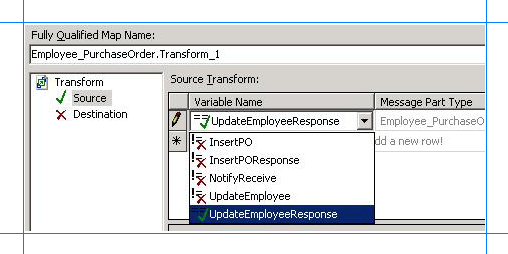
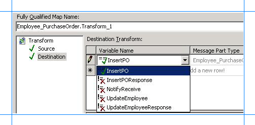
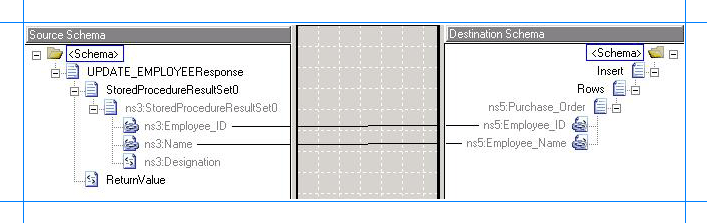
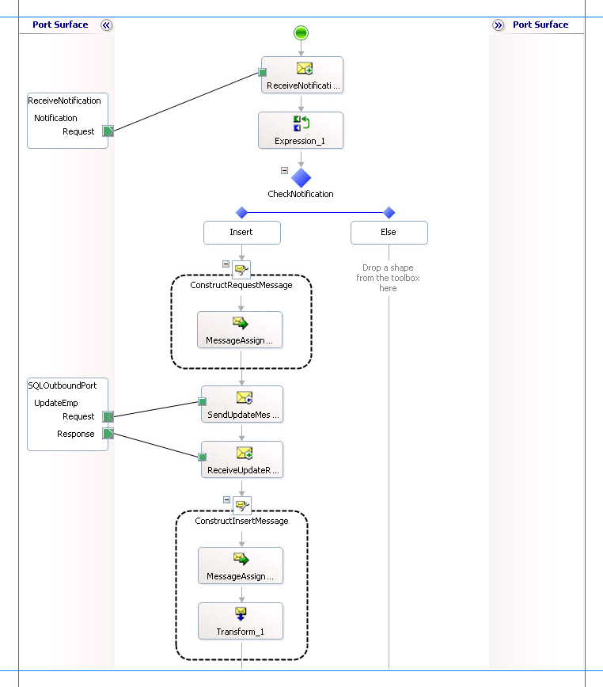

# Step 2: Map the UPDATE_EMPLOYEE Response Message to Insert Operation Request Message
  

 **Time to complete:** 10 minutes  

 **Objective:** In this step, you create the request message to perform an Insert operation on the **Purchase_Order** table and then map the response message for the **UPDATE_EMPLOYEE** stored procedure to the request message for the Insert operation. By doing so, you pass on the values in the response message to be inserted in the **Purchase_Order** table.  

## Prerequisites  
 You must have completed [Step 1: Create the Request Message for Insert Operation on Purchase_Order Table](../../adapters-and-accelerators/adapter-sql/step-1-create-the-request-message-for-insert-operation-on-purchase-order-table.md).  

### To map the messages  

1. To the existing orchestration, in the **Insert** block of the **Decide** shape, under the **ReceiveUpdateResponse** shape, add a **Message Assignment** shape. From the Toolbox, drag the **Message Assignment** shape to the space indicated.  

   > [!NOTE]
   >  When you drop the **Message Assignment** shape onto the design surface, Orchestration Designer creates the enclosing **Construct Message** shape for you.  

2. On the design surface, right-click the **ConstructMessage_1** shape, and then click **Properties Window**.  

3. In the **Properties** pane for the **ConstructMessage_1** shape, specify the following values.  


   |    Set this property     |     To this value      |
   |--------------------------|------------------------|
   | **Messages Constructed** |        InsertPO        |
   |         **Name**         | ConstructInsertMessage |


4. Double-click the **MessageAssignment** shape to open the **BizTalk Expression Editor**.  

5. In the **BizTalk Expression Editor**, add the following:  

   ```  
   InsertPO = UpdatePOMessageCreator.UpdatePOMessageCreator.XMLMessageCreator();  
   InsertPO(WCF.Action) = "TableOp/Insert/dbo/Purchase_Order";  
   ```  

    Here, **InsertPO** is the message you created in [Step 2: Create Messages for BizTalk Orchestrations](../../adapters-and-accelerators/adapter-sql/step-2-create-messages-for-biztalk-orchestrations.md) for sending request messages for Insert operation on the **Purchase_Order** table. In the **MessageAssignment** shape, you invoke the **UpdatePOMessageCreator** class to create a request message. Also, you set the WCF action for the request message.  

6. Within the **Construct Message** shape and after the **Message Assignment** shape, add a **Transform** shape.  

7. In the **Transform Configuration** dialog box, from the left pane, under the **Transform** label, click **Source**.  

8. From the **Source Transform** box on the right, click the space under the **Variable Name**, and then select **UpdateEmployeeResponse**.  

      

9. In the **Transform Configuration** dialog box, from the left pane, under the **Transform** label, click **Destination**.  

10. From the **Destination Transform** box on the right, click the space under the **Variable Name**, and then select **InsertPO**.  

       

11. Click **OK**. The map file opens.  

12. Expand the nodes in the source and destination schemas.  

13. Map the Employee_ID and name fields in both the schemas.  

    - Map the **Employee_ID** node in the source schema (UPDATE_EMPLOYEEResponse) to the **Employee_ID** node in the destination schema (Insert).  

    - Map the **Name** node in the source schema to the **Employee_Name** in the destination schema.  

      The following figure shows the mapped schemas.  

        

      Save and close the map.  

14. The following figure shows the in-progress orchestration.  

       

## What did I just do?  
 In this step, you created a message to insert records into the **Purchase_Order** table and then mapped the response message from the **UPDATE_EMPLOYEE** stored procedure to the request message for the Insert operation.  

## Next Steps  
 You send the request message to perform an Insert operation on the **Purchase_Order** table and receive a response, as described in [Step 3: Send the Request Message to Insert Records and Receive a Response](../../adapters-and-accelerators/adapter-sql/step-3-send-the-request-message-to-insert-records-and-receive-a-response.md).  

## See Also  
 [Step 1: Create the Request Message for Insert Operation on Purchase_Order Table](../../adapters-and-accelerators/adapter-sql/step-1-create-the-request-message-for-insert-operation-on-purchase-order-table.md)   
 [Lesson 4: Perform an Insert Operation on the Purchase Order Table](../../adapters-and-accelerators/adapter-sql/lesson-4-perform-an-insert-operation-on-the-purchase-order-table.md)