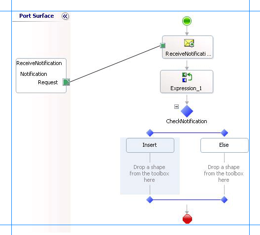

# Step 3: Add a Filter for Insert Notifications
  
  
 **Time to complete:** 5 minutes  
  
 **Objective:** In this step, you add a Decide shape to the orchestration to filter for notification messages for Insert operation. Subsequent operations in the orchestration are performed only if the notification received is of Insert type.  
  
## Prerequisites  
 You must have completed [Step 2: Extract Notification Type from Notification Message](../../adapters-and-accelerators/adapter-sql/step-2-extract-notification-type-from-notification-message.md).  
  
### To filter for notification messages  
  
1.  Add a **Decide** shape to the orchestration, after the **Expression** shape. From the Toolbox, drag the **Decide** shape onto the connecting line directly below the **Expression** shape.  
  
     The **Decide** shape expands to show a branch for the **If** statement **(Rule_1)** and a branch for the **Else** statement.  
  
2.  On the design surface, right-click the **Decide** shape, and then click **Properties Window**.  
  
3.  In the **Properties** pane for the **Decide** shape, in the **Name** property, type `CheckNotification`.  
  
4.  On the design surface, right-click the **Rule_1** shape (inside of the **Decide** shape), and then click **Properties Window**.  
  
5.  In the **Properties** pane for **Rule_1**, in the **Name** property, type **Insert**.  
  
6.  Right-click the **Insert** shape, and then click **Edit Boolean Expression**.  
  
7.  In the BizTalk Expression Editor, type the following:  
  
    ```  
    NotificationType.Equals("Insert")  
    ```  
  
     This condition tells the orchestration to perform subsequent operations only if the value in the **NotificationType** variable is **Insert**.  
  
    > [!NOTE]
    >  You added this variable in [Step 2: Extract Notification Type from Notification Message](../../adapters-and-accelerators/adapter-sql/step-2-extract-notification-type-from-notification-message.md) to extract the type of notification from the notification message received from the SQL Server database.  
  
8.  The following figure shows the in-progress orchestration with the **Decide** shape included.  
  
       
  
## What did I just do?  
 In this step, you added a **Decide** shape to filter the notification messages to perform subsequent operations only if the notification received is for Insert operations.  
  
## Next Steps  
 In the next step, you add orchestration shapes to invoke the UPDATE_EMPLOYE stored procedure on the Employee table, as described in [Lesson 3: Execute a Stored Procedure to Select New Employees Added](../../adapters-and-accelerators/adapter-sql/lesson-3-execute-a-stored-procedure-to-select-new-employees-added.md).  
  
## See Also  
 [Step 2: Extract Notification Type from Notification Message](../../adapters-and-accelerators/adapter-sql/step-2-extract-notification-type-from-notification-message.md)   
 [Lesson 2: Receive and Filter Notifications](../../adapters-and-accelerators/adapter-sql/lesson-2-receive-and-filter-notifications.md)
