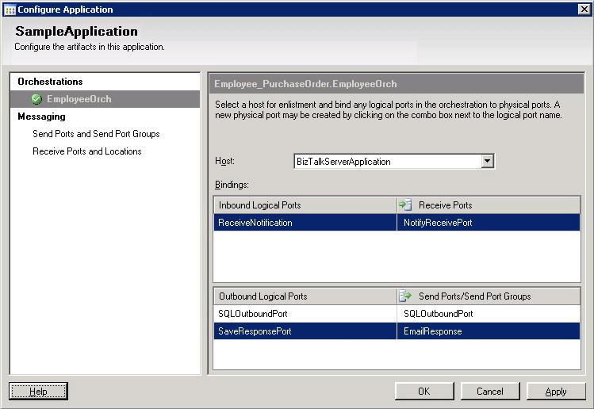

# Step 3: Configure and Start the Application
  
  
 **Time to complete:** 10 minutes  
  
 **Objective:** In this step, you configure and start the SampleApplication application. When you configure the SampleApplication application, you associate the logical artifacts you created in [!INCLUDE[btsVStudioNoVersion](../../includes/btsvstudionoversion-md.md)] with their physical counterparts.  
  
## Prerequisites  
 You must have completed [Step 2: Configure the Ports](../../adapters-and-accelerators/adapter-sql/step-2-configure-the-ports.md).  
  
### To configure and start the application  
  
1. Start the [!INCLUDE[btsBizTalkServerNoVersion](../../includes/btsbiztalkservernoversion-md.md)] Administration console.  
  
2. In the console tree on the left hand side, expand **BizTalk Server Administration**, right-click **BizTalk Group**, and then click **Refresh**.  
  
3. Expand **BizTalk Group**, expand **Applications**, right-click **SampleApplication**, and then click **Configure**.  
  
4. In the **Configure Application** dialog box, on the **EmployeeOrch** tab, do the following:  
  
   1.  For **Host** drop-down list, select **BizTalkServerApplication**.  
  
   2.  Double-click the cell across **ReceiveNotification** and select **NotifyReceivePort** from the drop-down list.  
  
   3.  Double-click the cell across **SQLOutboundPort** and select **SQLOutboundPort** from the drop-down list.  
  
   4.  Double-click the cell across **SaveResponsePort** and select **EmailResponse** from the drop-down list.  
  
5. The following figure shows a configured application.  
  
      
  
6. In the **Configure Application** dialog box, click **OK**.  
  
7. In the console tree, right-click **SampleApplication**, and then click **Start**.  
  
8. In the console tree, click **Applications**.  
  
9. In the Applications details pane, check that the **Status** of **SampleApplication** is **Started**.  
  
## What did I just do?  
 You configured and started the SampleApplication application  
  
## Next Steps  
 You test the application by inserting new employees in the **Employee** table, as described in [Step 4: Test the Application](../../adapters-and-accelerators/adapter-sql/step-4-test-the-application.md).  
  
## See Also  
 [Step 2: Configure the Ports](../../adapters-and-accelerators/adapter-sql/step-2-configure-the-ports.md)   
 [Step 4: Test the Application](../../adapters-and-accelerators/adapter-sql/step-4-test-the-application.md)   
 [Lesson 5: Deploy the Solution](../../adapters-and-accelerators/adapter-sql/lesson-5-deploy-the-solution.md)