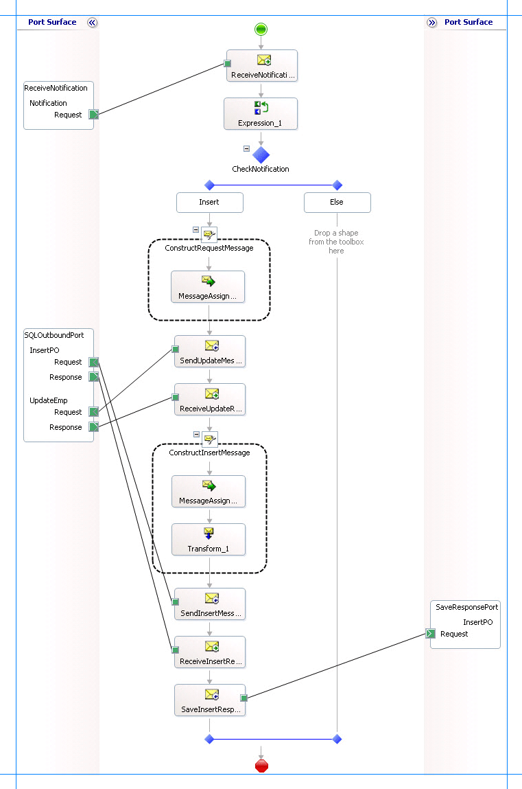

# Step 3: Send the Request Message to Insert Records and Receive a Response
  
  
 **Time to complete:** 10 minutes  
  
 **Objective:** In this step, you send the request message to insert records into the **Purchase_Order** table and receive a response.  
  
## Prerequisites  
 You must have completed [Step 2: Map the UPDATE_EMPLOYEE Response Message to Insert Operation Request Message](../../adapters-and-accelerators/adapter-sql/step-2-map-update_employee-response-to-insert-operation-request.md).  
  
### To send the request message and receive a response  
  
1.  Add the following shapes to the orchestration under the **Construct Message** shape.  
  
    |Shape|Shape Type|Properties|  
    |-----------|----------------|----------------|  
    |SendInsertMessage|Send|-   Set **Message** to *InsertPO* -   Set **Name** to *SendInsertMessage*|  
    |ReceiveInsertResponse|Receive|-   Set **Activate** to *False* -   Set **Message** to *InsertPOResponse* -   Set **Name** to *ReceiveInsertResponse*|  
    |SaveInsertResponse|Send|-   Set **Message** to *InsertPOResponse* -   Set **Name** to *SaveInsertResponse*|  
  
2.  Modify the **SQLOutboundPort** you created in [Step 2: Send the Request Message to SQL Server and Receive Response](../../adapters-and-accelerators/adapter-sql/step-2-send-the-request-message-to-sql-server-and-receive-response.md).  
  
    1.  Right-click the port in the Orchestration Designer, and then click **New Operation**. The port shape changes to add a new operation, **Operation_1**.  
  
    2.  Click **Operation_1** and in the properties window, change the value of Identifier to **InsertPO**.  
  
3.  Add a one-way send port to the orchestration. You will use this port to send the response message for the Insert operation. Set the following properties for the port.  
  
    |Set this property|To this value|  
    |-----------------------|-------------------|  
    |**Communication Direction**|Send|  
    |**Communication Pattern**|One-Way|  
    |**Identifier**|SaveResponsePort|  
  
     Also, change the operation name from Operation_1 to **InsertPO**.  
  
4.  Connect the port to action shapes. In Orchestration Designer, on the design surface, drag the green arrow-shaped handle for the port to the corresponding green handle of the action shape.  
  
    > [!NOTE]
    >  In this step, you use the drag-and-drop method to connect ports to action shapes. You could instead use the operation property of an action shape to connect the action shape to a port.  
  
     Connect the ports and action shapes as follows:  
  
    -   Connect the **SendInsertMessage** action shape to the **Request** handle of the **InsertPO** operation of the **SQLOutboundPort**.  
  
    -   Connect the **ReceiveInsertResponse** action shape to the **Response** handle of the **InsertPO** operation of the **SQLOutboundPort**.  
  
    -   Connect the **SaveInsertResponse** action shape to the **Request** handle of the **SaveResponsePort**.  
  
5.  The following figure shows the in-progress orchestration.  
  
       
  
## What did I just do?  
 You sent the request to insert records into the **Purchase_Order** table and receive a response.  
  
## Next Steps  
 You build the project, as described in [Step 4: Build the Project](../../adapters-and-accelerators/adapter-sql/step-4-build-the-project.md).  
  
## See Also  
 [Step 2: Map the UPDATE_EMPLOYEE Response Message to Insert Operation Request Message](../../adapters-and-accelerators/adapter-sql/step-2-map-update_employee-response-to-insert-operation-request.md)   
 [Step 4: Build the Project](../../adapters-and-accelerators/adapter-sql/step-4-build-the-project.md)   
 [Lesson 4: Perform an Insert Operation on the Purchase Order Table](../../adapters-and-accelerators/adapter-sql/lesson-4-perform-an-insert-operation-on-the-purchase-order-table.md)