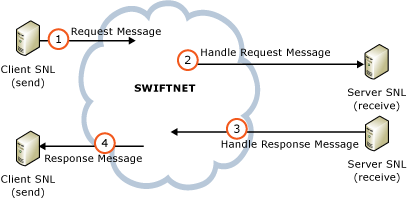

# FileAct Adapter Real-Time End-to-End Primitives
SWIFTNet primitives are a pair of XML documents exchanged between the application and SWIFTNet Link (SNL). For each end-to-end primitive, there are two versions of the primitive – one at the client (or send) side and one at the server (or receive) side. This comprises a total of four messages: Put File primitive, Get File primitive, and a Send Delivery Notification for each.  
  
 The following figure shows the FileAct end-to-end primitives.  
  
   
  
## Put File  
 An application initiates the Put File primitive to send a file to the file system of another SWIFTNet user. As an end-to-end function, there are both client-side and server side Put File primitives. These collaborate together to successfully complete a file transfer.  
  
 Each such collaboration sends a single file. Multiple Put File primitives may be exercised in parallel.  
  
## Get File  
 An application initiates the Get File primitive to retrieve a file from the file system of another SWIFTNet user. As an end-to-end function, there are both client-side and server-side Get File primitives. These collaborate together to successfully complete a file transfer.  
  
 Each such collaboration retrieves a single file. Multiple Get File primitives may be exercised in parallel.  
  
## Send Delivery Notification  
 Every Put File and every Get File primitive has the option of having the sending side of the file request that the receiving side return a delivery notification related to the file transfer. For a Put File primitive, the request message contains the request for a delivery notification.  
  
 In the case of a Get File primitive, the response message contains the request for a delivery notification.  
  
 In either case, after verifying that the file was received in its entirety (by exercising one of the status primitives to check that the transfer reaches the state Completed) and that the file has been adequately safe stored (for example, on a back-office system), the receiving application separately exercises the Delivery Notification primitive to return a positive confirmation of delivery to the sender. As an end-to-end function, there are both client-side and server-side Delivery Notification primitives. These collaborate together to successfully complete a file delivery notification.  
  
 Delivery notification requires the service designer to establish and enforce a protocol between the senders and receivers of files.  
  
## See Also  
 [FileAct Adapter Architecture](../../adapters-and-accelerators/fileact-interact/fileact-adapter-architecture.md)   
 [FileAct Adapter Real-Time Local Primitives](../../adapters-and-accelerators/fileact-interact/fileact-adapter-real-time-local-primitives.md)   
 [FileAct Adapter Store and Forward](../../adapters-and-accelerators/fileact-interact/fileact-adapter-store-and-forward.md)   
 [FileAct Adapter Security Architecture](../../adapters-and-accelerators/fileact-interact/fileact-adapter-security-architecture.md)   
 [FileAct Adapter File and Transfer Identification](../../adapters-and-accelerators/fileact-interact/fileact-adapter-file-and-transfer-identification.md)   
 [FileAct Adapter Supporting Information Transfer](../../adapters-and-accelerators/fileact-interact/fileact-adapter-supporting-information-transfer.md)   
 [FileAct Adapter Delivery Notification](../../adapters-and-accelerators/fileact-interact/fileact-adapter-delivery-notification.md)   
 [FileAct Adapter Status Monitoring](../../adapters-and-accelerators/fileact-interact/fileact-adapter-status-monitoring.md)
