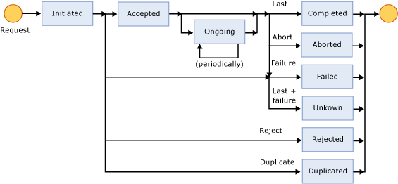

# FileAct Adapter Status Monitoring
The possible states of a file transfer and the transitions between those states are illustrated in the following figure.  
  
   
  
 The file transfer states are:  
  
-   **Initiated** – The client has sent the negotiation message to the server, but has not yet received the response. The server has received the negotiation request, but has not yet sent the response.  
  
-   **Accepted** – The server has accepted the request and has sent the TransferAnswer in the response message, and the transfer is still in progress.  
  
-   **Rejected** – The server has rejected the request and has the TransferAnswer in the response message, and has terminated the transfer.  
  
-   **Ongoing** – The transfer is in progress and is proceeding (renewed periodically as above).  
  
-   **Completed** – The file transfer has completed successfully as far as that side of the transfer is concerned, including the comparison of the digest value.  
  
-   **Failed** – The file transfer has failed because of a data access, processing, communications or timeout exception. (Note: Timeout is enforced by SWIFTNet Link, and the value is determined by SWIFT).  
  
-   **Aborted** – The file transfer has been aborted (either side my issue the abort).  
  
-   **Unknown and Duplicated** – This state occurs only because of timing. In the case of a sender, the file should be re-sent marked as possibly duplicated (PDIndicator). In the case of a receiver, when the PDIndicator implies that the file might have already been sent, the FileAct Adapter will check for the duplication, and if found, will return a TransferAnswer of Duplicated, which will terminate the current attempt.  
  
## See Also  
 [FileAct Adapter Architecture](../../adapters-and-accelerators/fileact-interact/fileact-adapter-architecture.md)   
 [FileAct Adapter Real-Time End-to-End Primitives](../../adapters-and-accelerators/fileact-interact/fileact-adapter-real-time-end-to-end-primitives.md)   
 [FileAct Adapter Real-Time Local Primitives](../../adapters-and-accelerators/fileact-interact/fileact-adapter-real-time-local-primitives.md)   
 [FileAct Adapter Store and Forward](../../adapters-and-accelerators/fileact-interact/fileact-adapter-store-and-forward.md)   
 [FileAct Adapter Security Architecture](../../adapters-and-accelerators/fileact-interact/fileact-adapter-security-architecture.md)   
 [FileAct Adapter File and Transfer Identification](../../adapters-and-accelerators/fileact-interact/fileact-adapter-file-and-transfer-identification.md)   
 [FileAct Adapter Supporting Information Transfer](../../adapters-and-accelerators/fileact-interact/fileact-adapter-supporting-information-transfer.md)   
 [FileAct Adapter Delivery Notification](../../adapters-and-accelerators/fileact-interact/fileact-adapter-delivery-notification.md)
