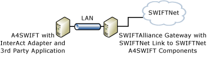
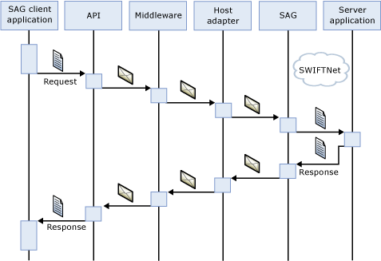
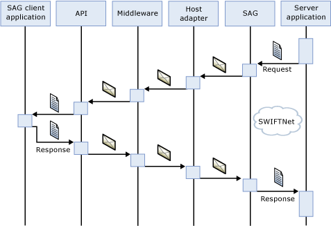

# InterAct Adapter Components
The InterAct adapter has a client and a server component. Note that there may be an A4SWIFT (minimal) installation on the same computer as the SWIFT Alliance Gateway (SAG) if it is running Windows Server. Also note that the SWIFTNet Link (SNL) may be on a separate computer from the SAG. The remote application programming interface (API) host adapter provided by SWIFT is used to communicate from A4SWIFT to the SAG, regardless of the location of the components.  
  
 The figure below shows where the components comprising the entire adapter and communications chain related to the InterAct adapter reside.  
  
   
  
 In the following figure, the client application uses A4SWIFT and the InterAct adapter. BizTalk Server is the middleware, which communicates to the remote API host adapter over TCPIP.  
  
   
  
 In the following figure, the server application uses A4SWIFT and the InterAct adapter. BizTalk Server is the middleware, which communicates to the remote API host adapter over TCPIP.  
  
   
  
## See Also  
 [InterAct Adapter Architecture](../../adapters-and-accelerators/fileact-interact/interact-adapter-architecture.md)   
 [InterAct Adapter Messages for Business Exchange](../../adapters-and-accelerators/fileact-interact/interact-adapter-messages-for-business-exchange.md)   
 [InterAct Adapter Client Application](../../adapters-and-accelerators/fileact-interact/interact-adapter-client-application.md)   
 [InterAct Adapter Server Application](../../adapters-and-accelerators/fileact-interact/interact-adapter-server-application.md)   
 [InterAct Adapter Store and Forward](../../adapters-and-accelerators/fileact-interact/interact-adapter-store-and-forward.md)   
 [InterAct Adapter Security Architecture](../../adapters-and-accelerators/fileact-interact/interact-adapter-security-architecture.md)   
 [InterAct Adapter End-to-End Reliable Delivery](../../adapters-and-accelerators/fileact-interact/interact-adapter-end-to-end-reliable-delivery.md)   
 [InterAct Adapter Status Monitoring](../../adapters-and-accelerators/fileact-interact/interact-adapter-status-monitoring.md)   
 [InterAct Adapter Non-Repudiation](../../adapters-and-accelerators/fileact-interact/interact-adapter-non-repudiation.md)
