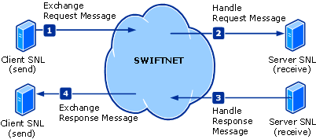

# InterAct Adapter Messages for Business Exchange
There are four messages in the InterAct adapter end-to-end cycle. These messages are SWIFTNet primitives. The first and last messages comprise the client-side primitives, SwInt:ExchangeRequest and SwInt:ExchangeResponse. The middle two messages comprise the server-side primitives, SwInt:HandleRequest and SwInt:HandleResponse.  
  
 At this level of simplification, there are six steps in the end-to-end message cycle:  
  
1. The client application prepares the request message.  
  
2. The client application passes the request message to SWIFTNet.  
  
3. SWIFTNet processes the request message, and sends it to the server application.  
  
4. The server application receives the request message from SWIFTNet.  
  
5. The server application prepares the response message.  
  
6. The server application passes the response message to SWIFTNet.  
  
7. SWIFTNet processes the response message, and sends it to the client application.  
  
8. The client application receives the response message from SWIFTNet.  
  
   The following figure shows the InterAct message exchange.  
  
     
  
## See Also  
 [InterAct Adapter Architecture](../../adapters-and-accelerators/fileact-interact/interact-adapter-architecture.md)   
 [InterAct Adapter Components](../../adapters-and-accelerators/fileact-interact/interact-adapter-components.md)   
 [InterAct Adapter Client Application](../../adapters-and-accelerators/fileact-interact/interact-adapter-client-application.md)   
 [InterAct Adapter Server Application](../../adapters-and-accelerators/fileact-interact/interact-adapter-server-application.md)   
 [InterAct Adapter Store and Forward](../../adapters-and-accelerators/fileact-interact/interact-adapter-store-and-forward.md)   
 [InterAct Adapter Security Architecture](../../adapters-and-accelerators/fileact-interact/interact-adapter-security-architecture.md)   
 [InterAct Adapter End-to-End Reliable Delivery](../../adapters-and-accelerators/fileact-interact/interact-adapter-end-to-end-reliable-delivery.md)   
 [InterAct Adapter Status Monitoring](../../adapters-and-accelerators/fileact-interact/interact-adapter-status-monitoring.md)   
 [InterAct Adapter Non-Repudiation](../../adapters-and-accelerators/fileact-interact/interact-adapter-non-repudiation.md)