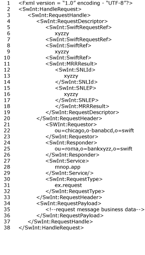
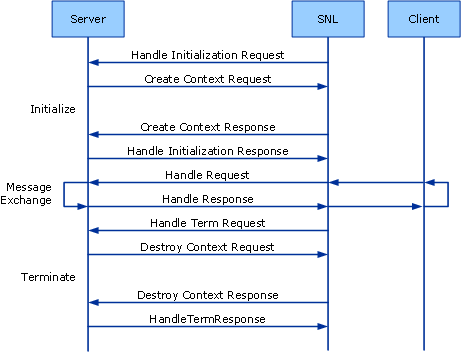

# InterAct Adapter Server Application
This section presents a general description of the composition of server application Request messages. These are the XML documents passed from the server-side SNL to the server application. As such, these messages are characteristic of the first part of the SWIFTNet primitives exercised on the server side.  
  
 The following figure shows the server request message.  
  
   
  
 The following figure shows the sequence of messages exchanged between SNL and the InterAct server application.  
  
   
  
## See Also  
 [InterAct Adapter Architecture](../../adapters-and-accelerators/fileact-interact/interact-adapter-architecture.md)   
 [InterAct Adapter Components](../../adapters-and-accelerators/fileact-interact/interact-adapter-components.md)   
 [InterAct Adapter Messages for Business Exchange](../../adapters-and-accelerators/fileact-interact/interact-adapter-messages-for-business-exchange.md)   
 [InterAct Adapter Client Application](../../adapters-and-accelerators/fileact-interact/interact-adapter-client-application.md)   
 [InterAct Adapter Store and Forward](../../adapters-and-accelerators/fileact-interact/interact-adapter-store-and-forward.md)   
 [InterAct Adapter Security Architecture](../../adapters-and-accelerators/fileact-interact/interact-adapter-security-architecture.md)   
 [InterAct Adapter End-to-End Reliable Delivery](../../adapters-and-accelerators/fileact-interact/interact-adapter-end-to-end-reliable-delivery.md)   
 [InterAct Adapter Status Monitoring](../../adapters-and-accelerators/fileact-interact/interact-adapter-status-monitoring.md)   
 [InterAct Adapter Non-Repudiation](../../adapters-and-accelerators/fileact-interact/interact-adapter-non-repudiation.md)
