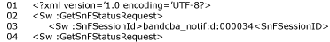
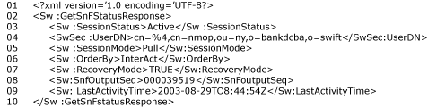

# InterAct Adapter Status Monitoring
SWIFTNet Link (SNL-C) retains a local status about SWIFTNet store and forward (SnF) sessions acquired on that SNL. To get the information about the session, use SwCall() with the following primitive:  
  
   
  
 Notice that you are not required to provide an AuthorizationContext. The information seen by the local SNL is returned, as shown in the following figure.  
  
   
  
## See Also  
 [InterAct Adapter Architecture](../../adapters-and-accelerators/fileact-interact/interact-adapter-architecture.md)   
 [InterAct Adapter Components](../../adapters-and-accelerators/fileact-interact/interact-adapter-components.md)   
 [InterAct Adapter Messages for Business Exchange](../../adapters-and-accelerators/fileact-interact/interact-adapter-messages-for-business-exchange.md)   
 [InterAct Adapter Client Application](../../adapters-and-accelerators/fileact-interact/interact-adapter-client-application.md)   
 [InterAct Adapter Server Application](../../adapters-and-accelerators/fileact-interact/interact-adapter-server-application.md)   
 [InterAct Adapter Store and Forward](../../adapters-and-accelerators/fileact-interact/interact-adapter-store-and-forward.md)   
 [InterAct Adapter Security Architecture](../../adapters-and-accelerators/fileact-interact/interact-adapter-security-architecture.md)   
 [InterAct Adapter End-to-End Reliable Delivery](../../adapters-and-accelerators/fileact-interact/interact-adapter-end-to-end-reliable-delivery.md)   
 [InterAct Adapter Non-Repudiation](../../adapters-and-accelerators/fileact-interact/interact-adapter-non-repudiation.md)
