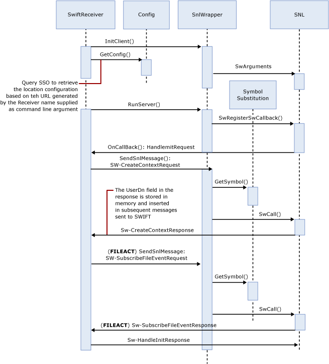

# SWIFT Receive Adapter Security Context
The Receiver adapter, unlike send adapter, is started from the SWIFTNet Link (SNL/RA) command prompt (SWIFTNet start). The receive adapter executable is configured in the SNL/RA configuration file (paramconfig). The adapter on startup initializes the SNL library based on the command line parameter. The configuration values are cached for later use.  
  
 The following figure shows the configuration of the receive adapter security context.  
  
   
  
## See Also  
 [SWIFT Receive Adapter Architecture](../../adapters-and-accelerators/fileact-interact/swift-receive-adapter-architecture.md)   
 [SWIFT Receive Adapter URI](../../adapters-and-accelerators/fileact-interact/swift-receive-adapter-uri.md)   
 [SWIFT Receive Adapter Initialization](../../adapters-and-accelerators/fileact-interact/swift-receive-adapter-initialization.md)   
 [SWIFT Receive Adapter Synchronous and Deferred Modes](../../adapters-and-accelerators/fileact-interact/swift-receive-adapter-synchronous-and-deferred-modes.md)   
 [SWIFT Receive Adapter Store and Forward](../../adapters-and-accelerators/fileact-interact/swift-receive-adapter-store-and-forward.md)
