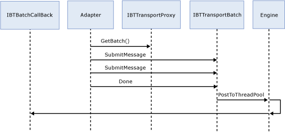
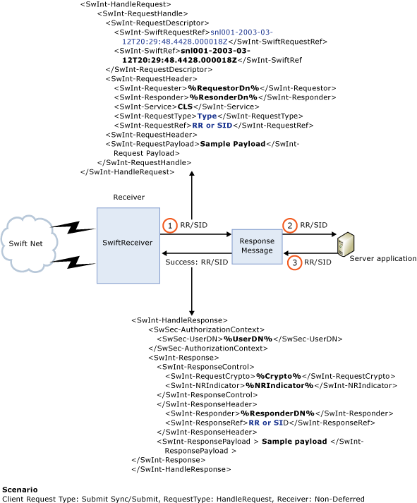

# SWIFT Receive Adapter Synchronous and Deferred Modes
SWIFTNet Link (SNL) server applications can operate in two different modes: synchronous and deferred mode. In synchronous mode, the server application sends a business response back to the client application. In deferred mode, the server application sends a technical acknowledgement back to the client application.  
  
 The following figure shows the sequence.  
  
   
  
 The following figure shows a high level representation of the receive side.  
  
   
  
## See Also  
 [SWIFT Receive Adapter Architecture](../../adapters-and-accelerators/fileact-interact/swift-receive-adapter-architecture.md)   
 [SWIFT Receive Adapter URI](../../adapters-and-accelerators/fileact-interact/swift-receive-adapter-uri.md)   
 [SWIFT Receive Adapter Initialization](../../adapters-and-accelerators/fileact-interact/swift-receive-adapter-initialization.md)   
 [SWIFT Receive Adapter Security Context](../../adapters-and-accelerators/fileact-interact/swift-receive-adapter-security-context.md)   
 [SWIFT Receive Adapter Store and Forward](../../adapters-and-accelerators/fileact-interact/swift-receive-adapter-store-and-forward.md)
