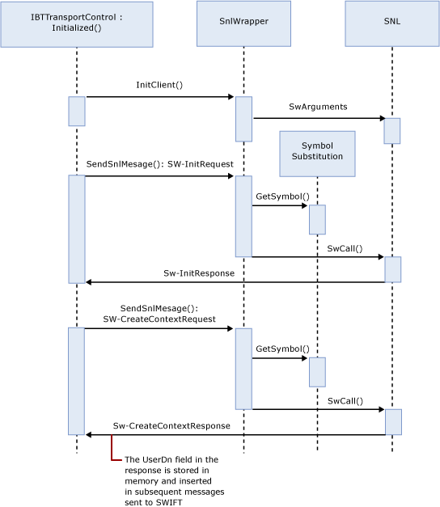

# SWIFT Send Adapter Initialization
Before sending a message to SWIFT, the send adapter must be initialized. The following figure shows the initialization sequence.  
  
   
  
## See Also  
 [SWIFT Send Adapter Architecture](../../adapters-and-accelerators/fileact-interact/swift-send-adapter-architecture.md)   
 [SWIFT Send Adapter URI](../../adapters-and-accelerators/fileact-interact/swift-send-adapter-uri.md)   
 [SWIFT Send Adapter Dynamic Send](../../adapters-and-accelerators/fileact-interact/swift-send-adapter-dynamic-send.md)   
 [SWIFT Send Adapter Synchronous Mode](../../adapters-and-accelerators/fileact-interact/swift-send-adapter-synchronous-mode.md)   
 [SWIFT Send Adapter Termination](../../adapters-and-accelerators/fileact-interact/swift-send-adapter-termination.md)