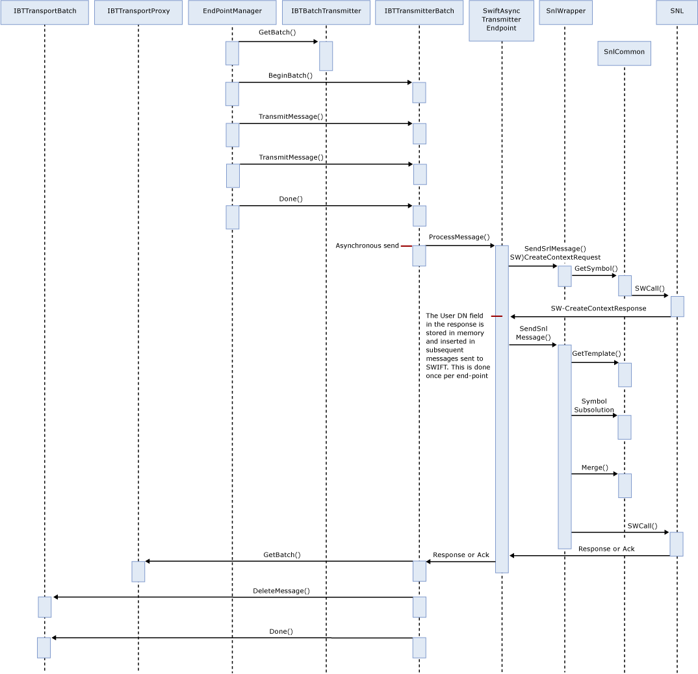

# SWIFT Send Adapter Synchronous Mode
The following diagram shows the sequence of actions that the send adapter in synchronous mode performs to send a message over SWIFT.  
  
   
  
## See Also  
 [SWIFT Send Adapter Architecture](../../adapters-and-accelerators/fileact-interact/swift-send-adapter-architecture.md)   
 [SWIFT Send Adapter URI](../../adapters-and-accelerators/fileact-interact/swift-send-adapter-uri.md)   
 [SWIFT Send Adapter Dynamic Send](../../adapters-and-accelerators/fileact-interact/swift-send-adapter-dynamic-send.md)   
 [SWIFT Send Adapter Initialization](../../adapters-and-accelerators/fileact-interact/swift-send-adapter-initialization.md)   
 [SWIFT Send Adapter Termination](../../adapters-and-accelerators/fileact-interact/swift-send-adapter-termination.md)