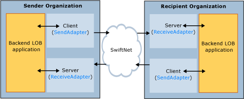
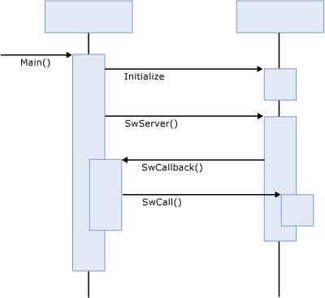

# SWIFTNet Client and Server
SWIFT uses the terms client and server to describe sending and receiving. A SWIFT client is a process that calls the SWIFTNet Link (SNL) to initiate communication over SWIFTNet. In BizTalk Server, this is called the send adapter. A SWIFT server is a program that is called by the SNL when traffic comes in over SWIFTNet. In BizTalk Server, this is called the receive adapter.  
  
 Do not confuse the SWIFT client and server with the business client and server. For example, a client (organization) relies on the services provided by a server (organization). If the server (organization) wants to initiate a communication with the client (organization), it must use an SNL client application to do so, and the client (organization) must have an SNL server application to receive the incoming traffic. This is described in the following figure.  
  
   
  
 SNL assumes both client and server applications are executables started from the command prompt. They both link to the SNL API DLL, which communicates with the actual SNL instance process.  
  
## SNL client applications  
 SNL client applications rely on the SwCall API described below. Technically speaking, a typical client application can be described as follows:  
  
```  
Main:  
  Initialize SNL API  
  Repeat  
    Call SwCall API  
  Until shutdown  
```  
  
 SNL client applications must run in a dedicated process, because SNL references the client context by process ID. SNL synchronizes calls that use Tuxedo resources to SwCall. As a result, only a single client thread at a time can effectively execute a SwCall.  
  
 The client supports the synchronous communication mode. This means that the return on the SWCall occurs when the response comes back from the server. The next SwCall can be performed only after this return.  
  
## SNL server applications  
 SNL server applications are slightly more complex than the client applications. Server applications register callback functions before performing a blocking call into the SNL DLL. Technically speaking, a typical server application can be described as follows:  
  
```  
Main:  
  Initialize SNL API  
  Call SwRegisterSwCallback, registering the Callback function  
  Call SwServer, block and receive callbacks  
  
Callback(Request):  
  Process Request  
  Return Response  
```  
  
 The server application can call the SwCall API while in the callback function. In some cases it must call SwCall to be able to produce the desired result or response. However, a server application can never initiate a communication over the network. A server application can never be a client application.  
  
 In the following figure, the call labeled **Initialize** is an abstraction for the SNL API initialization process, which requires multiple calls. The call labeled **SwCallback()** will be repeated several times, and the call labeled **SwCall()** is optional.  
  
   
  
 All calls between the server and the SNL API DLL are standard C calling convention synchronous function calls.  
  
## See Also  
 [Understanding FileAct and InterAct Adapter Architecture](../../adapters-and-accelerators/fileact-interact/understanding-fileact-and-interact-adapter-architecture.md)   
 [SWIFT Send Adapter Architecture](../../adapters-and-accelerators/fileact-interact/swift-send-adapter-architecture.md)   
 [SWIFT Receive Adapter Architecture](../../adapters-and-accelerators/fileact-interact/swift-receive-adapter-architecture.md)
