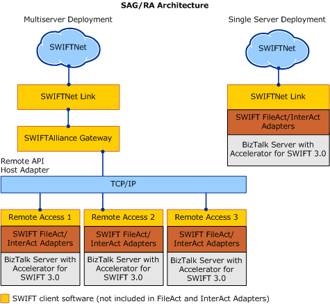

# Understanding FileAct and InterAct Adapter Architecture
The SWIFT Adapter is based on the BizTalk Adapter Framework. Using the classifications of adapters within BizTalk Server, the SWIFT adapters, FileAct and InterAct, represent the following:  
  
- Custom Adapter. This is a custom adapter built specifically to interact with the SWIFT network using a proprietary standard called FileAct and Interact.  
  
- Transport Adapter. This adapter allows business software application to send and receive messages with the SWIFT network.  
  
- Non-transacted. The adapter does not make use of any transaction object to interact with the SWIFT network.  
  
- Isolated. The receive adapter runs in a separate process and regular send adapters run in process.  
  
  For information about the BizTalk Adapter Framework, see the "What Is the Adapter Framework?" topic in BizTalk Server Help.  
  
  The following figure shows a high-level view of the FileAct and InterAct architecture.  
  
    
  
> [!NOTE]
>  Microsoft [!INCLUDE[swift_adapter](../../includes/swift-adapter-md.md)] supports only strict mode SWIFTNet Link (SNL) API.  
  
## In This Section  
  
-   [SWIFTNet Client and Server](../../adapters-and-accelerators/fileact-interact/swiftnet-client-and-server.md)  
  
-   [SWIFT Send Adapter Architecture](../../adapters-and-accelerators/fileact-interact/swift-send-adapter-architecture.md)  
  
-   [SWIFT Receive Adapter Architecture](../../adapters-and-accelerators/fileact-interact/swift-receive-adapter-architecture.md)  
  
-   [FileAct Adapter Architecture](../../adapters-and-accelerators/fileact-interact/fileact-adapter-architecture.md)  
  
-   [InterAct Adapter Architecture](../../adapters-and-accelerators/fileact-interact/interact-adapter-architecture.md)
