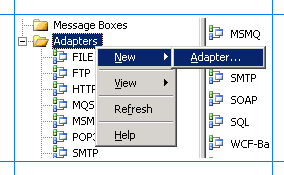
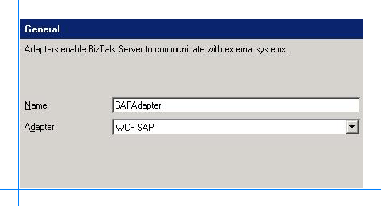

# Post installation steps for BizTalk Adapter Pack 2016
After you install the [!INCLUDE[adapterpacknoversion](../includes/adapterpacknoversion-md.md)], there are some post-installation steps. This topic lists these steps.   

## Add the adapter to BizTalk Administration

1. Open the [!INCLUDE[btsBizTalkServerNoVersion](../includes/btsbiztalkservernoversion-md.md)] Administration console.  

2. Expand the **BizTalk Group**, expand **Platform Settings**, and then select **Adapters**.  

3. Right-click **Adapters**, select **New**, and select **Adapter**.  

      

4. In the **Adapter Properties**, select an adapter from the drop-down list, such as **WCF-SAP**, and then enter a name, such as **WCF-SAP**.  

      

5. Select **OK**.  

## Use a newer Oracle.DataAccess.dll version  

When you configure a port to use the WCF-OracleDB adapter or use Visual Studio to consume a generated adapter, a message displays that the adapter needs Oracle.DataAccess.dll version 2.111.7.0. To resolve this message, install a supported Oracle.DataAccess.dll version (see [supported version list](https://social.technet.microsoft.com/wiki/contents/articles/17631.biztalk-server-supported-line-of-business-lob-and-enterprise-systems.aspx)), and then update the `bindingRedirect` element in the OracleDB configuration file using the following steps:  

1.  On the BizTalk Server, go to the following folders:  

     *drive*:\Program Files\Microsoft BizTalk Adapter Pack(x64)\bin  

     *drive*:\Program Files (x86)\Microsoft BizTalk Adapter Pack\bin  

2.  Open the Microsoft.Adapters.OracleDB.config file.  

3.  Find the following section, and then copy/paste the following:  

    ```  
    <assemblyBinding xmlns="urn:schemas-microsoft-com:asm.v1">  
              <dependentAssembly>  
                        <assemblyIdentity name="Oracle.DataAccess" publicKeyToken="89b483f429c47342" culture="neutral" />  
                        <bindingRedirect oldVersion="2.111.7.00" newVersion="2.112.1.00"/>  
              </dependentAssembly>  
    </assemblyBinding>  

    ```  

    > [!NOTE]
    >  In this example, we set *newVersion* to 2.112.1.00. Set this value to the version you have installed.  

> [!IMPORTANT]
> - If there are multiple BizTalk Servers in this group, make this change on all the BizTalk servers in the group.  
> - The *newVersion* value needs to be updated based on the version of the Oracle.DataAccess.dll file installed on the computer.  Oracle.DataAccess.dll is included with the Oracle Client you install from Oracle.  You must only install an Oracle Client version that is [supported by the BizTalk Adapter Pack](http://social.technet.microsoft.com/wiki/contents/articles/17631.biztalk-server-supported-line-of-business-lob-and-enterprise-systems.aspx).  

## Create SQL Server Database objects (SAP adapter only)  
 To invoke tRFCs in an SAP system, run the *SapAdapter-DbScript-Install.sql* SQL script. This script is installed with the [!INCLUDE[adapterpacknoversion](../includes/adapterpacknoversion-md.md)] installation, and creates database objects in SQL Server. The script is typically installed at *\<installation drive\>:\Program Files\Microsoft [!INCLUDE[adapterpacknoversion](../includes/adapterpacknoversion-md.md)]*. You can run this script against any SQL Server database, as long as you enter that database name while using the adapter to invoke tRFCs.

## Register the adapter bindings
During the [!INCLUDE[adapterpacknoversion](../includes/adapterpacknoversion-md.md)] installation, the setup wizard may fail to register the adapter bindings or the .NET Framework Data Provider for mySAP Business Suite. And the setup proceeds with the adapter installation. This may be caused by the Windows Communication Foundation (WCF) installation, the [!INCLUDE[afproductnamelong](../includes/afproductnamelong-md.md)] installation, or the machine.config file being corrupt.  

> [!IMPORTANT]
> Complete the following steps *only* if the setup wizard fails to register the adapter bindings, or .NET Framework Data Providers in the machine.config file.  

1. Go to the machine.config file on the computer. For example, on a 32-bit platform, the machine.config is available under *\<system drive\>:\WINDOWS\Microsoft.NET\Framework\\<version\>\CONFIG*.  

2. Open the file using a text editor.  

3. Register the adapter bindings:  

   1. Search for the `system.serviceModel` element, and add the following under it:  

      ```  
      <client>  
        <endpoint binding="sapBinding" contract="IMetadataExchange" name="sap" />  
        <endpoint binding="siebelBinding" contract="IMetadataExchange" name="siebel" />  
        <endpoint binding="oracleDBBinding" contract="IMetadataExchange" name="oracleDb" />  
        <endpoint binding="oracleEBSBinding" contract="IMetadataExchange" name="oracleEBS" />  
        <endpoint binding="sqlBinding" contract="IMetadataExchange" name="mssql" />  
      </client>  
      ```  

   2. Search for the `bindingElementExtensions` element under system.serviceModel\extensions.  

   3. Look for the missing adapter binding. Add the following sections under the `bindingElementExtensions` node, depending on the missing adapter binding. You must register all the bindings if the setup wizard fails to register any.  

       For the [!INCLUDE[adaptersap_short](../includes/adaptersap-short-md.md)], add:  

      ```  
      <add name="sapAdapter" type="Microsoft.Adapters.SAP.SAPAdapterExtensionElement,Microsoft.Adapters.SAP, Version=<version>, Culture=neutral, PublicKeyToken=<public key>" />  
      ```  

       For the [!INCLUDE[adaptersiebel_short](../includes/adaptersiebel-short-md.md)], add:  

      ```  
      <add name="siebelAdapter" type="Microsoft.Adapters.Siebel.SiebelAdapterExtensionElement,Microsoft.Adapters.Siebel, Version=<version>, Culture=neutral, PublicKeyToken=<public key>" />  
      ```  

       For the [!INCLUDE[adapteroracle_short](../includes/adapteroracle-short-md.md)], add:  

      ```  
      <add name="oracleDBAdapter" type="Microsoft.Adapters.OracleDB.OracleDBAdapterExtensionElement,Microsoft.Adapters.OracleDB, Version=<version>, Culture=neutral, PublicKeyToken=<public key>" />  
      ```  

       For the [!INCLUDE[adapteroraclebusinessshort](../includes/adapteroraclebusinessshort-md.md)], add:  

      ```  
      <add name="OracleEBSAdapter" type="Microsoft.Adapters.OracleEBS.OracleEBSBindingElementExtensionElement, Microsoft.Adapters.OracleEBS, Version=<version>, Culture=neutral, PublicKeyToken=<public key>" />  
      ```  

       For the [!INCLUDE[adaptersqlshort](../includes/adaptersqlshort-md.md)], add:  

      ```  
      <add name="sqlAdapter" type="Microsoft.Adapters.Sql.SqlAdapterBindingElementExtensionElement,Microsoft.Adapters.Sql, Version=<version>, Culture=neutral, PublicKeyToken=<public key>" />  
      ```  

   4. Search for the `bindingExtensions` element under system.serviceModel\extensions.  

   5. Look for the missing adapter binding. Add the following sections under the `bindingExtensions` node, depending on the missing adapter binding. You must register all the bindings if the setup wizard fails to register any.  

       For [!INCLUDE[adaptersap_short](../includes/adaptersap-short-md.md)], add:  

      ```  
      <add name="sapBinding" type="Microsoft.Adapters.SAP.SAPAdapterBindingSection,Microsoft.Adapters.SAP, Version=<version>, Culture=neutral, PublicKeyToken=<public key>" />  
      ```  

       For [!INCLUDE[adaptersiebel_short](../includes/adaptersiebel-short-md.md)], add:  

      ```  
      <add name="siebelBinding" type="Microsoft.Adapters.Siebel.SiebelAdapterBindingSection,Microsoft.Adapters.Siebel, Version=<version>, Culture=neutral, PublicKeyToken=<public key>" />  
      ```  

       For [!INCLUDE[adapteroracle_short](../includes/adapteroracle-short-md.md)], add:  

      ```  
      <add name="oracleDBBinding" type="Microsoft.Adapters.OracleDB.OracleDBAdapterBindingSection,Microsoft.Adapters.OracleDB, Version=<version>, Culture=neutral, PublicKeyToken=<public key>" />  
      ```  

       For [!INCLUDE[adapteroraclebusinessshort](../includes/adapteroraclebusinessshort-md.md)], add:  

      ```  
      <add name="OracleEBSBinding" type="Microsoft.Adapters.OracleEBS.OracleEBSBindingCollectionElement, Microsoft.Adapters.OracleEBS,Microsoft.Adapters.OracleEBS, Version=<version>, Culture=neutral, PublicKeyToken=<public key>" />  
      ```  

       For [!INCLUDE[adaptersqlshort](../includes/adaptersqlshort-md.md)], add:  

      ```  
      <add name="sqlBinding" type="Microsoft.Adapters.Sql.SqlAdapterBindingCollectionElement,Microsoft.Adapters.Sql, Version=<version>, Culture=neutral, PublicKeyToken=<public key>" />  
      ```  

   > [!NOTE]
   >  To get the public key value, see **Determine the public key and version** (in this topic).  

4. Register the .NET Framework data providers:  

   1. Search for the `DbProviderFactories` element under the system.data node.  

   2. Look for the missing .NET Framework Data Providers. Add the following sections under the `DbProviderFactories` node, depending on the missing provider. You must register all the providers if the setup wizard fails to register any.  

       For the [!INCLUDE[adoprovidersapshort](../includes/adoprovidersapshort-md.md)], add:  

      ```  
      <add name="SAPClient Data Provider" invariant="Microsoft.Data.SAPClient"   
          description=".NET Framework Data Provider for mySAP Business Suite"    type="Microsoft.Data.SAPClient.SAPClientFactory,Microsoft.Data.SAPClient, Version=<version>, Culture=neutral, PublicKeyToken=<public key>" />  
      ```  

       For the [!INCLUDE[adoprovidersiebelshort](../includes/adoprovidersiebelshort-md.md)], add:  

      ```  
      <add name="SiebelClient Data Provider" invariant="Microsoft.Data.SiebelClient"  
          description=".NET Framework Data Provider for Siebel eBusiness Applications"  
          type="Microsoft.Data.SiebelClient.SiebelProviderFactory,Microsoft.Data.SiebelClient, Version=<version>, Culture=neutral, PublicKeyToken=<public key>" />  
      ```  

5. Save and close the machine.config file.  

## Determine the public key and version  
 Complete the following steps to determine the public key and version for an adapter or the .NET Framework Data Provider.  

1. Go to the Windows directory, typically *C:\WINDOWS\assembly*.  

2. Right-click the DLL for which you want the public key, and then select **Properties**. The following table lists the name of the DLLs for each adapter and provider:  


   |                         Adapter/.NET Framework Data Provider                         |       Name of the DLL        |
   |--------------------------------------------------------------------------------------|------------------------------|
   |           [!INCLUDE[adaptersap_short](../includes/adaptersap-short-md.md)]           |    Microsoft.Adapters.SAP    |
   |        [!INCLUDE[adaptersiebel_short](../includes/adaptersiebel-short-md.md)]        |  Microsoft.Adapters.Siebel   |
   |        [!INCLUDE[adapteroracle_short](../includes/adapteroracle-short-md.md)]        | Microsoft.Adapters.OracleDB  |
   | [!INCLUDE[adapteroraclebusinessshort](../includes/adapteroraclebusinessshort-md.md)] | Microsoft.Adapters.OracleEBS |
   |            [!INCLUDE[adaptersqlshort](../includes/adaptersqlshort-md.md)]            |  Microsoft.Adapters.Sql.dll  |
   |        [!INCLUDE[adoprovidersapshort](../includes/adoprovidersapshort-md.md)]        |   Microsoft.Data.SAPClient   |
   |     [!INCLUDE[adoprovidersiebelshort](../includes/adoprovidersiebelshort-md.md)]     | Microsoft.Data.SiebelClient  |


3. On the **General** tab, the **Public Key Token** value is the public key for the DLL. The **Version** value is the version number for the DLL.  

4. Copy the public key, and then select **Cancel**.  

## Install the custom RFCs  
Required only *if* you want to use the [!INCLUDE[adoprovidersapshort](../includes/adoprovidersapshort-md.md)]. See [Install Custom RFCs](../adapters-and-accelerators/adapter-sap/install-custom-rfcs-for-the-data-provider-for-sap.md) in the [!INCLUDE[adaptersap_short](../includes/adaptersap-short-md.md)] documentation. 

> [!IMPORTANT]
>  If you are using an earlier version of the custom RFCs provided with the [!INCLUDE[adapterpacknoversion](../includes/adapterpacknoversion-md.md)], then you must upgrade them to the RFCs provided with this release. Do this by removing the earlier RFCs, and then installing the RFCs included with this release.  

## Install the enterprise applications  
For the steps and guidance to install the different enterprise LOB systems, we recommend you use the installation guides provided by the enterprise system. Also refer to its adapter documentation for specific configuration changes, if any.   

## Installation and post-installation checklist  

- Make sure you installed all the [software prerequisites](../adapters-and-accelerators/software-prerequisites-for-biztalk-adapter-pack-2016.md) with the correct installation option.

- Make sure you have the supported version of the enterprise LOB applications installed on your computer where you installed the [!INCLUDE[adapterpacknoversion](../includes/adapterpacknoversion-md.md)]. See [Supported Line-of-Business (LOB) systems](http://social.technet.microsoft.com/wiki/contents/articles/17631.biztalk-server-supported-line-of-business-lob-systems.aspx).  

- To install only the adapter for the enterprise LOB system you want to connect, make sure you installed the [!INCLUDE[adapterpacknoversion](../includes/adapterpacknoversion-md.md)] using the **Custom** installation option. Make sure you did not use the **Complete** installation option. See [Installing the BizTalk Adapter Pack](../adapters-and-accelerators/installing-the-biztalk-adapter-pack-2016.md).  

- If you want to make tRFC calls to the SAP system using the [!INCLUDE[adaptersap_short](../includes/adaptersap-short-md.md)], make sure you create the required tables in a SQL Server database. See **Create SQL Server Database objects** (in this topic).

- While running the [!INCLUDE[adapterpacknoversion](../includes/adapterpacknoversion-md.md)] setup wizard, you may get an error message that states the setup failed to register the bindings. If so, register them manually. See **Register the adapter bindings** (in this topic).  

- If you chose to install the [!INCLUDE[adoprovidersapshort](../includes/adoprovidersapshort-md.md)] as part of the [!INCLUDE[adapterpacknoversion](../includes/adapterpacknoversion-md.md)] installation, make sure you install the custom RFCs on the SAP system. See [Install Custom RFCs](../adapters-and-accelerators/adapter-sap/install-custom-rfcs-for-the-data-provider-for-sap.md).

## More good info
[Change or remove the BizTalk Adapter Pack](../adapters-and-accelerators/update-or-uninstall-the-biztalk-adapter-pack-2016.md)  
[BizTalk Adapter Pack FAQ](../adapters-and-accelerators/frequently-asked-questions-for-the-biztalk-adapter-pack.md)