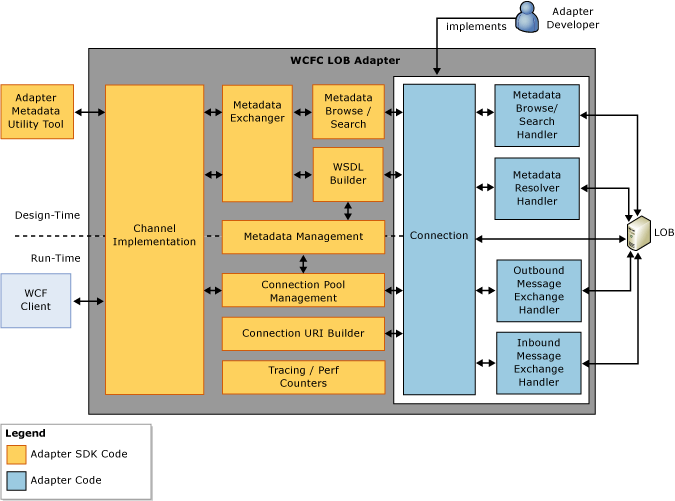

# Architecture overview of the WCF LOB Adapter SDK
The [!INCLUDE[afproductnameshort](../../includes/afproductnameshort-md.md)] is built on top of the WCF Channel Model and provides design-time and run-time extensions for adapter developers to create adapters to line-of-business systems that have large and dynamic metadata. An adapter created using the [!INCLUDE[afproductnameshort](../../includes/afproductnameshort-md.md)] is surfaced to the consumer as a custom WCF binding. The following figure shows the internal architecture and main components of WCF LOB Adapter SDK.  
  
   
  
## Handlers  
 *Handler* defines the message exchange patterns supported by the adapter.  
  
 The following table summarizes the available handler types, their function, and the [!INCLUDE[nextref_btsWinCommFoundation](../../includes/nextref-btswincommfoundation-md.md)] channel(s) they map to.  
  
|**Handler Type**|**Function**|**Maps to WCF Channels**|  
|---|---|---|  
|`Microsoft.ServiceModel.Channels.Common.IOutboundHandler`|Supports one-way send or request/response pattern.|IOutputChannel,   IRequestChannel|  
|`Microsoft.ServiceModel.Channels.Common.IAsyncOutboundHandler`|Supports asynchronous one-way send or request/response pattern.|IOutputChannel,   IRequestChannel|  
|`Microsoft.ServiceModel.Channels.Common.IInboundHandler`|Supports one-way receive or reply patterns.|IInputChannel,   IReplyChannel|  
|`Microsoft.ServiceModel.Channels.Common.IAsyncInboundHandler`|Supports asynchronous variants of methods one-way receive or reply patterns.|IInputChannel   IReplyChannel|  
|`Microsoft.ServiceModel.Channels.Common.IMetadataBrowseHandler`|Supports browsing of metadata on the target system.|IRequestChannel|  
|`Microsoft.ServiceModel.Channels.Common.IMetadataSearchHandler`|Supports searching of metadata on the target system.|IRequestChannel|  
|`Microsoft.ServiceModel.Channels.Common.IMetadataResolverHandler`|Supports retrieval of metadata from the target system.|IRequestChannel|  
  
## Channel implementation  
 An adapter built using the [!INCLUDE[afproductnameshort](../../includes/afproductnameshort-md.md)] is basically a transport channel (System.ServiceModel.Channels.IServiceListner). An adapter built using the [!INCLUDE[afproductnameshort](../../includes/afproductnameshort-md.md)] is surfaced to the consumer as a WCF binding, where the binding is used to create the channel stack. This binding can be considered a peer to other predefined WCF bindings such as BasicHttpBinding, WsHttpBinding, and NetTcpBinding, and can be set via app.config or in code by the client application when calling a service. This binding contains an ordered set of binding elements, with the adapter being the key binding element that derives from the T:System.ServiceModel.Channels.TransportBindingElement class. In an outbound scenario, the [!INCLUDE[afproductnameshort](../../includes/afproductnameshort-md.md)] runtime uses a channel factory to create the adapter (that is, the transport channel). In an inbound scenario, the [!INCLUDE[afproductnameshort](../../includes/afproductnameshort-md.md)] runtime makes use of channel listeners for incoming channels in a service application.  Both run-time as well as design-time messages pass through this component.  
  
## Connection factory, connection, and connection URI builder  
 *ConnectionFactory* provides a factory pattern for creating connections based on URI and user credentials. For more information, see `Microsoft.ServiceModel.Channels.Common.IConnectionFactory`.  
  
 *Connection* defines a low-level communication contract with the target system, and encapsulates native communication APIs and connection handles. For more information, see `Microsoft.ServiceModel.Channels.Common.IConnection`.  
  
 The *Connection Uri Builder* allows adapter consumers to programmatically build connection URIs without specific knowledge of syntax. For more information, see `Microsoft.ServiceModel.Channels.Common.ConnectionUri`.  
  
## Connection management  
 *Connection management* is responsible for the lifetime management of the connections of an adapter. It internally keeps a pool of the connections ready for use. This connection pool is credential and URI-based. The credential contains a user name and password that define the security context the connection runs under.  
  
 When the same credentials and URI are used, any channel being opened under the same connection factory obtains the connection from the pool if there is one available already.  
  
 Connection pool manager keeps records of how many open connections there are to that URI regardless of the credentials and across the boundaries of the channel factory. For example, in one system, you can have two users who have different credentials, which means there are two channel factories connecting to the system.  
  
> [!NOTE]
>  The adapter may be limited with respect to the number of connections it can support, generally limited by system resources.  
  
 To help adapter developers configure the connection pool settings, the [!INCLUDE[afproductnameshort](../../includes/afproductnameshort-md.md)] provides two classes, `Microsoft.ServiceModel.Channels.Common.ConnectionPoolSettings` and `Microsoft.ServiceModel.Channels.Common.ConnectionManagerSettings`.  
  
## Metadata management  
 *Metadata management* is responsible for the object-oriented representation of the caching of the metadata for the target system. Metadata can be held in a common cache accessible across all credentials, or it can be cached per credential basis.  
  
 The metadata life cycle begins with its design-time definitions and continues through usage during runtime. At design time, adapter developers must identify the set of operations, and must generate the necessary WSDL and client side proxy. At runtime, the Adapter Framework-based adapters use the predefined metadata to interpret the messages returned from the target system calls.  
  
 To help adapter writers configure the metadata setting, the Adapter Framework provides three classes, `Microsoft.ServiceModel.Channels.Common.CacheSettings`, `Microsoft.ServiceModel.Channels.Common.MetadataSettings` and `Microsoft.ServiceModel.Channels.Common.CommonCacheSettings`.  
  
## WSDL builder  
 *WSDL Builder* provides automatic WSDL generation from the WCF LOB Adapter SDK's internal metadata object model (it can be overridden for scenarios that require custom WSDL generation).  
  
 See `Microsoft.ServiceModel.Channels.Common.IWsdlRetrieval` for more information.  
  
## Metadata browse/search  
 *Metadata browse/search* allows for browsing and searching all LOB metadata.  
  
 For more information, see `Microsoft.ServiceModel.Channels.IMetadataRetrievalContract`.  
  
## Metadata generation  
 *Metadata generation* allows for generating code for the client (for outbound scenarios) and for the service (for inbound scenarios) based on operations selected by the adapter consumer. Even though we recommend that adapter consumers use the tools [!INCLUDE[addadapterservrefshort](../../includes/addadapterservrefshort-md.md)] ([!INCLUDE[consumeadapterservshort](../../includes/consumeadapterservshort-md.md)] in case of BizTalk applications), the [!INCLUDE[afproductnameshort](../../includes/afproductnameshort-md.md)] provides a public interface `Microsoft.ServiceModel.Channels.MetadataRetrievalClient.GetMetadata%2A` to retrieve the System.Web.Services.Description.ServiceDescription, which represents a Web Service Description Language (WSDL) containing information about selected operations and types. Adapter writers make use of the metadata object model for the [!INCLUDE[afproductnameshort](../../includes/afproductnameshort-md.md)] that includes classes derived from `Microsoft.ServiceModel.Channels.Common.OperationMetadata` and `Microsoft.ServiceModel.Channels.Common.TypeMetadata` to describe the details of each operation and type.  
  