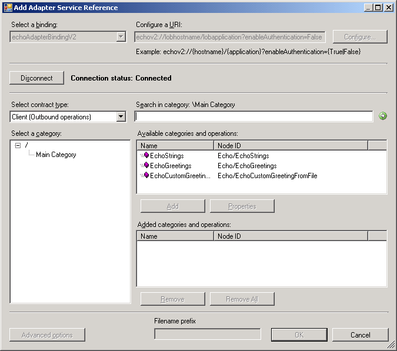
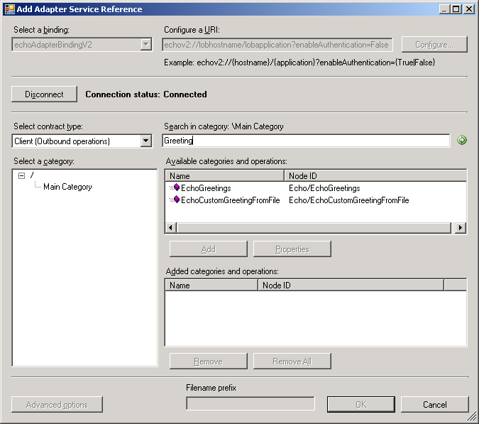

# Browse and search metadata using the WCF LOB Adapter SDK
This section provides information about how to expose browse and search functionality with an adapter by implementing IMetadataBrowseHandler and IMetadataSearchHandler, respectively.  
  
## IMetadataBrowseHandler  
 When adding an adapter to a project, IMetadataBrowseHandler allows browsing of the categories and operations that the adapter supports. This allows the adapter consumer to view metadata information at design time, and to select only the operations that the client process requires.  
  
 When using the [!INCLUDE[addadapterservreflong](../../includes/addadapterservreflong-md.md)] or [!INCLUDE[consumeadapterservlong](../../includes/consumeadapterservlong-md.md)] to add an adapter to a project, the IMetadataBrowseHandler populates the **Select contract type**, **Select a Category**, and **Available categories and operations** boxes.  
  
   
  
 The following example demonstrates how to implement IMetadataBrowseHandler. It constructs a MetadataRetrievalNode array containing information on the categories and operations that the adapter supports.  
  
```csharp  
public class EchoAdapterMetadataBrowseHandler : EchoAdapterHandlerBase, IMetadataBrowseHandler  
    {  
        /// <summary>  
        /// Initializes a new instance of the EchoAdapterMetadataBrowseHandler class  
        /// </summary>  
        public EchoAdapterMetadataBrowseHandler(EchoAdapterConnection connection  
            , MetadataLookup metadataLookup)  
            : base(connection, metadataLookup)  
        {  
        }  
  
        #region IMetadataBrowseHandler Members  
  
        /// <summary>  
        /// Retrieves an array of MetadataRetrievalNodes from the target system.  
        /// The browse operation will return nodes starting from the childStartIndex in the path provided in absoluteName, and the number of nodes returned is limited by maxChildNodes.  
        /// The method should complete within the specified timespan or throw a timeout exception.  
        /// If absoluteName is null or an empty string, return nodes starting from the root + childStartIndex.  
        /// If childStartIndex is zero, then return starting at the node indicated by absoluteName (or the root node if absoluteName is null or empty).  
        /// </summary>  
        public MetadataRetrievalNode[] Browse(string nodeId  
            , int childStartIndex  
            , int maxChildNodes, TimeSpan timeout)  
        {  
            // note we don't support timeout in this sample  
            if (MetadataRetrievalNode.Root.NodeId.Equals(nodeId))  
            {  
                MetadataRetrievalNode node = new MetadataRetrievalNode("EchoMainCategory");  
                node.DisplayName = "Main Category";  
                node.IsOperation = false;  
                node.Description = "This category contains inbound and outbound categories.";  
                node.Direction = MetadataRetrievalNodeDirections.Inbound | MetadataRetrievalNodeDirections.Outbound;  
                return new MetadataRetrievalNode[] { node };  
            }  
            else if( "EchoMainCategory".CompareTo(nodeId) == 0 )  
            {  
                // Inbound operations  
                MetadataRetrievalNode inOpNode1 = new MetadataRetrievalNode("Echo/OnReceiveEcho");  
                inOpNode1.DisplayName = "OnReceiveEcho";  
                inOpNode1.Description = "This operation echoes the location and length of a file dropped in the specified file system.";  
                inOpNode1.Direction = MetadataRetrievalNodeDirections.Inbound;  
                inOpNode1.IsOperation = true;  
                // Outbound operations  
                MetadataRetrievalNode outOpNode1 = new MetadataRetrievalNode("Echo/EchoStrings");  
                outOpNode1.DisplayName = "EchoStrings";  
                outOpNode1.Description = "This operation echoes the incoming string COUNT number of times in a string array.";  
                outOpNode1.Direction = MetadataRetrievalNodeDirections.Outbound;  
                outOpNode1.IsOperation = true;  
                MetadataRetrievalNode outOpNode2 = new MetadataRetrievalNode("Echo/EchoGreetings");  
                outOpNode2.DisplayName = "EchoGreetings";  
                outOpNode2.Description = "This operation echoes the incoming Greeting object COUNT number of times in an array of type Greeting.";  
                outOpNode2.Direction = MetadataRetrievalNodeDirections.Outbound;  
                outOpNode2.IsOperation = true;  
                MetadataRetrievalNode outOpNode3 = new MetadataRetrievalNode("Echo/EchoCustomGreetingFromFile");  
                outOpNode3.DisplayName = "EchoCustomGreetingFromFile";  
                outOpNode3.Description = "This operation echoes the greeting object by reading its instance from a file. The Greeting object's metadata is obtained from a predefined XSD file.";  
                outOpNode3.Direction = MetadataRetrievalNodeDirections.Outbound;  
                outOpNode3.IsOperation = true;  
                return new MetadataRetrievalNode[] { inOpNode1, outOpNode1, outOpNode2, outOpNode3 };  
            }  
  
            return null;  
        }  
  
        #endregion IMetadataBrowseHandler Members  
    }  
```  
  
## IMetadataSearchHandler  
 Implementing IMetadataSearchHandler within an adapter provides the ability to search for available operations at design time by entering a search term, such as a portion of an operation name. This is very useful if your adapter contains many operations, since you can enter search values to limit the operations returned.  
  
 When using the [!INCLUDE[addadapterservreflong](../../includes/addadapterservreflong-md.md)] or [!INCLUDE[consumeadapterservlong](../../includes/consumeadapterservlong-md.md)] to add an adapter to a project, the IMetadataSearchHandler resolves search strings entered in the **Search in category** box, and returns a list of matching items in the **Available categories and operations** box.  
  
   
  
 You can also perform searches with svcutil.exe when generating WSDL or proxy for an adapter, by passing the search value as a query string in the format of op=value. The following is an example of using svcutil.exe to return only the Echo/EchoStrings operation information.  
  
```  
svcutil.exe “echov2://lobhostname/lobapplication?enableAuthentication=False&op=Echo/EchoStrings” /target:metadata  
  
```  
  
> [!NOTE]
>  The [!INCLUDE[afproductnameshort](../../includes/afproductnameshort-md.md)] does not provide a default wildcard search functionality such as Echo* or %Echo%. It is up to the adapter author to implement wildcard or pattern matching functionality.  
  
 The following example demonstrates how to implement IMetadataSearchHandler. It constructs a MetadataRetrievalNode array containing information about the categories and operations that the adapter supports.  
  
```csharp  
public class EchoAdapterMetadataSearchHandler : EchoAdapterHandlerBase, IMetadataSearchHandler  
    {  
        /// <summary>  
        /// Initializes a new instance of the EchoAdapterMetadataSearchHandler class  
        /// </summary>  
        public EchoAdapterMetadataSearchHandler(EchoAdapterConnection connection  
            , MetadataLookup metadataLookup)  
            : base(connection, metadataLookup)  
        {  
        }  
  
        #region IMetadataSearchHandler Members  
  
        /// <summary>  
        /// Retrieves an array of MetadataRetrievalNodes (see Microsoft.ServiceModel.Channels) from the target system.  
        /// The search will begin at the path provided in absoluteName, which points to a location in the tree of metadata nodes.  
        /// The contents of the array are filtered by SearchCriteria and the number of nodes returned is limited by maxChildNodes.  
        /// The method should complete within the specified timespan or throw a timeout exception.  If absoluteName is null or an empty string, return nodes starting from the root.  
        /// If SearchCriteria is null or an empty string, return all nodes.  
        /// </summary>  
        public MetadataRetrievalNode[] Search(string nodeId  
            , string searchCriteria  
            , int maxChildNodes, TimeSpan timeout)  
        {  
  
            List<MetadataRetrievalNode> resultList = new List<MetadataRetrievalNode>();  
            if ("OnReceiveEcho".ToLower().Contains(searchCriteria.ToLower()))  
            {  
                MetadataRetrievalNode nodeInbound = new MetadataRetrievalNode("Echo/OnReceiveEcho");  
                nodeInbound.DisplayName = "OnReceiveEcho";  
                nodeInbound.Description = "This operation echos the location and length of a file dropped in the specified file system.";  
                nodeInbound.Direction = MetadataRetrievalNodeDirections.Inbound;  
                nodeInbound.IsOperation = true;  
                resultList.Add(nodeInbound);  
            }  
            if ("EchoStrings".ToLower().Contains(searchCriteria.ToLower()))  
            {  
                MetadataRetrievalNode outOpNode1 = new MetadataRetrievalNode("Echo/EchoStrings");  
                outOpNode1.DisplayName = "EchoStrings";  
                outOpNode1.Description = "This operation echoes the incoming string COUNT number of times in a string array.";  
                outOpNode1.Direction = MetadataRetrievalNodeDirections.Outbound;  
                outOpNode1.IsOperation = true;  
                resultList.Add(outOpNode1);  
            }  
            if ("EchoGreetings".ToLower().Contains(searchCriteria.ToLower()))  
            {  
                MetadataRetrievalNode outOpNode2 = new MetadataRetrievalNode("Echo/EchoGreetings");  
                outOpNode2.DisplayName = "EchoGreetings";  
                outOpNode2.Description = "This operation echoes the incoming Greeting object COUNT number of times in an array of type Greeting.";  
                outOpNode2.Direction = MetadataRetrievalNodeDirections.Outbound;  
                outOpNode2.IsOperation = true;  
                resultList.Add(outOpNode2);  
            }  
            if ("EchoCustomGreetingFromFile".ToLower().Contains(searchCriteria.ToLower()))  
            {  
                MetadataRetrievalNode outOpNode3 = new MetadataRetrievalNode("Echo/EchoCustomGreetingFromFile");  
                outOpNode3.DisplayName = "EchoCustomGreetingFromFile";  
                outOpNode3.Description = "This operation echoes the greeting object by reading its instance from a file. The Greeting object's metadata is obtained from a predefined XSD file.";  
                outOpNode3.Direction = MetadataRetrievalNodeDirections.Outbound;  
                outOpNode3.IsOperation = true;  
                resultList.Add(outOpNode3);  
            }  
            return resultList.ToArray();  
        }  
  
        #endregion IMetadataSearchHandler Members  
    }  
```  
  
## See Also  
 [Development Activities](../../esb-toolkit/development-activities.md)
