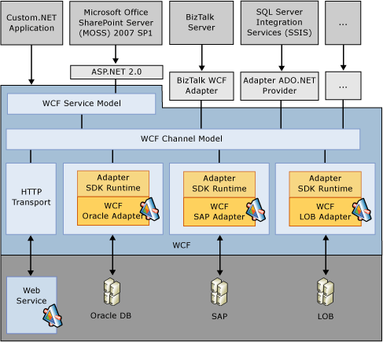
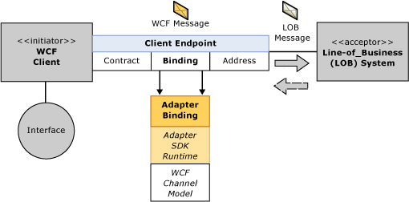
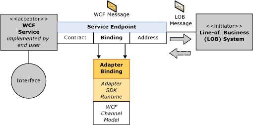
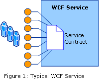
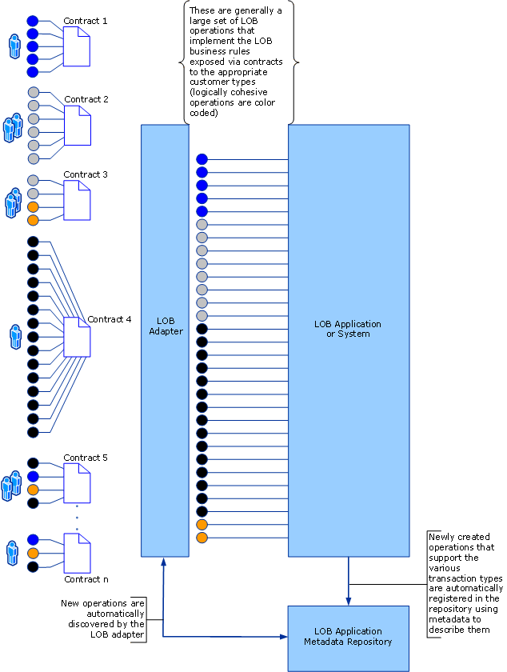

# Read how WCF is used by the WCF LOB Adapter SDK
The [!INCLUDE[afproductnameshort](../../includes/afproductnameshort-md.md)] extends the [!INCLUDE[nextref_btsWinCommFoundation](../../includes/nextref-btswincommfoundation-md.md)] channel architecture and depends on the [!INCLUDE[nextref_btsWinCommFoundation](../../includes/nextref-btswincommfoundation-md.md)] runtime to provide the basic messaging services required to expose adapter functionality and exchange information. 
  
 The [!INCLUDE[afproductnameshort](../../includes/afproductnameshort-md.md)] provides a framework for writing adapters, surfacing them in [!INCLUDE[nextref_btsWinCommFoundation](../../includes/nextref-btswincommfoundation-md.md)], and complementing them with common adapter elements such as metadata and connection pooling. It also consists of support tools to enhance the experience such as the [!INCLUDE[addadapterservrefshort](../../includes/addadapterservrefshort-md.md)] for .NET applications and [!INCLUDE[consumeadapterservshort](../../includes/consumeadapterservshort-md.md)] for [!INCLUDE[btsBizTalkServerNoVersion](../../includes/btsbiztalkservernoversion-md.md)] applications and the [!INCLUDE[afdevwizardnamelong](../../includes/afdevwizardnamelong-md.md)].  
  
 It is the responsibility of the [!INCLUDE[nextref_btsWinCommFoundation](../../includes/nextref-btswincommfoundation-md.md)] to expose services to a wide array of consuming applications, to manage the flow of messages between different endpoints, and to provide an SDK and tools to customize, configure, and monitor message flow. For example, a developer can customize the behavior of a [!INCLUDE[afproductnameshort](../../includes/afproductnameshort-md.md)] by extending its channel with custom message handlers.  
  
 The relationship between the [!INCLUDE[afproductnameshort](../../includes/afproductnameshort-md.md)] and [!INCLUDE[nextref_btsWinCommFoundation](../../includes/nextref-btswincommfoundation-md.md)] is shown in the following high-level architectural figure.  
  
   
  
 The [!INCLUDE[afproductnameshort](../../includes/afproductnameshort-md.md)] is built on top of [!INCLUDE[nextref_btsWinCommFoundation](../../includes/nextref-btswincommfoundation-md.md)] as an extension to the [!INCLUDE[nextref_btsWinCommFoundation](../../includes/nextref-btswincommfoundation-md.md)] channel model. It provides a domain-specific and simplified object model and tool set for building adapters as custom [!INCLUDE[nextref_btsWinCommFoundation](../../includes/nextref-btswincommfoundation-md.md)] channels. Adapters built using the [!INCLUDE[afproductnameshort](../../includes/afproductnameshort-md.md)] are surfaced as custom [!INCLUDE[nextref_btsWinCommFoundation](../../includes/nextref-btswincommfoundation-md.md)] bindings.  
  
 The following figure shows the outbound message exchange using a given adapter binding.  
  
   
  
 The following figure shows the inbound message exchange using a given adapter binding.  
  
   
  
 For more information about the [!INCLUDE[nextref_btsWinCommFoundation](../../includes/nextref-btswincommfoundation-md.md)] channel model, see [Channel Model Overview](https://msdn.microsoft.com/library/ms729840.aspx).  
  
## WCF Services and the WCF LOB Adapter SDK  
 When developing a typical [!INCLUDE[nextref_btsWinCommFoundation](../../includes/nextref-btswincommfoundation-md.md)] service, the first step is to create the contract for the service that is shared with the outside world that describes how to communicate with the service. This contract essentially specifies the collection and structure of messages required to access the operations offered by the service.  
  
 Once this contract is exposed as a service, the [Service Model Metadata Utility Tool (Svcutil.exe)](https://msdn.microsoft.com/library/aa347733.aspx) can be used to create a [!INCLUDE[nextref_btsWinCommFoundation](../../includes/nextref-btswincommfoundation-md.md)] client to consume it. The contract provides information about a static set of operations and messages that must not change. 
  
   
  
 In contrast, adapters built using the [!INCLUDE[afproductnameshort](../../includes/afproductnameshort-md.md)] provide a dynamic set of metadata about the collection of operations and data that are available within a line-of-business system. The line-of-business system often has too many operations to be described in one contract and may have new operations added to respond to emerging business needs.  
  
 For example, a line-of-business system may provide account management operations. After identifying a need to streamline the creation of new customer accounts, the company updates the line-of-business system to include the new operation. An adapter built using the [!INCLUDE[afproductnameshort](../../includes/afproductnameshort-md.md)] exposes this operation in the metadata it provides to clients.  
  
 At design time, the [!INCLUDE[afproductnameshort](../../includes/afproductnameshort-md.md)]-based adapter generates contracts dynamically to meet the needs of the line-of-business system.  
  
   
  
 The ASDK provides [!INCLUDE[addadapterservrefshort](../../includes/addadapterservrefshort-md.md)] and [!INCLUDE[consumeadapterservshort](../../includes/consumeadapterservshort-md.md)] tools for the adapter consumer to generate dynamic contracts at design time.  
  
 At runtime, when the message flows into the adapter written using the [!INCLUDE[afproductnameshort](../../includes/afproductnameshort-md.md)], the adapter often must take a series of actions on the receive message. These actions include:  
  
- Looking up metadata pertaining to the message  
  
- Opening the message  
  
- Interpreting the message  
  
- Calling the appropriate functions in the line-of-business system  
  
  In the case of a [!INCLUDE[nextref_btsWinCommFoundation_md](../../includes/nextref-btswincommfoundation-md.md)] service, messages simply pass through without being resolved through metadata.  
  
## See Also  
 [BizTalk Adapter for Oracle Database and the WCF LOB Adapter SDK](../adapter-oracle-database/architecture-overview-of-the-biztalk-adapter-for-oracle-database.md)