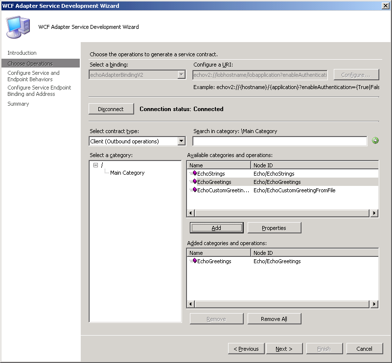

# Step 1: Use the Adapter Service Development Wizard to Create the Web Project
  
  
 **Time to complete:** 10 minutes  
  
 In this step, you create a project using Visual Studio and the [!INCLUDE[afsvcdevwizshort](../../includes/afsvcdevwizshort-md.md)]. The [!INCLUDE[afsvcdevwizshort](../../includes/afsvcdevwizshort-md.md)] collects information about the adapter, operations, and endpoint configurations, and generates a Web project that can then be deployed to IIS.  
  
## Prerequisites  
 You must build and deploy the Echo sample described in [Tutorial 1: Develop the Echo Adapter](../../adapters-and-accelerators/wcf-lob-adapter-sdk/tutorial-1-develop-the-echo-adapter.md) before beginning this tutorial.  
  
### To start the Adapter Service Development Wizard  
  
1.  Start Visual Studio and then on the **File** menu, point to **New**, and then click **Web Site**.  
  
2.  In the **New Web Site** dialog box, perform the following actions:  
  
    |Use this|To do this|  
    |--------------|----------------|  
    |**Language**|Click **Visual C#**.|  
    |**Templates**|Click **WCF Adapter Service**.|  
    |**Location**|Select **File System**, and then type **C:\Tutorials\EchoWeb** as the path.|  
  
3.  Click **OK**.  
  
4.  On the **Welcome page**, click **Next**.  
  
### To select the adapter and URI  
  
1.  On the **Choose the operations to generate a service contract** page, select **echoAdapterBindingV2** from the **Select a binding** drop-down list, and then click **Configure**.  
  
2.  On the **Security** tab of the **Configure Adapter** dialog box, set **Client Credential type** to **Username**, and then set the **User name credentials** as follows:  
  
    |Property|Value|  
    |--------------|-----------|  
    |**User name**|username|  
    |**Password**|password|  
  
    > [!NOTE]
    >  The user name and password entered here are only used to connect to the adapter while performing the steps in the wizard, and are not preserved after the wizard completes.  
  
3.  Click the **URI Properties** tab, and then set the properties as follows:  
  
    |Property|Value|  
    |--------------|-----------|  
    |**Application**|LobApplication|  
    |**EnableAuthentication**|True|  
    |**Hostname**|lobhostname|  
    |**EchoInUpperCase**|False|  
  
    > [!NOTE]
    >  The URI properties selected here will be used to create the \<**client**\>\<**endpoint**\> elements in the web.config file.  
  
4.  Click the **Binding Properties** tab. Note the default values, and then click **OK**.  
  
    > [!NOTE]
    >  The binding values will be used to generate the \<**bindings**\>\<**echoAdapterBindingV2**\> elements in the web.config file.  
  
### To select the contract and operations  
  
1.  On the **Choose the operations to generate a service contract** page, click **Connect**.  
  
2.  In the **Select a category** tree, select **Main Category**. This populates the **Available categories and operations** list.  
  
    > [!NOTE]
    >  You can also enter a search term in the **Search in category** field to find any operations that contain the search term.  
  
3.  In the **Available categories and operations** list, select **EchoGreetings** and click **Add**. This moves the EchoGreetings operation to the **Added categories and operations** list. The operations selected here will be exposed to client applications through the client proxy code generated by the wizard.  
  
       
  
4.  Click **Next**.  
  
### To configure service and endpoint behavior  
  
1.  On the **Configure service and endpoint behaviors** page, enter the following values for **Service Behavior Configuration**:  
  
    |Property|Value|  
    |--------------|-----------|  
    |**EnableMetadataExchange**|True|  
    |**IncludeExceptionDetailsinFault**|True|  
    |**Name**|customServiceBehavior|  
    |**UseServiceCertificate**|False|  
  
     These values are used to populate the \<**serviceBehaviors**\>.  
  
2.  Enter the following values for **Endpoint Behavior Configuration**:  
  
    |Property|Value|  
    |--------------|-----------|  
    |**Name**|customEndpointBehavior|  
    |**AuthenticationType**|**HTTPUsernamePassword**|  
    |**UsernameHeader**|MyUserHeader|  
    |**PasswordHeader**|MyPassHeader|  
  
     These values will be used to specify the **adapterSecurityBridgeType** in the <**endpointBehaviors** element in web.confg.  
  
       
  
3.  Click **Next**  
  
### To configure the binding  
  
1. On the **Configure the service endpoint binding and address** page, select the **BindingConfiguration** entry in **Configure the address and binding for the contract**, and then click the ellipsis (**…**) button.  
  
2. In the **Customize Binding** dialog box, set **Mode** to **TransportWithMessageCredential**, and then click **OK**.  
  
3. Click **Apply**, and then click **Next**.  
  
4. On the **Summary** page, review the contracts and operations selected for this project, and then click **Finish**. You will be presented with the EchoWeb solution, which contains the project files created by the [!INCLUDE[afsvcdevwizshort](../../includes/afsvcdevwizshort-md.md)]  
  
## What did I just do?  
 In this step, you used the [!INCLUDE[afsvcdevwizshort](../../includes/afsvcdevwizshort-md.md)] to generate a Web project that, when published to IIS, will host the Echo Adapter developed in [Tutorial 1: Develop the Echo Adapter](../../adapters-and-accelerators/wcf-lob-adapter-sdk/tutorial-1-develop-the-echo-adapter.md) in the IIS process. The resulting Web project allows Web Services and WCF clients to access the selected operations.  
  
## Next Steps  
 To build and deploy the Web project, proceed to [Step 2: Deploy the Web Project](../../adapters-and-accelerators/wcf-lob-adapter-sdk/step-2-deploy-the-web-project.md)  
  
## See Also  
 [Tutorial 1: Develop the Echo Adapter](../../adapters-and-accelerators/wcf-lob-adapter-sdk/tutorial-1-develop-the-echo-adapter.md)