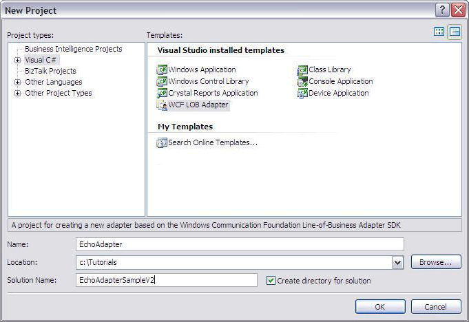
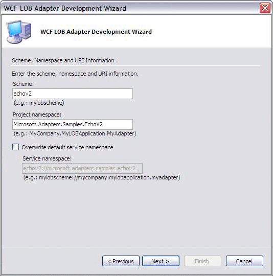
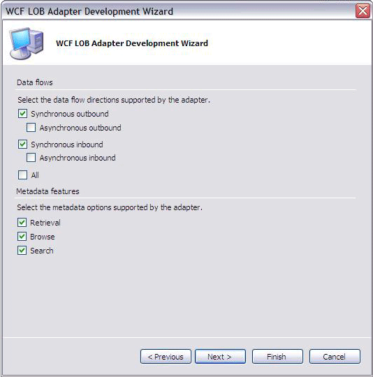
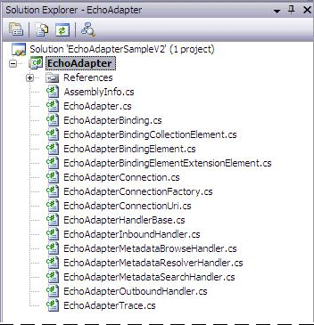

# Step 1: Use the WCF LOB Adapter Development Wizard to Create the Echo Adapter Project
  

 **Time to complete:** 15 minutes  

 In this step, you will create a project using [!INCLUDE[btsVStudioNoVersion](../../includes/btsvstudionoversion-md.md)] and the [!INCLUDE[afdevwizardnameshort](../../includes/afdevwizardnameshort-md.md)]. The [!INCLUDE[afdevwizardnameshort](../../includes/afdevwizardnameshort-md.md)] will guide you through steps involved in developing a custom adapter for the system. It collects information about message exchange patterns, metadata features, adapter properties, and connection properties. Once the wizard successfully completes, it generates a set of files.  

## Prerequisites  
 You must possess the knowledge described in [Before You Begin the Tutorial](../../core/before-you-begin-the-tutorial.md) and have successfully set up your computer for your adapter development by using the [!INCLUDE[afproductnameshort](../../includes/afproductnameshort-md.md)].  

## Choose WCF LOB Adapter Plug-in in Visual Studio  

1.  Start Visual Studio and then on the **File** menu, point to **New**, and then click **Project**.  

2.  In the **New Project** dialog box, do the following:  

    |Use this|To do this|  
    |--------------|----------------|  
    |**Project types**|Click **Visual C#**.|  
    |**Templates**|Click **WCF LOB Adapter**.|  
    |**Name**|Type **EchoAdapter**.|  
    |**Location**|Type **C:\Tutorials**.|  
    |**Create directory for solution**|Select this check box to create a directory for the solution files.|  
    |**Solution Name**|Type **EchoAdapterSampleV2**.|  

     The following figure shows the **New Project** dialog box.  

       

3.  Click **OK**.  

4.  On the **Welcome** page, click **Next**. The following figure shows the **Welcome** page.  

       

5.  Click **Next**.  

## Enter the scheme and namespace information  

1.  On the **Scheme, Namespace, and URI Information** page, do the following:  

    |Use this|To do this|  
    |--------------|----------------|  
    |**Scheme**|Type **echov2**.|  
    |**Project namespace**|Type **Microsoft.Adapters.Samples.EchoV2**.|  

     The following figure shows the **Scheme, Namespace, and URI Information** page.  

       

2.  Click **Next**.  

## Enter the data flow and metadata features  

1.  On the **Data Flows** and **Metadata Features** page, do the following:  

     **Message Exchange Patterns**  

    |Use this|To do this|  
    |--------------|----------------|  
    |**Synchronous outbound**|Select the check box.|  
    |**Synchronous inbound**|Select the check box.|  

     **Metadata Features**  

    |Use this|To do this|  
    |--------------|----------------|  
    |**Retrieval**|Select the check box.|  
    |**Browse**|Select the check box.|  
    |**Search**|Select the check box.|  

    > [!NOTE]
    >  Data flows in this context means the same as message exchange patterns, the term used in the conceptual topics.  

     The following figure shows the **Data Flows** and **Metadata Features** page.  

       

2.  Click **Next**.  

## Enter the adapter properties  

1. On the **Adapter Properties** page, do the following:  

2. Add a property called **Count**. This number is used by every operation of the echo adapter. Each operation will return the input value the **Count** number of times.  

   |     Use this      |               To do this               |
   |-------------------|----------------------------------------|
   | **Property name** |            Type **Count**.             |
   |   **Data type**   |        Select **System.Int32**.        |
   | **Default value** |              Type **5**.               |
   |      **Add**      | Click to add the new adapter property. |

3. Add a property called **EnableConnectionPooling**. This flag is used by the [!INCLUDE[afproductnameshort](../../includes/afproductnameshort-md.md)] to enable or disable the runtime connection pooling.  

   |     Use this      |               To do this               |
   |-------------------|----------------------------------------|
   | **Property name** |   Type **EnableConnectionPooling**.    |
   |   **Data type**   |       Select **System.Boolean**.       |
   | **Default value** |             Type **true**.             |
   |      **Add**      | Click to add the new adapter property. |

4. Add a property called **InboundFileFilter**. This property is used by the FileSystemWatcher to monitor files of this extension. This property is applicable for the inbound scenario only.  

   |     Use this      |               To do this               |
   |-------------------|----------------------------------------|
   | **Property name** |      Type **InboundFileFilter**.       |
   |   **Data type**   |       Select **System.String**.        |
   | **Default value** |            Type **\*.txt**.            |
   |      **Add**      | Click to add the new adapter property. |

5. Add a property called **InboundFileSystemWatcherFolder**. This property is used to set the folder where the files will be dropped for FileSystemWatcher to raise notification to the adapter. This property is applicable for the inbound scenario only.  

   |Use this|To do this|  
   |--------------|----------------|  
   |**Property name**|Type **InboundFileSystemWatcherFolder**.|  
   |**Data type**|Select **System.String**.|  
   |**Default value**|Type **C:\\\inbound\\\watcher**.|  
   |**Add**|Click to add the new adapter property.|  

    The following figure shows the **Adapter Properties** page.  

      

6. Click **Next**.  

## Enter the connection properties  

1.  On the **Connection Properties** page, do the following:  

2.  Add a property called **Application**. This property is for illustrative purpose only. The echo adapter does not involve any LOB system.  

    |Use this|To do this|  
    |--------------|----------------|  
    |**Property name**|Type **Application**.|  
    |**Data type**|Select **System.String**.|  
    |**Default value**|Type **lobapplication**.|  
    |**Add**|Click to add the new adapter property.|  

3.  Add a property called **EnableAuthentication**. When `true`, the adapter expects a value in the username field within the client credentials.  

    |Use this|To do this|  
    |--------------|----------------|  
    |**Property name**|Type **EnableAuthentication**.|  
    |**Data type**|Select **System.Boolean**.|  
    |**Default value**|Type **false**.|  
    |**Add**|Click to add the new adapter property.|  

4.  Add a property called **HostName**. This property is for illustrative purpose only, similar to property **Application**.  

    |Use this|To do this|  
    |--------------|----------------|  
    |**Property name**|Type **Hostname**.|  
    |**Data type**|Select **System.String**.|  
    |**Default value**|Type **lobhostname**.|  
    |**Add**|Click to add the new adapter property.|  

5.  Add a property called **EchoInUpperCase**. This property controls whether some operations convert echoed strings to upper case or leave them in their original format.  

    |Use this|To do this|  
    |--------------|----------------|  
    |**Property name**|Type **EchoInUpperCase**.|  
    |**Data type**|Select **System.Boolean**.|  
    |**Default value**|Type **False**.|  
    |**Add**|Click to add the new adapter property.|  

6.  Click **Next**.  

## End the wizard  

1.  On the **Summary** page, click **Finish**. The following figure shows **Solution Explorer** with the **EchoAdapter** project.  

       

     Your project should contain the same files. If it does not, exit Visual Studio, delete the **EchoAdapterSampleV2** folder, and then restart this step of the tutorial.  

2.  In Visual Studio, on the **File** menu, click **Save All**.  

    > [!NOTE]
    >  You saved your work. You can safely close Visual Studio at this time or go to the next step, [Step 2: Categorize the Adapter and Connection Properties](../../adapters-and-accelerators/wcf-lob-adapter-sdk/step-2-categorize-the-adapter-and-connection-properties.md).  

## What Did I Just Do?  
 In this step, you created the echo adapter solution by using Visual Studio and the [!INCLUDE[afdevwizardnameshort](../../includes/afdevwizardnameshort-md.md)]. The following table contains the set of files and what each file is for.  

|**File Name**|**Description**|  
|-------------------|---------------------|  
|EchoAdapter.cs|This is the main adapter class which inherits from `Microsoft.ServiceModel.Channels.Common.Adapter`.   No changes are necessary for the echo adapter.|  
|EchoAdapterBinding.cs|This is the class used while creating a binding for an adapter.   No changes are necessary for the echo adapter.|  
|EchoAdapterBindingCollectionElement.cs|This is the Binding Collection Element class which implements the `System.ServiceModel.Configuration.StandardBindingCollectionElement`.   No changes are necessary for the echo adapter.|  
|EchoAdapterBindingElement.cs|This provides a base class for the configuration elements.   To categorize the adapter and connection properties of the echo adapter, follow [Step 2: Categorize the Adapter and Connection Properties](../../adapters-and-accelerators/wcf-lob-adapter-sdk/step-2-categorize-the-adapter-and-connection-properties.md).|  
|EchoAdapterBindingElementExtensionElement.cs|This class is provided to represent the adapter as a binding element, so that it can be used within a user-defined WCF custom binding.   To categorize the adapter and connection properties of the echo adapter, follow [Step 2: Categorize the Adapter and Connection Properties](../../adapters-and-accelerators/wcf-lob-adapter-sdk/step-2-categorize-the-adapter-and-connection-properties.md).|  
|EchoAdapterHandlerBase.cs|This is the base class for handlers used to store common properties/helper functions exposed by your base class.   To categorize the adapter and connection properties of the echo adapter, follow [Step 2: Categorize the Adapter and Connection Properties](../../adapters-and-accelerators/wcf-lob-adapter-sdk/step-2-categorize-the-adapter-and-connection-properties.md).|  
|EchoAdapterConnection.cs|This defines the connection to the target system.   To support the echo adapter's connection to the target system, follow [Step 3: Implement the Connection for the Echo Adapter](../../adapters-and-accelerators/wcf-lob-adapter-sdk/step-3-implement-the-connection-for-the-echo-adapter.md).|  
|EchoAdapterConnectionFactory.cs|This defines the connection factory for the target system.   To support the echo adapter's connection to the target system, follow [Step 3: Implement the Connection for the Echo Adapter](../../adapters-and-accelerators/wcf-lob-adapter-sdk/step-3-implement-the-connection-for-the-echo-adapter.md).|  
|EchoAdapterConnectionUri.cs|This is the class for representing an adapter connection Uri.   To support the echo adapter's connection to the target system, follow [Step 3: Implement the Connection for the Echo Adapter](../../adapters-and-accelerators/wcf-lob-adapter-sdk/step-3-implement-the-connection-for-the-echo-adapter.md)).|  
|EchoAdapterMetadataBrowseHandler.cs|This class is used while performing a connection-based browse for metadata from the target system.   To support the metadata browsing capability for the echo adapter, follow [Step 4: Implement the Metadata Browse Handler for the Echo Adapter](../../adapters-and-accelerators/wcf-lob-adapter-sdk/step-4-implement-the-metadata-browse-handler-for-the-echo-adapter.md).|  
|EchoAdapterMetadataSearchHandler.cs|This class is used for performing a connection-based search for metadata from the target system.   To support the metadata searching capability for the echo adapter, follow [Step 5: Implement the Metadata Search Handler for the Echo Adapter](../../adapters-and-accelerators/wcf-lob-adapter-sdk/step-5-implement-the-metadata-search-handler-for-the-echo-adapter.md).|  
|EchoAdapterMetadataResolve.cs|This class is used for performing a connection-based retrieval of metadata from the target system.   To support the metadata resolving capability for the echo adapter, follow [Step 6: Implement the Metadata Resolve Handler for the Echo Adapter](../../adapters-and-accelerators/wcf-lob-adapter-sdk/step-6-implement-the-metadata-resolve-handler-for-the-echo-adapter.md).|  
|EchoAdapterOutboundHandler.cs|This class is used for sending data to the target system.   To support the outbound message exchange for the echo adapter, follow [Step 7: Implement the Synchronous Outbound Handler for the Echo Adapter](../../adapters-and-accelerators/wcf-lob-adapter-sdk/step-7-implement-the-synchronous-outbound-handler-for-the-echo-adapter.md).|  
|EchoAdapterInboundHandler.cs|This class implements an interface for listening or polling for data.   To support the inbound message exchange for the echo adapter, follow [Step 8: Implement the Synchronous Inbound Handler for the Echo Adapter](../../adapters-and-accelerators/wcf-lob-adapter-sdk/step-8-implement-the-synchronous-inbound-handler-for-the-echo-adapter.md).|  
|EchoAdapterTrace.cs|This class implements adapter tracing, for debugging and troubleshooting.|  

## Next Steps  
 You categorize adapter and connection properties for their UI logical grouping, and then implement connection, metadata browsing, searching, and resolving capabilities, and the outbound and inbound message exchanges. Lastly, you build and deploy the echo adapter.  

## See Also  
 [Step 2: Categorize the Adapter and Connection Properties](../../adapters-and-accelerators/wcf-lob-adapter-sdk/step-2-categorize-the-adapter-and-connection-properties.md)   
 [Tutorial 1: Develop the Echo Adapter](../../adapters-and-accelerators/wcf-lob-adapter-sdk/tutorial-1-develop-the-echo-adapter.md)