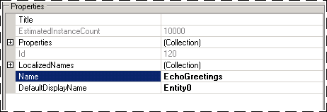
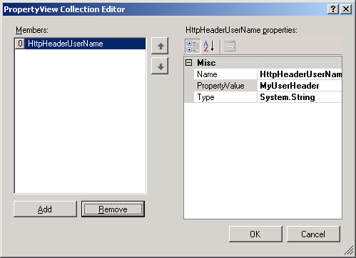
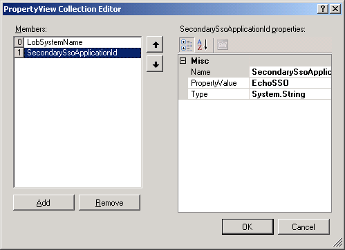
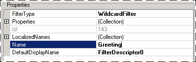
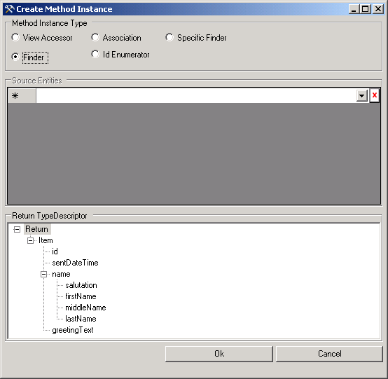
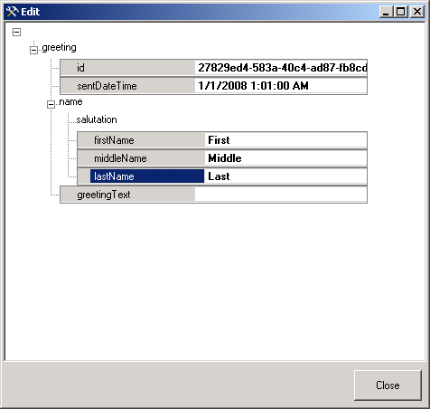

# Step 3: Create an Application Definition File
  
  
 **Time to complete:** 15 minutes  
  
 The Business Data Catalog feature in Microsoft Office SharePoint Server exposes and incorporates data from line-of-business (LOB) applications into portals. To incorporate this data into your portal site, you must build an application definition file that Microsoft Office SharePoint Server can consume.  
  
 In this step you use the Business Data Catalog Definition Editor tool, available with the Microsoft Office SharePoint Server 2007 SDK, to create an application definition file for the Business Data Catalog. This definition file describes the EchoGreetings method of the Echo adapter, and will be used in later steps to enable SharePoint to communicate with the adapter.  
  
 The purpose of the Microsoft Office SharePoint Server application that you are creating is to allow you to invoke the EchoGreetings method of the Echo adapter and return the response using a SharePoint Web Part.  
  
## Prerequisites  
 You should have completed [Step 2: Deploy the Web Project](../../adapters-and-accelerators/wcf-lob-adapter-sdk/step-2-deploy-the-web-project.md). You must also have access to the Business Data Catalog Definition Editor, which is installed as part of the Microsoft Office SharePoint Server 2007 SDK. You can download the SDK from [http://go.microsoft.com/fwlink/?LinkId=104130](http://go.microsoft.com/fwlink/?LinkId=104130).  
  
## Creating an Application Definition File  
 This topic provides step-by-step instructions to create an application definition file for connecting the SharePoint Business Data Catalog with the WCF adapter hosted in IIS.  
  
#### To connect to the WCF adapter service and create entities  
  
1.  From the **Start menu**, point to **All Programs**, and then click **Microsoft Business Data Catalog Definition Editor**.  
  
2.  On the toolbar, click **Add LOB System**.  
  
3.  In the Add LOB System window, click **Connect to Webservice**.  
  
4.  In the **URL** box, type the URL for the WCF service. The URL must be in the following format: `https://machinename/EchoWeb/EchoOutboundContract.svc?wsdl`  
  
5.  Click **Connect**.  
  
6.  To see the available operations, click the **Add Web Method** tab. You should see the EchoGreetings method. Drag the method to the Design Surface.  
  
7.  Click **OK**.  
  
8.  In the **Enter the name for the LOB System** dialog box, type a name in the **LOB System Name** box. For this example, enter **EchoWSLOB**, and then click **OK**.  
  
9. Expand the **EchoWSLob** node, and then expand the **Entities** node. Select **Entity0** and in the Properties pane type **EchoGreetings** as the value for the **Name** property.  
  
       
  
## Specify User Name and Password Headers for the Method  
 When calling a WCF adapter, you may have to provide user credentials that will be passed to the LOB system. In [Step 1: Use the Adapter Service Development Wizard to Create the Web Project](../../adapters-and-accelerators/wcf-lob-adapter-sdk/step-1-use-the-adapter-service-development-wizard-to-create-the-web-project.md), you configured the Echo adapter to require that user name and password information be provided in the MyUserHeader and MyPassHeader fields. You must now use the same field names for this application definition file.  
  
#### To specify user name and password headers  
  
1.  In the Metadata Objects pane, expand the **EchoGreetings** node, and then expand the **Methods** node.  
  
2.  Click the **EchoGreetings** node and, in the Properties pane, click the ellipsis **(…)** button in the **Properties** field.  
  
3.  In the PropertyView Collection Editor window, click **Add**, and in the **Name** field of the Property pane, type  **HttpHeaderUserName**.  
  
       
  
4.  In the **PropertyValue**field, type **MyUserHeader**.  
  
5.  Click **Add**, and in the Property pane type **HttpHeaderPassword** for the Name field, then type **MyPassHeader** for the **PropertyValue** field.  
  
6.  Click **OK**.  
  
## Set up Single Sign-On for Connecting to the Echo Adapter  
 SharePoint uses information from Single Sign-On to populate the MyUserHeader and MyPassHeader with authentication values. To link this application definition file to Single Sign-On, you must provide a SecondarySsoApplicationId.  
  
#### To set the SecondarySsoApplicationId property  
  
1. In the Metadata Objects pane, expand the **EchoWSLOB** node, and then expand the **Instances** node.  
  
2. Click **EchoWSLOB_Instance**, and in the Properties pane, click the ellipsis <strong>(…)</strong>button in the **Properties** field.  
  
3. In the PropertyView Collection Editor window, click **Add**, and in the Property pane, type **SecondarySsoApplicationId** in the **Name** field.  
  
4. In the **PropertyValue** field, type **EchoSSO**.  
  
      
  
5. Click **OK**.  
  
## Create Input Filters and Default Values  
 The application definition file must be able to  accept user input that can be passed to a Web service. To accomplish this, you must perform the following set of tasks:  
  
#### To create a filter, and map it to the greeting parameter  
  
1.  In the Metadata Objects pane, expand the **EchoWSLOB** node, and then expand the **Methods** node.  
  
2.  Expand the **EchoGreetings** method, right-click **Filters**, and then click **Add Filter**.  
  
3.  In the Properties pane, type **Greeting** in the **Name** field.  
  
       
  
4.  In the Metadata Objects pane, expand the **EchoWSLOB** node, and then expand the **Methods** node  
  
5.  Expand the **EchoGreetings** method, and then expand the **Parameters** node.  
  
6.  Expand the **greeting** node, and then expand the second **greeting** node.  
  
7.  Click the **greetingText** node, and in the Properties pane, select **Greeting** from the **FilterDescriptor** list.  
  
#### To create a Finder method instance for the EchoGreetings method  
  
1.  In the Metadata Objects pane, expand the **EchoWSLOB** node, and then expand the **Methods** node.  
  
2.  Expand the **EchoGreetings** method, right-click **Instances**, and then click **Add Method Instance** to open the Create Method Instance window.  
  
3.  In the Create Method Instance window, click **Finder** for **Method Instance Type**, and then select **Return** for **Return TypeDescriptor**.  
  
       
  
4.  Click **OK**.  
  
5.  In the Properties pane, type **EchoGreetings_Instance** in the **Name** field.  
  
#### To set default parameters  
  
1.  In the Metadata Objects pane, expand the **EchoWSLOB** node, and then expand the **Methods** node.  
  
2.  Expand the **EchoGreetings** method, and then expand the **Instances** node.  
  
3.  Select the **EchoGreetings_Instance** method instance, and in the Properties pane, click the ellipsis button (…) in the **DefaultValues** field.  
  
4.  In the Edit window, expand the **greeting** node, and then expand the second **greeting** node. Expand the **name** node, until the tree structure is fully displayed.  
  
5.  In the Edit window, set the field values as follows:  
  
    |Set this|To this|  
    |--------------|-------------|  
    |**id**|A GUID value, for example 27829ed4-583a-40c4-ad87-fb8cdd9dc98d.|  
    |**sentDateTime**|The current date and time, for example 05/15/08 9:12 AM|  
    |**firstName**|First|  
    |**middleName**|Middle|  
    |**lastName**|Last|  
  
       
  
6.  Click **Close**.  
  
### To export the application definition file  
  
1.  In the Metadata Objects pane, right-click the **EchoWSLOB** node, and then click **Export**.  
  
2.  Save the file as EchoWS.xml.  
  
## What did I just do?  
 You have used the Business Data Catalog Definition Editor tool to create an application definition file that can be imported into Microsoft Office SharePoint Server 2007 to enable connectivity with your adapter that is hosted in IIS.  
  
## Next Steps  
 You must now create a SharePoint application based on the application definition file created in this step. See [Step 4: Create a Sharepoint Application to Access the Adapter](../../adapters-and-accelerators/wcf-lob-adapter-sdk/step-4-create-a-sharepoint-application-to-access-the-adapter.md) for instructions.  
  
## See Also  
 [Tutorial 3: Hosting the Echo Adapter in IIS](../../adapters-and-accelerators/wcf-lob-adapter-sdk/tutorial-3-hosting-the-echo-adapter-in-iis.md)