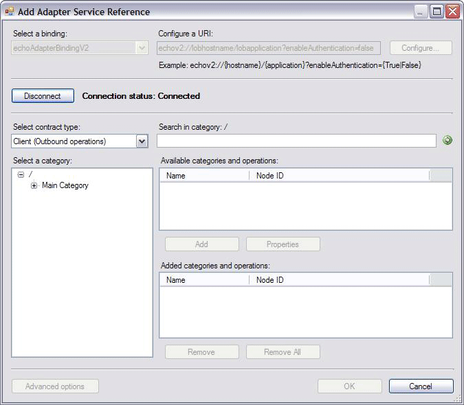
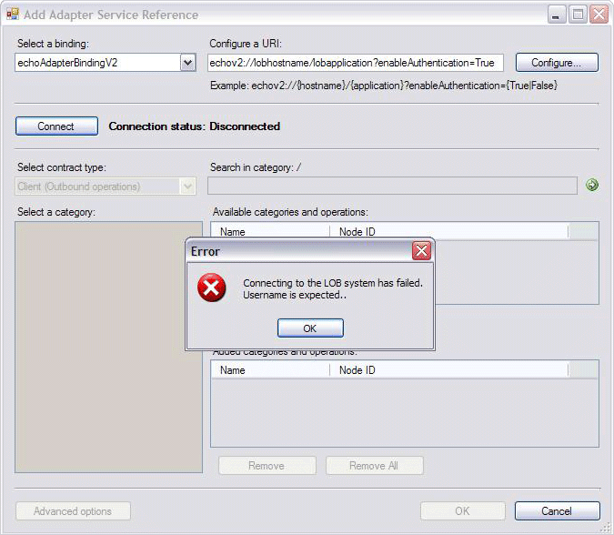
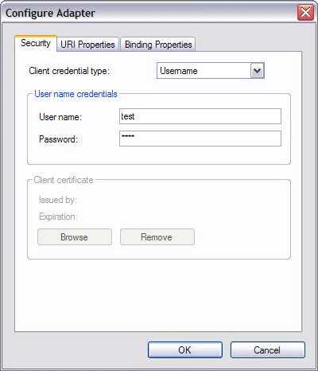
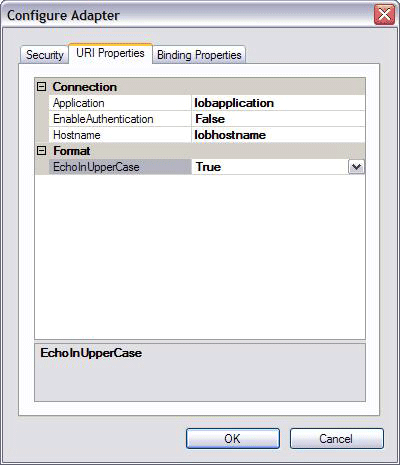

# Step 3: Implement the Connection for the Echo Adapter
  

 **Time to complete:** 45 minutes  

 In this step, you implement the connection capability of the Echo adapter. According to the [!INCLUDE[afproductnameshort](../../includes/afproductnameshort-md.md)], you must implement the following abstract class and interfaces when connecting to the target system.  

- `Microsoft.ServiceModel.Channels.Common.ConnectionUri`  

- `Microsoft.ServiceModel.Channels.Common.IConnection`  

- `Microsoft.ServiceModel.Channels.Common.IConnectionFactory`  

  Instead of deriving from the above abstract class and interfaces, the [!INCLUDE[afdevwizardnameshort](../../includes/afdevwizardnameshort-md.md)] automatically generates the three derived classes, EchoAdapterConnection, EchoAdapterConnectionUri, and EchoAdapterConnectionFactory. In addition to creating the classes, each has a default method that throws a specific exception, `System.NotImplementedException`.  This statement reminds the developer to implement each class.  When the class is implemented, this exception-throwing statement must be removed.  

  In the following section, you update those three classes to get a better understanding of how to handle a connection, what the URI structure is, and how to programmatically retrieve various URI elements and then use those elements within the adapter.  

## Prerequisites  
 Before you begin this step, you must have successfully completed [Step 2: Categorize the Adapter and Connection Properties](../../adapters-and-accelerators/wcf-lob-adapter-sdk/step-2-categorize-the-adapter-and-connection-properties.md). And you should have a clear understanding of the `Microsoft.ServiceModel.Channels.Common.IConnection`, `Microsoft.ServiceModel.Channels.Common.IConnectionFactory`, and `Microsoft.ServiceModel.Channels.Common.ConnectionUri` classes.  

## Connection-Related Classes  
 The [!INCLUDE[afdevwizardnameshort](../../includes/afdevwizardnameshort-md.md)] generates three derived classes, EchoAdapterConnection, EchoAdapterConnectionUri, and EchoAdapterConnectionFactory. The following provides a brief overview of methods associated with each.  

### EchoAdapterConnection  
 Depending on your adapter complexity, you might need to implement all of the following five methods. For Echo adapter, most are not supported, because the Echo adapter sample does not involve any target system.  

|**Method**|**Description**|  
|----------------|---------------------|  
|public void Close(TimeSpan timeout)|Closes the connection to the target system. The Echo adapter uses this method to only add trace events to the trace listener.|  
|public bool IsValid(TimeSpan timeout)|Returns a value indicating whether the connection is still valid.<br /><br /> Not supported by the Echo adapter.|  
|public void Open(TimeSpan timeout)|Opens the connection to the target system.<br /><br /> N/A for the Echo adapter. However, the example shows you how to use a URI element called enableAuthentication to require users to provide a user name.|  
|public void ClearContext()|Clears the context of the connection. This method is called when the connection is set back to the connection pool.<br /><br /> Not supported by the Echo adapter.|  
|public void Abort()|Aborts the connection to the target system.<br /><br /> Not supported by the Echo adapter.|  

### EchoAdapterConnectionFactory  
 The connection factory is responsible for creating the connection. By default, you must modify this class only when connecting to a target system. Although the Echo adapter does not involve any target system, it shows you how to use a custom URI element called enableAuthentication if your connection requires user authentication.  

> [!NOTE]
>  The enableAuthentication is not a keyword, it is just a variable name. Hence, you can choose any name for it.  

### EchoAdapterConnectionUri  
 This represents a connection string to the target system.  


|               **Method**               |                                                                                                                                       **Description**                                                                                                                                        |
|----------------------------------------|----------------------------------------------------------------------------------------------------------------------------------------------------------------------------------------------------------------------------------------------------------------------------------------------|
|        public override Uri Uri         |                                                                                                    Gets and sets the Uri. Gets to build the Uri string and sets to parse the Uri string.                                                                                                     |
|   public EchoAdapterConnectionUri()    |                                                                                                                    Initializes a new instance of the ConnectionUri class.                                                                                                                    |
| public override string SampleUriString | Returns EchoAdapter.SCHEME + "://{hostname}/{application}?enableAuthentication={True&#124;False}".<br /><br /> This return string displays as the **Example** in the [!INCLUDE[addadapterservrefshort](../../includes/addadapterservrefshort-md.md)] tool, as shown in the following figure. |

   

## Echo Adapter Connection URI  
 The sample Echo adapter connection URI is described as: EchoAapter.SCHEME://{hostname}/{application}?enableAuthentication={true&#124;false}  

 Since the EchoAapter.SCHEME is echov2, the connection URI is:  

 echo2://lobhostname/lobapplication?enableAuthentication={true&#124;false}  

 You can read the previous connection URI when enableAuthentication=false as follows:  

 Using the echov2 transport schema, go to a computer named lobhostname, where an application named lobapplication that does not require any authentication is waiting for your connection.  

 Or, when enableAuthentication=true, read the connection as follows:  

 Using the echov2 transport schema, go to a computer named lobhostname, where an application named lobapplication expects that authentication is waiting for your connection. For the Echo adapter, only a user name is required.  

 With a defined URI, you can programmatically consume and parse it for connectivity and configuration. If the connection requires sensitive data such as a user name and password, do not contain such information in the URI. Instead, add such information in the `System.ServiceModel.Description.ClientCredentials` object. The code example that you add shows you how to do so.  

 In the following code, the Echo adapter constructs the URI in two ways to show you how the adapter can use various URI elements to modify the adapter feature.  

 echo2://lobhostname/lobapplication?enableAuthentication=[true&#124;false]  

 echo2://lobhostname/lobapplication?enableAuthentication=[true&#124;false]&echoInUpperCase=true  

### Retrieving the URI Element  
 You can parse each URI element in the Echo adapter URI echo2://lobhostname/lobapplication?enableAuthentication=false&echoInUpperCase=false.  The URI element values and associated methods are listed in the following table:  

|**URI Element Value**|**Method**|  
|---------------------------|----------------|  
|lobhostname|`System.Uri.Host%2A` to retrieve the host name|  
|Lobapplication|`System.Uri.AbsolutePath%2A` to retrieve the target application name|  
|enableAuthentation=false|GetQueryStringValue("enableAuthentication")<br /><br /> Use this URI element to validate user credentials **Note:**  GetQueryStringValue is a static method defined in the `Microsoft.ServiceModel.Channels.Common.ConnectionUri`|  
|echoInUpperValue=false|GetQueryStringValue("echoInUpperValue")<br /><br /> Use this URI element to convert the incoming string to upper case.|  

### EnableAuthentication URI Element  
 Your target system often requires you to provide client credentials to establish a connection to the target system. As mentioned, the Echo adapter does not involve any target system. Though as a sample, it shows how to use a custom URI element called enableAuthentication to provide the credentials.  

```  
 public class EchoAdapterConnection : IConnection   
{  
….  
   public void Open(TimeSpan timeout)  
  {  
    // only validate the credentials if EnableAuthentication  
    // connection property value is true  
    if (this.ConnectionFactory.ConnectionUri.EnableAuthentication)  
    {  
        // this adapter expects a value in username  
        if (this.connectionFactory.ClientCredentials != null &&  
            string.IsNullOrEmpty(this.connectionFactory.ClientCredentials.UserName.UserName))  
        {  
            throw new CredentialsException("Username is expected.");  
        }  
  }  
}  
```  

 The code checks to see if enableAuthentication is true and if a user name is not provided; if a user name is not provided, it throws an exception, which is caught by the [!INCLUDE[addadapterservrefshort](../../includes/addadapterservrefshort-md.md)] tool, as shown below:  

   

 To provide the user name, you can enter it in the Configure Adapter dialog box in the [!INCLUDE[addadapterservrefshort](../../includes/addadapterservrefshort-md.md)] tool, as shown in the following figure:  

   

### EchoInUpperCase URI Element  
 The EchoInUpperCase URI element can be referenced like a Boolean flag. If the flag is true, then the adapter converts the input string of the EchoStrings operation to uppercase.  

 To change the default value of the echoInUpperCase URI element, use the URI Properties tab of the Configure Adapter in the [!INCLUDE[addadapterservrefshort](../../includes/addadapterservrefshort-md.md)], as shown below.  

   

## Updating EchoAdapterConnection  
 You implement the IsValid, Open, and Close method of the EchoAdapterConnection class.  

#### To update the EchoAdapterConnection class  

1.  In **Solution Explorer**, double-click the **EchoAdapterConnection.cs** file.  

2.  In the Visual Studio editor, right-click anywhere within the editor, in the context menu, point to **Outlining**, and then click **Stop Outlining**.  

3.  In the Visual Studio editor, find the **IsValid** method. Inside the **IsValid** method, replace the existing implementation with the one below:  

    ```csharp  
    return true;  
    ```  

4.  In the Visual Studio editor, find the **Open** method. Inside the **Open** method, replace the existing implementation with the following implementation. This shows you how to use the URI enableAuthentication element to ensure user  name is provided:  

    ```csharp  
    // only validate the credentials if EnableAuthentication  
    // connection property value is true  
    if (this.ConnectionFactory.ConnectionUri.EnableAuthentication)  
    {  
        // this adapter expects a value in username  
        // it just logs the credentials in the trace file  
        if (this.connectionFactory.ClientCredentials != null &&  
            string.IsNullOrEmpty(this.connectionFactory.ClientCredentials.UserName.UserName))  
        {  
            throw new CredentialsException("Username is expected.");  
        }  
        // got the username, log it in trace file  
        EchoAdapterUtilities.Trace.Trace(System.Diagnostics.TraceEventType.Information, "EchoAdapterConnection::Open", "Username is " + this.connectionFactory.ClientCredentials.UserName.UserName);  
    }  
    EchoAdapterUtilities.Trace.Trace(System.Diagnostics.TraceEventType.Information, "EchoAdapterConnection::Open", "Connection successfully established!");  
    ```  

5.  In the Visual Studio editor, find the **Close** method. Inside the **Close** method, add the following single statement:  

    ```csharp  
    EchoAdapterUtilities.Trace.Trace(System.Diagnostics.TraceEventType.Information, "EchoAdapterConnection::Close", "Connection successfully closed!");  
    ```  

## Updating the EchoAdapterConnectionFactory  
 You implement EchoAdapterConnectionFactory constructor, and add two properties called ClientCredentials and ConnectionUri.  

#### To update the EchoAdapterConnectionFactory class  

1.  In **Solution Explorer**, double-click the **EchoAdapterConnectionFactory.cs** file.  

2.  In the Visual Studio editor, right-click anywhere within the editor, in the context menu, point to **Outlining**, and then click **Stop Outlining**.  

3.  In the Visual Studio editor, find the **Private Fields** region. Add the following single statement:  

    ```csharp  
    private EchoAdapterConnectionUri connectionUri;  
    ```  

     Your list of private fields should match the following:  

    ```csharp  
    // Stores the client credentials  
    private ClientCredentials clientCredentials;  
    // Stores the adapter class  
    private EchoAdapter adapter;  
    private EchoAdapterConnectionUri connectionUri;  
    ```  

4.  In the Visual Studio editor, find the **EchoAdapterConnectionFactory** method. Inside the **EchoAdapterConnectionFactory** constructor method, before "}", add the following single statement as the last statement.  

    ```csharp  
    this.connectionUri = connectionUri as EchoAdapterConnectionUri;  
    ```  

     The implementation of the **EchoAdapterConnectionFactory** method should match the following:  

    ```csharp  
    /// <summary>  
    /// Initializes a new instance of the EchoAdapterConnectionFactory class  
    /// </summary>  
    public EchoAdapterConnectionFactory(ConnectionUri connectionUri  
        , ClientCredentials clientCredentials  
        , EchoAdapter adapter)  
    {  
        this.clientCredentials = clientCredentials;  
        this.adapter = adapter;  
        //added  
        this.connectionUri = connectionUri as EchoAdapterConnectionUri;  
    }  
    ```  

5.  In the Visual Studio editor, find the **Public Properties** region. Add the following code:  

    ```csharp  
    /// <summary>  
    /// Returns the client credentials  
    /// </summary>  
    public ClientCredentials ClientCredentials  
    {  
        get  
        {  
            return this.clientCredentials;  
        }  
    }  

    /// <summary>  
    /// Returns the Connection Uri for this adapter  
    /// </summary>  
    public EchoAdapterConnectionUri ConnectionUri  
    {  
        get  
        {  
            return this.connectionUri;  
        }  
    }  
    ```  

## Updating the EchoAdapterConnectionUri  
 You implement the EchoAdapterConnectionUri default constructor, EchoAdapterConnectionUri(Uri uri) overloaded constructor, and the public override Uri Uri property.  

#### To update the EchoAdapterConnectionUri class  

1.  In **Solution Explorer**, double-click the **EchoAdapterConnectionUri.cs** file.  

2.  In the Visual Studio editor, right-click anywhere within the editor, in the context menu, point to **Outlining**, and then click **Stop Outlining**.  

3.  In the Visual Studio editor, find the **Constructors** region. Inside the **EchoAdapterConnectionUri()** default constructor, add the following statement:  

    ```csharp  
    Uri = new Uri("echov2://lobhostname/lobapplication?enableauthentication=False");  
    ```  

4.  In the Visual Studio editor, inside the **EchoAdapterConnectionUri(Uri uri)** overloaded constructor, and add the following statement:  

    ```csharp  
    Uri = uri;  
    ```  

     Your implementation of the EchoAdapterConnectionUri(Uri uri) method should match the following:  

    ```csharp  
    public EchoAdapterConnectionUri(Uri uri)  
        : base()  
    {  
        Uri = uri;  
    }  
    ```  

5.  In the Visual Studio editor, inside the **public override Uri Uri** method, replace the existing with the following logic. The get builds the Uri with echoInUpperCase or without it. The set parses the URI to retrieve host name, database name, and query values.  

    ```csharp  
    get  
    {  
        // Build the uri  
        if (String.IsNullOrEmpty(this.hostname)) throw new InvalidUriException("Invalid target system host name.");  
        if (String.IsNullOrEmpty(this.application)) throw new InvalidUriException("Invalid target system data source name.");  
        if (EchoInUpperCase)  
        {  
            // build the uri with echoInUpperCase= query string  
            return new Uri(EchoAdapter.SCHEME + "://" + Hostname + "/" + Application + "?" + "enableAuthentication=" + EnableAuthentication + "&" + "echoInUpperCase=" + echoInUpperCase);  
        }  
        else  
        {  
            // build the uri without echoInUpperCase= query string  
            return new Uri(EchoAdapter.SCHEME + "://" + Hostname + "/" + Application + "?" + "enableAuthentication=" + EnableAuthentication);  
        }  
    }  
    set  
    {  
        // Parse the uri  
        String[] enableAuthValue = GetQueryStringValue(value, "enableAuthentication");  
        if (enableAuthValue.Length > 0) this.enableAuthentication = Boolean.Parse(enableAuthValue[0]);  
        String[] echoInUpperValue = GetQueryStringValue(value, "echoInUpperCase");  
        if (echoInUpperValue.Length > 0) this.echoInUpperCase = Boolean.Parse(echoInUpperValue[0]);  

        this.hostname = value.Host;  
        String[] applicationValue = value.AbsolutePath.Split('/');  
        if (applicationValue.Length > 1) this.Application = applicationValue[1];  
    }  
    ```  

6.  In Visual Studio, on the **File** menu, click **Save All**.  

7.  On the **Build** menu, click **Build Solution**. You should successfully compile the project. If not, ensure that you have followed every step above.  

> [!NOTE]
>  You saved your work. You can safely close Visual Studio at this time or go to the next step, [Step 4: Implement the Metadata Browse Handler for the Echo Adapter](../../adapters-and-accelerators/wcf-lob-adapter-sdk/step-4-implement-the-metadata-browse-handler-for-the-echo-adapter.md).  

## What Did I Just Do?  
 You implemented the connection for the Echo adapter. You learned the connection components of the [!INCLUDE[afproductnameshort](../../includes/afproductnameshort-md.md)], the basic structure of the connection URI, how to programmatically parse the URI elements, and how you can use the URI element to change the adapter feature.  

## Next Steps  
 You implement metadata browsing, searching, and resolving capabilities, and the outbound message exchange. Finally, you build and deploy the adapter.  

## See Also  
 [Step 4: Implement the Metadata Browse Handler for the Echo Adapter](../../adapters-and-accelerators/wcf-lob-adapter-sdk/step-4-implement-the-metadata-browse-handler-for-the-echo-adapter.md)   
 [Tutorial 1: Develop the Echo Adapter](../../adapters-and-accelerators/wcf-lob-adapter-sdk/tutorial-1-develop-the-echo-adapter.md)