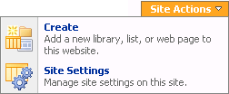
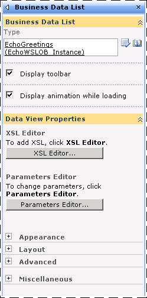
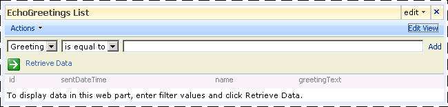

# Step 4: Create a Sharepoint Application to Access the Adapter
  
  
 **Time to complete:** 15 minutes  
  
 In this step you take the application definition file that you created using the Business Data Catalog Definition Editor tool, and import it into Microsoft Office SharePoint Server.  
  
## Prerequisites  
  
-   You should have created an application file as described in [Step 3: Create an Application Definition File](../../adapters-and-accelerators/wcf-lob-adapter-sdk/step-3-create-an-application-definition-file.md).  
  
-   The Microsoft Single Sign-On service must be running.  
  
## How to Create a SharePoint Application  
 Creating a SharePoint application involves the following steps:  
  
- Create a Single Sign-On (SSO) application in SharePoint.  
  
- Create a Shared Services Provider, and import the application definition file.  
  
- Create a Web Part page, and add Web Parts.  
  
  This topic demonstrates how to perform these steps.  
  
## Creating an SSO Application in SharePoint  
 To pass user credentials to the Echo adapter from a SharePoint application, you must set up an SSO application that maps to a user account or group.  
  
#### Manage server settings for Single Sign-On  
  
1.  Start SharePoint 3.0 Central Administration. On the **Start** menu, point to **All Programs**, point to **Microsoft Office Server**, and then click **SharePoint 3.0 Central Administration**.  
  
2.  On the top navigation bar, click **Operations**.  
  
3.  On the Operations page, in the **Security Configuration** section, click **Manage settings for single sign-on**.  
  
4.  On the Manage Settings for Single Sign-On page, in the **Server Settings** section, click **Manage Server Settings**.  
  
5.  Ensure that the information on this page is correct for your Single Sign-On installation. For more information about these operations, see “Configure single sign-on (Office SharePoint Server)” at [http://go.microsoft.com/fwlink/?LinkId=105291](http://go.microsoft.com/fwlink/?LinkId=105291).  
  
#### Manage settings for enterprise application definitions  
  
1.  In SharePoint Central Administration, on the top navigation bar, click **Operations**.  
  
2.  On the Operations page, in the **Security Configuration** section, click **Manage Settings for single sign-on**.  
  
3.  On the Manage Settings for Single Sign-On page, in the **Enterprise Application Definition Settings** section, click **Manage Settings for enterprise application definitions**.  
  
4.  On the Manage Enterprise Application Definitions page, click **New Item**.  
  
5.  On the Create Enterprise Application Definitions Page, set the **Display name** field to **EchoSSO**, and then set the **Application name** field to **EchoSSO**. This value should match the SecondarySsoApplicationId you specified in [Step 3: Create an Application Definition File](../../adapters-and-accelerators/wcf-lob-adapter-sdk/step-3-create-an-application-definition-file.md).  
  
6.  In the **Contact e-mail address** field, enter your e-mail address, and then click **OK**.  
  
#### Manage account information for enterprise application definitions  
  
1.  In SharePoint Central Administration, on the top navigation bar, click **Operations**.  
  
2.  On the Operations page, in the **Security Configuration Section**, click **Manage settings for single sign-on**.  
  
3.  On the Manage Settings for Single Sign-On page, in the **Enterprise Application Definition Settings** section, click **Manage account information for enterprise application definitions**.  
  
4.  On the Manage Account Information for an Enterprise Application Definition, select **EchoSSO** from the **Enterprise application definition** list.  
  
5.  In the **Group account name** field, type the Windows group that will be used to secure this application definition. For example, **DOMAIN\Domain Users**.  
  
6.  Click **Set**.  
  
7.  On the Provide EchoSSO Account Information page, in the **Username** field type **testuser**, and then in the **Password** field type **testpassword**.  
  
8.  Click **OK**, and then click **Done**.  
  
## Creating a Shared Services Provider and importing the application definition file  
 A Shared Services Provider (SSP) is a logical grouping of shared services and their supporting resources. You can create an SSP by using the SharePoint Central Administration Console. This example will work in any SSP. For more information about creating an SSP, see “Chapter overview: Create and Configure Shared Services Providers” at [http://go.microsoft.com/fwlink/?LinkId=105119](http://go.microsoft.com/fwlink/?LinkId=105119).  
  
### To import the application definition file  
  
1.  Start SharePoint 3.0 Central Administration. On the **Start** menu, point to **All Programs**, point to **Microsoft Office Server**, and then click **SharePoint 3.0 Central Administration**.  
  
2.  In the left navigation pane, click the name of the SSP to which you want to import the application definition.  
  
3.  In the **Business Data Catalog** section, click **Import application definition**.  
  
4.  On the Import Application Definition page, click **Browse**, and then select the EchoWS.xml file.  
  
5.  Click **Import**, and then click **OK**.  
  
## Creating Web Parts  
 You must now create Web Parts in your SharePoint site to use the method instance created in the Business Data Catalog Definition Editor. Web Parts are reusable components that can contain any kind of Web-based information, including analytical, collaborative, and database information.  
  
#### To create a Web Part page  
  
1.  Start SharePoint 3.0 Central Administration. On the **Start** menu, point to **All Programs**, point to **Microsoft Office Server**, and then click **SharePoint 3.0 Central Administration**.  
  
2.  In the left navigation pane, click the name of the SSP in which you imported the application definition file.  
  
3.  On the Shared Services Administration page, in the upper-right corner, click **Site Actions**, and then click **Create**.  
  
       
  
4.  On the **Create** page, in the **Web Pages** section, click **Web Part Page**.  
  
5.  On the New Web Part page, in the **Name** field, type **EchoPart**, and then select **Full Page, Vertical** from the **Chose a Layout Template** list.  
  
6.  Click **Create**.  
  
#### To add a Business Data Web Part  
  
1.  Click **Add a Web Part**.  
  
2.  In the **Add Web Parts** dialog box, select **Business Data List**, and then click **Add**.  
  
       
  
3.  Click **Open the tool pane**.  
  
4.  The Business Data List tool pane opens in the right pane. In the **Business Data List** section, for the **Type** field, click the **Browse** button.  
  
       
  
5.  In the **Business Data Type Picker** dialog box, select the **EchoWSLob_Instance** application, and then click **OK**.  
  
6.  On the Business Data List tool pane, click **OK**.  
  
7.  You are presented with a field that allows you to enter a greeting value to pass to the EchoGreetings method. Enter data in the greeting field and click **Retrieve Data**. This invokes the EchoGreetings method of the Echo adapter hosted in IIS and returns a response.  
  
       
  
    > [!NOTE]
    >  The name column does not contain the user information, but only displays BDC.Name. This occurs because the BDC expects only a simple record structure, and does not display the complex structure represented by the name field.  
  
8.  Click **Exit Edit Mode** from the upper corner of the page.  
  
## What did I just do?  
 You have used the SharePoint 3.0 Central Administration to import an application definition, and create Web Parts that use this definition to invoke the EchoGreetings operation of the Echo adapter.  
  
## Next Steps  
 This tutorial is complete. For more information using the Business Data Catalog, see “Business Data Catalog” at [http://go.microsoft.com/fwlink/?LinkId=119921](http://go.microsoft.com/fwlink/?LinkId=119921).  
  
## See Also  
 [Tutorial 3: Hosting the Echo Adapter in IIS](../../adapters-and-accelerators/wcf-lob-adapter-sdk/tutorial-3-hosting-the-echo-adapter-in-iis.md)