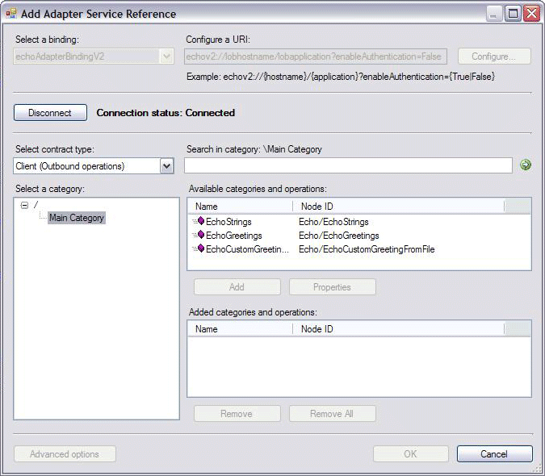
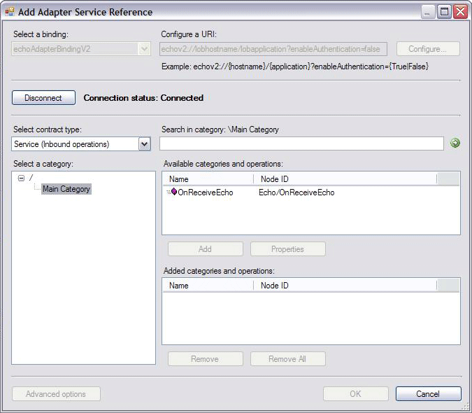

# Step 4: Implement the Metadata Browse Handler for the Echo Adapter
  
  
 **Time to complete:** 45 minutes  
  
 In this step, you implement the browse capability of the Echo adapter. This capability allows your adapter to perform a connection-based browse to obtain metadata from the target system. Regardless of your adapter's capabilities, your adapter must support the browse capability.  
  
 According to the [!INCLUDE[afproductnameshort](../../includes/afproductnameshort-md.md)], to support browse capability, you must implement the `Microsoft.ServiceModel.Channels.Common.IMetadataBrowseHandler` interface. For the Echo adapter, the [!INCLUDE[afdevwizardnameshort](../../includes/afdevwizardnameshort-md.md)] automatically generates the derived class called EchoAdapterMetadataBrowseHandler.  
  
 In the following steps, you update this class to get a better understanding of how to implement the `Microsoft.ServiceModel.Channels.Common.IMetadataBrowseHandler.Browse%2A` method, how to set various properties of the `Microsoft.ServiceModel.Channels.MetadataRetrievalNode` object, and how the operation and category nodes supported by the adapter appear in the [!INCLUDE[addadapterservrefshort](../../includes/addadapterservrefshort-md.md)] tool.  
  
## Prerequisites  
 Before you begin this step, you must have successfully completed [Step 3: Implement the Connection for the Echo Adapter](../../adapters-and-accelerators/wcf-lob-adapter-sdk/step-3-implement-the-connection-for-the-echo-adapter.md). You must also understand the following classes:  
  
-   `Microsoft.ServiceModel.Channels.MetadataRetrievalNode`  
  
-   `Microsoft.ServiceModel.Channels.MetadataRetrievalNodeDirections`  
  
-   `Microsoft.ServiceModel.Channels.Common.IMetadataBrowseHandler`  
  
## The IMetadataBrowseHandler Interface  
 The `Microsoft.ServiceModel.Channels.Common.IMetadataBrowseHandler` interface is defined as:  
  
```  
public interface IMetadataBrowseHandler : IConnectionHandler, IDisposable  
{  
    MetadataRetrievalNode[] Browse(string nodeId, int childStartIndex, int maxChildNodes, TimeSpan timeout);  
}  
```  
  
 The `Microsoft.ServiceModel.Channels.Common.IMetadataBrowseHandler.Browse%2A` method returns an array of `Microsoft.ServiceModel.Channels.MetadataRetrievalNode` objects based on the method parameters. The parameter definitions for the `Microsoft.ServiceModel.Channels.Common.IMetadataBrowseHandler.Browse%2A` method are described in the following table.  
  
> [!NOTE]
>  The Echo adapter implementation uses only the node ID and ignores the other three parameters, since the Echo adapter supports only a few nodes.  
  
|  **Parameter**  |                                                                                                                                                                                                                               **Definition**                                                                                                                                                                                                                                |
|-----------------|-----------------------------------------------------------------------------------------------------------------------------------------------------------------------------------------------------------------------------------------------------------------------------------------------------------------------------------------------------------------------------------------------------------------------------------------------------------------------------|
|     nodeId      | Each item in the hierarchy of the metadata explorer (the [!INCLUDE[addadapterservrefshort](../../includes/addadapterservrefshort-md.md)] and<br /><br /> [!INCLUDE[consumeadapterservshort](../../includes/consumeadapterservshort-md.md)]) has a nodeId. Each node ID must be unique and can be a category or an operation. The category can have subcategories. **Note:**  If null or an empty string (""), operations are retrieved from the root node ("/") by default. |
| childStartIndex |                                                                                                                                                                                           The index of the first child to return.<br /><br /> Not supported by the Echo adapter.                                                                                                                                                                                            |
|  maxChildNodes  |                                                                                                                                                                  The maximum number of result nodes to return. Use Int32.Max to retrieve all result nodes.<br /><br /> Not supported by the Echo adapter.                                                                                                                                                                   |
|     timeout     |                                                                                                                                                                                   The maximum time allowed for the operation to complete.<br /><br /> Not supported by the Echo adapter.                                                                                                                                                                                    |
  
 When implementing the `Microsoft.ServiceModel.Channels.Common.IMetadataBrowseHandler.Browse%2A` method, you must add every category and operation node to the array of `Microsoft.ServiceModel.Channels.MetadataRetrievalNode` objects. To specify a node as category, set the `Microsoft.ServiceModel.Channels.MetadataRetrievalNode.IsOperation%2A` to `false`. To specify a node as operation, set the `Microsoft.ServiceModel.Channels.MetadataRetrievalNode.IsOperation%2A` to `true`.  
  
## Echo Adapter Metadata Browse  
 Depending on your target system's categories and operations, there are many ways to build an array of `Microsoft.ServiceModel.Channels.MetadataRetrievalNode` objects. The operations and categories you choose should represent the operations you want to expose. But for the Echo adapter, it simply creates a `Microsoft.ServiceModel.Channels.MetadataRetrievalNode` object for each of the following nodes with node ID listed:  
  
```  
EchoMainCategory  (node under the root node)  
        Echo/EchoStrings   (outbound operation)  
        Echo/EchoGreetings(outbound operation)  
        Echo/EchoCustomGreetingFromFile(outbound operation)  
        Echo/OnReceiveEcho (inbound operation)  
```  
  
 The EchoMainCategory is the category node under the root node ("/"). This node is also used as the category for both inbound and outbound operations. Hence, when creating the `Microsoft.ServiceModel.Channels.MetadataRetrievalNode` object for that category, you can do the following:  
  
```  
MetadataRetrievalNode node = new MetadataRetrievalNode("EchoMainCategory");  
node.IsOperation = false; //category  
node.Direction = MetadataRetrievalNodeDirections.Inbound | MetadataRetrievalNodeDirections.Outbound  //for both inbound and outbound  
```  
  
 For an outbound operation such as Echo/EchoString that belongs to the EchoMainCategory, you can do the following:  
  
```  
if( "EchoMainCategory".CompareTo(nodeId) == 0 ) //category is EchoMainCategory  
      {  
          // Outbound operations  
          MetadataRetrievalNode outOpNode1 = new MetadataRetrievalNode("Echo/EchoStrings");  
          outOpNode1.DisplayName = "EchoStrings";  
          outOpNode1.Description = "This operation echoes the incoming string COUNT number of times in a string array.";  
          outOpNode1.Direction = MetadataRetrievalNodeDirections.Outbound;  
          outOpNode1.IsOperation = true;  
```  
  
 For an inbound operation such as Echo/OnReceiveEcho that belongs to the EchoMainCategory, you can do the following:  
  
```  
  if( "EchoMainCategory".CompareTo(nodeId) == 0 ) //category is EchoMainCategory  
        {             
// Inbound operations  
            MetadataRetrievalNode inOpNode1 = new MetadataRetrievalNode("Echo/OnReceiveEcho");  
            inOpNode1.DisplayName = "OnReceiveEcho";  
            inOpNode1.Description = "This operation echoes the location and length of a file dropped in the specified file system.";  
            inOpNode1.Direction = MetadataRetrievalNodeDirections.Inbound;  
            inOpNode1.IsOperation = true;  
```  
  
 When the [!INCLUDE[addadapterservrefshort](../../includes/addadapterservrefshort-md.md)] and [!INCLUDE[consumeadapterservshort](../../includes/consumeadapterservshort-md.md)] tools explore the Echo adapter metadata, by default, it starts from the root node ("/").  
  
 The following figure shows that the EchoMainCategory node appears under the root node ("/"):  
  
   
  
 To browse the three outbound operations, in the [!INCLUDE[addadapterservrefshort](../../includes/addadapterservrefshort-md.md)] tool, in the **Select contract type** drop-down list,select the **Client (Outbound operations)** option. You see those operations in the **Available categories and operations** list box, as shown below:  
  
   
  
 In the previous figure, notice that the `Microsoft.ServiceModel.Channels.MetadataRetrievalNode.DisplayName%2A` value appears in the **Name** column of the **Available categories and operations** list box. The parameter passed into the `Microsoft.ServiceModel.Channels.MetadataRetrievalNode` constructor appears in the **Node ID** column of the **Available categories and operations** list box, and the `Microsoft.ServiceModel.Channels.MetadataRetrievalNode.Description%2A` value appears as the tool tip that contains the description, when you right-click the `Microsoft.ServiceModel.Channels.MetadataRetrievalNode.DisplayName%2A`.  
  
 To see the inbound operations, in the [!INCLUDE[addadapterservrefshort](../../includes/addadapterservrefshort-md.md)] tool, in the **Select contract type** drop-down list,select the **Service (Inbound operations)** option. You see the inbound OnReceiveEcho operation in the **Available categories and operations** list box, as shown in the following figure:  
  
   
  
## Implementing the IMetadataBrowseHandler  
 In this step, you update the EchoAdapterMetadataBrowseHandler class to implement the Echo adapter's metadata browse, that is, to implement the `Microsoft.ServiceModel.Channels.Common.IMetadataBrowseHandler.Browse%2A` method of the `Microsoft.ServiceModel.Channels.Common.IMetadataBrowseHandler` interface. Specifically, you create a `Microsoft.ServiceModel.Channels.MetadataRetrievalNode` object for each category and operation, set appropriate values for that object, and then return the array of `Microsoft.ServiceModel.Channels.MetadataRetrievalNode` objects for category and operations. Keep in mind that when you create a `Microsoft.ServiceModel.Channels.MetadataRetrievalNode` object, you need to pass in the node ID, not the display name.  
  
#### To update the EchoAdapterMetadataBrowseHandler class  
  
1.  In Solution Explorer, double-click the **EchoAdapterMetadataBrowseHandler.cs** file.  
  
2.  In the Visual Studio editor, right-click anywhere within the editor, in the context menu, point to **Outlining**, and then click **Stop Outlining**.  
  
3.  In the Visual Studio editor, inside the **Browse** method, replace the existing logic with the following to create a `Microsoft.ServiceModel.Channels.MetadataRetrievalNode` object for EchoMainCategory.  
  
    ```csharp  
    if (MetadataRetrievalNode.Root.NodeId.Equals(nodeId))  
    {  
        MetadataRetrievalNode node = new MetadataRetrievalNode("EchoMainCategory");  
        node.DisplayName = "Main Category";  
        node.IsOperation = false;  
        node.Description = "This category contains inbound and outbound categories.";  
        node.Direction = MetadataRetrievalNodeDirections.Inbound | MetadataRetrievalNodeDirections.Outbound;  
        return new MetadataRetrievalNode[] { node };  
    }  
    ```  
  
4.  Continue adding the following logic to create a `Microsoft.ServiceModel.Channels.MetadataRetrievalNode` object for Echo/OnReceiveEcho.  
  
    ```csharp  
    if( "EchoMainCategory".CompareTo(nodeId) == 0 )  
    {  
        // Inbound operations  
        MetadataRetrievalNode inOpNode1 = new MetadataRetrievalNode("Echo/OnReceiveEcho");  
        inOpNode1.DisplayName = "OnReceiveEcho";  
        inOpNode1.Description = "This operation echos the location and length of a file dropped in the specified file system.";  
        inOpNode1.Direction = MetadataRetrievalNodeDirections.Inbound;  
        inOpNode1.IsOperation = true;  
    ```  
  
5.  Continue adding the following logic to create a `Microsoft.ServiceModel.Channels.MetadataRetrievalNode` object for Echo/EchoStrings.  
  
    ```csharp  
    // Outbound operations  
    MetadataRetrievalNode outOpNode1 = new MetadataRetrievalNode("Echo/EchoStrings");  
    outOpNode1.DisplayName = "EchoStrings";  
    outOpNode1.Description = "This operation echoes the incoming string COUNT number of times in a string array.";  
    outOpNode1.Direction = MetadataRetrievalNodeDirections.Outbound;  
    outOpNode1.IsOperation = true;  
    ```  
  
6.  Continue adding the following code to create a `Microsoft.ServiceModel.Channels.MetadataRetrievalNode` object for Echo/EchoGreetings.  
  
    ```csharp  
    MetadataRetrievalNode outOpNode2 = new MetadataRetrievalNode("Echo/EchoGreetings");  
    outOpNode2.DisplayName = "EchoGreetings";  
    outOpNode2.Description = "This operation echoes the incoming Greeting object COUNT number of times in an array of type Greeting.";  
    outOpNode2.Direction = MetadataRetrievalNodeDirections.Outbound;  
    outOpNode2.IsOperation = true;  
    ```  
  
7.  Continue adding the following code to create a `Microsoft.ServiceModel.Channels.MetadataRetrievalNode` object for Echo/ EchoGreetingFromFile.  
  
    ```csharp  
    MetadataRetrievalNode outOpNode3 = new MetadataRetrievalNode("Echo/EchoCustomGreetingFromFile");  
    outOpNode3.DisplayName = "EchoCustomGreetingFromFile";  
    outOpNode3.Description = "This operation echoes the greeting object by reading its instance from a file. The Greeting object's metadata is obtained from a predefined XSD file.";  
    outOpNode3.Direction = MetadataRetrievalNodeDirections.Outbound;  
    outOpNode3.IsOperation = true;  
    ```  
  
8.  Continue adding the following code to return an array of `Microsoft.ServiceModel.Channels.MetadataRetrievalNode` objects or null if not matched.  
  
    ```  
        return new MetadataRetrievalNode[] { inOpNode1, outOpNode1, outOpNode2, outOpNode3 };  
    }  
    return null;  
    ```  
  
9. In Visual Studio, on the **File** menu, click **Save All**.  
  
10. On the **Build** menu, click **Build Solution**. You should successfully build the project. If not, ensure that you have followed every step above.  
  
> [!NOTE]
>  You saved your work. You can safely close Visual Studio at this time or go to the next step, [Step 5: Implement the Metadata Search Handler for the Echo Adapter](../../adapters-and-accelerators/wcf-lob-adapter-sdk/step-5-implement-the-metadata-search-handler-for-the-echo-adapter.md).  
  
## What Did I Just Do?  
 You just implemented the metadata browsing capability of the Echo adapter, by implementing the `Microsoft.ServiceModel.Channels.Common.IMetadataBrowseHandler.Browse%2A` method of the `Microsoft.ServiceModel.Channels.Common.IMetadataBrowseHandler` interface. Specifically, you created a `Microsoft.ServiceModel.Channels.MetadataRetrievalNode` object for the category, and then returned it as an array of the `Microsoft.ServiceModel.Channels.MetadataRetrievalNode` objects. For each operation, you created a `Microsoft.ServiceModel.Channels.MetadataRetrievalNode` object, and then returned all those objects in an array of `Microsoft.ServiceModel.Channels.MetadataRetrievalNode`.  
  
## Next Steps  
 You implement metadata searching and resolving capabilities, and the outbound message exchange. Finally, you build and deploy the Echo adapter.  
  
## See Also  
 [Tutorial 1: Develop the Echo Adapter](../../adapters-and-accelerators/wcf-lob-adapter-sdk/tutorial-1-develop-the-echo-adapter.md)   
 [Step 3: Implement the Connection for the Echo Adapter](../../adapters-and-accelerators/wcf-lob-adapter-sdk/step-3-implement-the-connection-for-the-echo-adapter.md)   
 [Step 5: Implement the Metadata Search Handler for the Echo Adapter](../../adapters-and-accelerators/wcf-lob-adapter-sdk/step-5-implement-the-metadata-search-handler-for-the-echo-adapter.md)