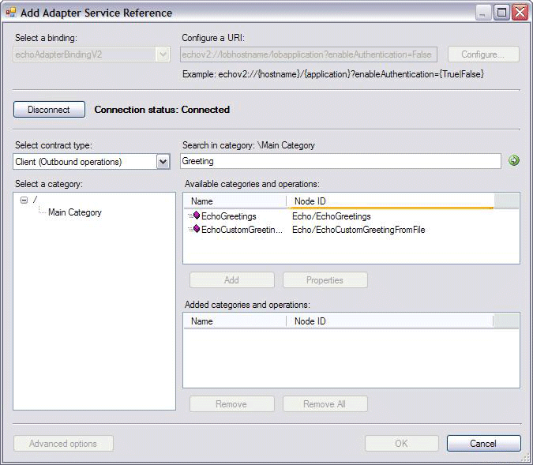
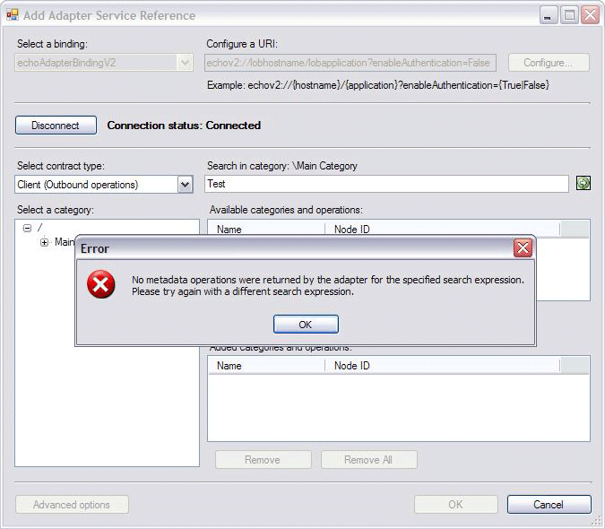

# Step 5: Implement the Metadata Search Handler for the Echo Adapter
  
  
 **Time to complete:** 30 minutes  
  
 In this step of the tutorial, you implement the search capability of the Echo adapter. Unlike browse, search is optional. According to the [!INCLUDE[afproductnameshort](../../includes/afproductnameshort-md.md)], to support search capability, you must implement the `Microsoft.ServiceModel.Channels.Common.IMetadataSearchHandler` interface. For the Echo adapter, the [!INCLUDE[afdevwizardnameshort](../../includes/afdevwizardnameshort-md.md)] automatically generates one derived class called EchoAdapterMetadataSearchHandler.  
  
 You first update the EchoAdapterMetadataSearchHandler class to get a better understanding of how to implement this interface, how to populate  `Microsoft.ServiceModel.Channels.MetadataRetrievalNode` object, and how the search results appear in the [!INCLUDE[addadapterservrefshort](../../includes/addadapterservrefshort-md.md)] tool.  
  
## Prerequisites  
 Before you begin this step, complete [Step 4: Implement the Metadata Browse Handler for the Echo Adapter](../../adapters-and-accelerators/wcf-lob-adapter-sdk/step-4-implement-the-metadata-browse-handler-for-the-echo-adapter.md). You must also have a clear understanding about the following classes:  
  
-   `Microsoft.ServiceModel.Channels.MetadataRetrievalNode`
  
-   `Microsoft.ServiceModel.Channels.Common.IMetadataSearchHandler`  
  
-   `Microsoft.ServiceModel.Channels.MetadataRetrievalNodeDirections`  
  
## The IMetadataSearchHandler Interface  
 The `Microsoft.ServiceModel.Channels.Common.IMetadataSearchHandler` is defined as:  
  
```  
public interface IMetadataSearchHandler : IConnectionHandler, IDisposable  
{  
    MetadataRetrievalNode[] Search(string nodeId, string searchCriteria, int maxChildNodes, TimeSpan timeout);  
}  
```  
  
 The `Microsoft.ServiceModel.Channels.Common.IMetadataSearchHandler.Search%2A` method returns an array of `Microsoft.ServiceModel.Channels.MetadataRetrievalNode` objects based on the search criteria. The parameter definitions for the Search method are described in the following table:  
  
|**Parameter**|**Definition**|  
|-------------------|--------------------|  
|nodeId|The node ID to start searching from. If null or an empty string (""), operations will be retrieved from the root node ("/").|  
|searchCriteria|The search criteria, which is adapter-specific. If no search criteria are specified, the adapter should return all nodes.|  
|maxChildNodes|The maximum number of result nodes to return. Use Int32.Max to retrieve all result nodes.<br /><br /> Not supported by the Echo adapter.|  
|timeout|The maximum time allowed for the operation to complete.<br /><br /> Not supported by the Echo adapter.|  
  
 For search result, your adapter can choose to return either category nodes or operation nodes, or both. It is up to the type of search feature your adapter supports.  
  
## Echo adapter Metadata Search  
 Depending on your target system's categories and operations, there are many ways to build an array of `Microsoft.ServiceModel.Channels.MetadataRetrievalNode` objects to return. The way Echo adapter implements the search functionality is to go through every operation with its node ID in the following list:  
  
```  
Echo/OnReceiveEcho, inbound operation  
Echo/EchoStrings, outbound operation  
Echo/EchoGreetings, outbound operation  
Echo/EchoGreetingFromFile, outbound operation  
```  
  
- If the node ID then matches the search criteria, it creates a `Microsoft.ServiceModel.Channels.MetadataRetrievalNode` object using the node ID of the operation, and then assigns the properties with values. For example,  
  
  ```  
  MetadataRetrievalNode nodeInbound = new MetadataRetrievalNode("Echo/OnReceiveEcho"); //create the MetadataRetrievalNode using the operation's node ID.  
  nodeInbound.DisplayName = "OnReceiveEcho"; //The Display Name shown in the Name column of the Add Adapter Service Reference Visual Studio Plug-in  
  nodeInbound.Description = "This operation echoes the location and length of a file dropped in the specified file system.";  //The Description shown as the tool tip in the Add Adapter Service Visual Studio Plug-in  
  nodeInbound.Direction = MetadataRetrievalNodeDirections.Inbound;    //It is an inbound operation  
  nodeInbound.IsOperation = true;  //It is an operation, not category.  
  ```  
  
- And then add the object to a collection of the `Microsoft.ServiceModel.Channels.MetadataRetrievalNode`s, for example,  
  
  ```  
  resultList.Add(nodeInbound);  
  ```  
  
- Lastly returns the collection in an array format.  
  
  ```  
  return resultList.ToArray();  
  ```  
  
  You can use the [!INCLUDE[addadapterservrefshort](../../includes/addadapterservrefshort-md.md)] and [!INCLUDE[consumeadapterservshort](../../includes/consumeadapterservshort-md.md)] tools to perform a connection-based search for the available operations. For example, the following figure shows that when the searching criteria is the string **Greeting**, the search returns the **EchoGreetings** and **EchoGreetingFromFile** operations.  
  
    
  
  If no match is found, either tool will return the error message shown in the following figure.  
  
    
  
## Implementing the IMetadataSearchHandler  
 You will implement the `Microsoft.ServiceModel.Channels.Common.IMetadataSearchHandler.Search%2A` method of the `Microsoft.ServiceModel.Channels.Common.IMetadataSearchHandler` interface. If the operation's display name matches the search criteria, you will create a `Microsoft.ServiceModel.Channels.MetadataRetrievalNode` object for that operation, and then add that object to an array of the `Microsoft.ServiceModel.Channels.MetadataRetrievalNode` objects.  
  
#### To update the EchoAdapterMetadataSearchHandler class  
  
1.  In Solution Explorer, double-click the **EchoAdapterMetadataSearchHandler.cs** file.  
  
2.  In the Visual Studio editor, inside the **Search** method, replace the existing logic with the following. This logic creates a `Microsoft.ServiceModel.Channels.MetadataRetrievalNode` object if Echo/OnReceiveEcho matches the specified search criteria.  
  
    ```csharp  
    List<MetadataRetrievalNode> resultList = new List<MetadataRetrievalNode>();  
    if ("OnReceiveEcho".ToLower().Contains(searchCriteria.ToLower()))  
    {  
        MetadataRetrievalNode nodeInbound = new MetadataRetrievalNode("Echo/OnReceiveEcho");  
        nodeInbound.DisplayName = "OnReceiveEcho";  
        nodeInbound.Description = "This operation echoes the location and length of a file dropped in the specified file system.";  
        nodeInbound.Direction = MetadataRetrievalNodeDirections.Inbound;  
        nodeInbound.IsOperation = true;  
        resultList.Add(nodeInbound);  
    }  
    ```  
  
3.  Continue adding the following logic to create a `Microsoft.ServiceModel.Channels.MetadataRetrievalNode` object if Echo/EchoStrings matches the specified search criteria.  
  
    ```csharp  
    if ("EchoStrings".ToLower().Contains(searchCriteria.ToLower()))  
    {  
        MetadataRetrievalNode outOpNode1 = new MetadataRetrievalNode("Echo/EchoStrings");  
        outOpNode1.DisplayName = "EchoStrings";  
        outOpNode1.Description = "This operation echoes the incoming string COUNT number of times in a string array.";  
        outOpNode1.Direction = MetadataRetrievalNodeDirections.Outbound;  
        outOpNode1.IsOperation = true;  
        resultList.Add(outOpNode1);  
    }  
    ```  
  
4.  Continue adding the following logic to create a `Microsoft.ServiceModel.Channels.MetadataRetrievalNode` object if Echo/EchoGreetings matches the specified search criteria.  
  
    ```csharp  
    if ("EchoGreetings".ToLower().Contains(searchCriteria.ToLower()))  
        {  
            MetadataRetrievalNode outOpNode2 = new MetadataRetrievalNode("Echo/EchoGreetings");  
            outOpNode2.DisplayName = "EchoGreetings";  
            outOpNode2.Description = "This operation echoes the incoming Greeting object COUNT number of times in an array of type Greeting.";  
            outOpNode2.Direction = MetadataRetrievalNodeDirections.Outbound;  
            outOpNode2.IsOperation = true;  
            resultList.Add(outOpNode2);  
        }  
    ```  
  
5.  Continue adding the following code to create a `Microsoft.ServiceModel.Channels.MetadataRetrievalNode` object if Echo/EchoGreetingFromFile matches the specified search criteria.  
  
    ```csharp  
    if ("EchoCustomGreetingFromFile".ToLower().Contains(searchCriteria.ToLower()))  
    {  
        MetadataRetrievalNode outOpNode3 = new MetadataRetrievalNode("Echo/EchoCustomGreetingFromFile");  
        outOpNode3.DisplayName = "EchoCustomGreetingFromFile";  
        outOpNode3.Description = "This operation echoes the greeting object by reading its instance from a file. The Greeting object's metadata is obtained from a predefined XSD file.";  
        outOpNode3.Direction = MetadataRetrievalNodeDirections.Outbound;  
        outOpNode3.IsOperation = true;  
        resultList.Add(outOpNode3);  
    }  
    ```  
  
6.  Continue adding the following code to return an array of `Microsoft.ServiceModel.Channels.MetadataRetrievalNode` objects.  
  
    ```csharp  
    return resultList.ToArray();  
    ```  
  
7.  In Visual Studio, on the **File** menu, click **Save All**.  
  
8.  On the **Build** menu, click **Build Solution**. You should successfully compiled the project. If not, ensure that you have followed every step above.  
  
    > [!NOTE]
    >  You saved your work. You can safely close Visual Studio at this time or go to the next step, [Step 6: Implement the Metadata Resolve Handler for the Echo Adapter](../../adapters-and-accelerators/wcf-lob-adapter-sdk/step-6-implement-the-metadata-resolve-handler-for-the-echo-adapter.md).  
  
## What Did I Just Do?  
 You just implemented the metadata searching capability of the Echo adapter, by implementing the `Microsoft.ServiceModel.Channels.Common.IMetadataSearchHandler.Search%2A` method of the `Microsoft.ServiceModel.Channels.Common.IMetadataSearchHandler` interface. Specifically, you created a `Microsoft.ServiceModel.Channels.MetadataRetrievalNode` object for every operation that matches the criteria and then returned an array of the `Microsoft.ServiceModel.Channels.MetadataRetrievalNode` objects.  
  
## Next Steps  
 You will implement the metadata resolving capability, and the outbound and inbound message exchange capabilities. Finally, you will build and deploy the Echo adapter.  
  
## See Also  
 [Step 4: Implement the Metadata Browse Handler for the Echo Adapter](../../adapters-and-accelerators/wcf-lob-adapter-sdk/step-4-implement-the-metadata-browse-handler-for-the-echo-adapter.md)   
 [Step 6: Implement the Metadata Resolve Handler for the Echo Adapter](../../adapters-and-accelerators/wcf-lob-adapter-sdk/step-6-implement-the-metadata-resolve-handler-for-the-echo-adapter.md)   
 [Tutorial 1: Develop the Echo Adapter](../../adapters-and-accelerators/wcf-lob-adapter-sdk/tutorial-1-develop-the-echo-adapter.md)