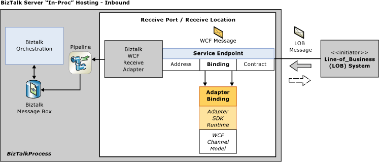

# Using BizTalk Server and the WCF LOB Adapter SDK
This section contains information about the relationship of [!INCLUDE[btsBizTalkServerNoVersion](../../includes/btsbiztalkservernoversion-md.md)] and [!INCLUDE[afproductnameshort](../../includes/afproductnameshort-md.md)]. Information contained in this section includes comparisons of the two different frameworks provided by each and tips for migrating the [!INCLUDE[btsBizTalkServerNoVersion](../../includes/btsbiztalkservernoversion-md.md)] custom adapter.  

## Relationship with the SDK and BizTalk Server
 [!INCLUDE[afproductnameshort](../../includes/afproductnameshort-md.md)] provides an SDK and set of tools and components that enable developers to write sophisticated adapters for line-of-business systems containing a dynamic set of operations and data. Adapters are exposed as WCF custom bindings and as such can be consumed by applications that can consume WCF bindings.  

 [!INCLUDE[btsBizTalkServerNoVersion](../../includes/btsbiztalkservernoversion-md.md)] is a product that enables message flow and coordination between a diverse set of enterprise systems; communication between [!INCLUDE[btsBizTalkServerNoVersion](../../includes/btsbiztalkservernoversion-md.md)] and external systems are handled through adapters that take external messages and transform them into a format suitable for processing by [!INCLUDE[btsBizTalkServerNoVersion](../../includes/btsbiztalkservernoversion-md.md)].  

 These two technologies intersect in the [!INCLUDE[btsBizTalkServerNoVersion](../../includes/btsbiztalkservernoversion-md.md)] WCF adapter. It can consume bindings exposed by WCF and therefore consume the operations and data exposed by the adapter written with the [!INCLUDE[afproductnameshort](../../includes/afproductnameshort-md.md)].  

 The following figures provides a high-level overview of how the BizTalk WCF adapter and WCF LOB adapters are used within [!INCLUDE[btsBizTalkServerNoVersion](../../includes/btsbiztalkservernoversion-md.md)] to communicate with target LOB systems.  

   

   

## Differences between the SDK and the BizTalk Server Adapter Framework

While both the [!INCLUDE[afproductnameshort](../../includes/afproductnameshort-md.md)] and [!INCLUDE[btsBizTalkServerNoVersion](../../includes/btsbiztalkservernoversion-md.md)] Adapter Framework provide an SDK for writing custom adapters, there are significant differences in the amount of support provided in terms of API's and tools and also in the reusability of the adapter once it is completed.  

 Some of the primary differences between the two frameworks are summarized in the following table.  

|     Feature      |                                                                   [!INCLUDE[afproductnameshort](../../includes/afproductnameshort-md.md)]                                                                   |                  [!INCLUDE[btsBizTalkServerNoVersion](../../includes/btsbiztalkservernoversion-md.md)] Adapter Framework                   |
|------------------|-------------------------------------------------------------------------------------------------------------------------------------------------------------------------------------------------------------|--------------------------------------------------------------------------------------------------------------------------------------------|
|       API        | [!INCLUDE[dotnet45](../../includes/dotnet45-md.md)] and [!INCLUDE[dotnet451](../../includes/dotnet451-md.md)] assembly, provides help classes for metadata processing, connection management, and messaging |                                            COM, provides basic support for adapter operations.                                             |
| Adapter exposure |                                                            Exposed as WCF binding; available to any application that can consume a WCF binding.                                                             | Exposed only to [!INCLUDE[btsBizTalkServerNoVersion](../../includes/btsbiztalkservernoversion-md.md)]; not reusable by other applications. |
|      Tools       |                       [!INCLUDE[afdevwizardnameshort](../../includes/afdevwizardnameshort-md.md)], metadata browser for [!INCLUDE[btsVStudioNet](../../includes/btsvstudionet-md.md)]                       |                                                                    n/a                                                                     |
|  Extensibility   |                                                                                       Yes (as WCF channel extension)                                                                                        |                                                                     No                                                                     |

 Adapters created using the BizTalk Adapter Framework are consumable from only within BizTalk Server. On the other hand, adapters written to the [!INCLUDE[afproductnameshort](../../includes/afproductnameshort-md.md)] are surfaced as custom WCF bindings. This broadens their reach to any application that consumes a service, which for all practical purposes is any .NET application including [!INCLUDE[btsBizTalkServerNoVersion](../../includes/btsbiztalkservernoversion-md.md)]. The WCF-based adapters are used within [!INCLUDE[btsBizTalkServerNoVersion](../../includes/btsbiztalkservernoversion-md.md)] using the BizTalk WCF adapter and continue to exist in parallel with the native BizTalk adapters. 

