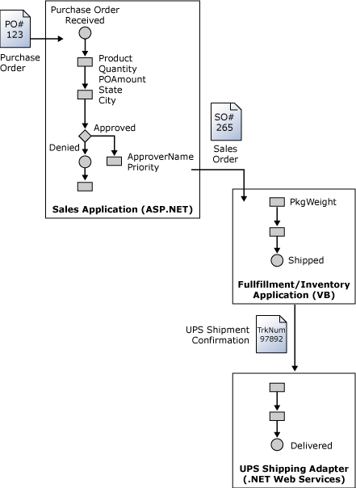

# Activity Continuation
The BAM activity (also called the business activity) can span multiple heterogeneous applications (for example, a pipeline, two orchestrations, a line-of-business application, and then another pipeline). The BAM infrastructure can correlate the events from multiple applications with a little help from the developer – a concept called "*Continuation*," which is shown in the following figure.  
  
   

## Applications  
 The first part of the activity happens in the Sales application, the second part of the activity happens in the Packaging & Assembly application, and finally, the delivery progress is available in the Shipping application. Each application uses different IDs for the current work unit: purchase order number (PO), sales order number (SO), and shipping order number (UPS). To correlate the events between two different applications, you must:  
  
- Identify the continuation token – a unique piece of data that is available to both applications (for example, the part of the message being exchanged).  
  
- Call EnableContinuation in the first application and pass the continuation token along with the current ActivityID.  
  
- Do not call BeginActivity in the second application.  
  
- Fire all subsequent events in the second application by using the continuation token instead of ActivityID.  
  
  The following code example illustrates the use of activity continuation among three applications:  
  
  **Purchase Order Application**  
  
```  
string oID="PO#123";  
string soID="SO#265";  
es.BeginActivity("PurchaseOrder",poID);  
es.UpdateActivity("PurchaseOrder",poID,  
    "POReceived",DateTime.UtcNow,  
    "POAmount",100,  
"CustomerCity","Seattle");  
es.EnableContinuation(  
   "PurchaseOrder",poId,soID);  
es.EndActivity("PurchaseOrder",poID);  
```  
  
 **Fulfillment Application**  
  
```  
string soID="SO#265";  
string upsID="UPS#97892";  
es.UpdateActivity("PurchaseOrder",soID,  
    "POApproved",DateTime.UtcNow,  
    "ProductName","ProductA");  
es.EnableContinuation(  
   "PurchaseOrder",soID,upsID);  
es.EndActivity("PurchaseOrder",soID);  
```  
  
 **Shipping Application**  
  
```  
string upsID="UPS#97892"  
es.UpdateActivity("PurchaseOrder", upsID,  
"POShipped",DateTime.UtcNow);  
es.EndActivity("PurchaseOrder",upsID)  
  
```  
  
 Follow these guidelines to use activity continuation in your code:  
  
-   Only use continuation when the end user must treat the work of different applications as part of the same activity. Use separate activities for each application and create an activity relationship if the end user views the work in each applications as meaningful activities.  
  
-   If the work units in the applications do not have a one-to-one relationship, you can use activity relationships but not continuation, for example, when multiple shipments exist for a sales order.  
  
-   If you send data to BAM synchronously (using DirectEventStream) and the ActivityID is propagated to all involved components, then you do not need to use continuation.  
  
-   If you send data to BAM asynchronously (using BufferedEventStream or from orchestrations), then you must use continuation even if the ActivityID is propagated to all components. In this case, you need to use a different ActivityID in each application by prefixing it with a unique string (for example, Application Name). This is necessary because the data from different applications may arrive to BAM in random order and BAM has to hide the out-of-order events to ensure correct query and aggregation results.  
  
-   Continuation does not require rewriting your applications to exchange more data.  
  
## See Also  
  
 [BAM Dynamic Infrastructure](../core/bam-dynamic-infrastructure.md)   
 [BAM API (BizTalk Server Sample)](../core/bam-api-biztalk-server-sample.md)   
 [BAM End-to-End (BizTalk Server Sample)](../core/bam-end-to-end-biztalk-server-sample.md)