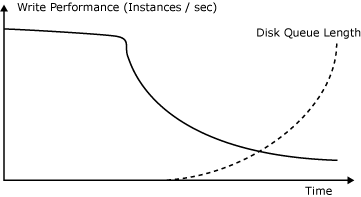
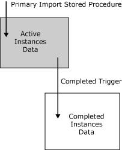
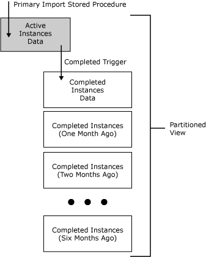

# Activity Data Storage
This topic describes activity data storage, the performance problems caused by the growth of activity tables over time, and how BAM solves these performance problems with separate tables for activities in progress and completed activities. This topic also describes the online window for querying data, and how you can use partitioning in BAM for higher performance.  
  
 The basic idea of activity data storage is to have a separate table for each activity type, in which each record represents a different activity instance (for example, in-progress or completed).  
  
 In this example, if the activity were Purchase Order the table would look as follows:  
  
|PO#|RecvTime|City|Quantity|ShipTime|DeliveryTime|  
|----------|--------------|----------|--------------|--------------|------------------|  
|123|8:00am|Seattle|150|8:24am|12:45pm|  
|124|8:30am|Seattle|234|8:45am|1:20pm|  
|125|8:35am|Redmond|87|9:05am|2:30pm|  
|126|8:45am|Seattle|450|9:20am|3:10pm|  
|127|8:55am|Redmond|200|9:30am|\<NULL\>|  
|128|8:57am|Seattle|340|9:20am|3:05pm|  
|129|9:12am|Seattle|120|9:45am|\<NULL\>|  
|130|9:30am|Redmond|25|10:15am|\<NULL\>|  
|131|9:45|Seattle|250|10:35am|\<NULL\>|  
|132|10:00am|Redmond|100|\<NULL\>|\<NULL\>|  
|133|10:15am|Seattle|230|\<NULL\>|\<NULL\>|  
|134|10:25am|Redmond|45|\<NULL\>|\<NULL\>|  
  
 In this table, when BAM receives a new purchase order, it inserts a new row and some sets some of the columns to non-null values (RecvTime, City, Quantity, and so on). Later, when you approve and ship this purchase order, BAM sets ShipTime to a non-null value. Finally, when you receive and confirm the shipment, BAM sets DeliveryTime to a non-null value.  
  
 The performance of this simplistic implementation quickly degrades over time. In the beginning, the performance is limited by the number of the transactions the SQL server can perform (essentially CPU bound), but after some time, it drops drastically. At the same time, the average queue length for disk IO increases beyond the acceptable limits:  
  
   
BAM Write Performance versus Disk Queue Length  
  
 The reason for this is that the size of the table grows as more instances of the business process complete. For example, the first time, the UPDATE statement of the stored procedure causes a search on the clustered index for purchase order number and reads some pages in memory. Since the instances of the purchase order process are independent (some take a long time, but some are short), the next call to the stored procedure may be for some other purchase order instance and therefore will require reading of different data pages in memory. As long as the total number of purchase order records is small, SQL Server will cache all data pages in memory. When the number of the records grows large enough, the cache-hit ratio decreases and each operation requires a physical disk read. Apparently, in this situation no query activity against the table is possible.  
  
## BAM tables  
 To avoid this problem BAM uses two separate tables – one for the activities still in progress, and another for the completed ones in the following figure:  
  
   
BAM Tables  
  
 In this figure, the idea is to keep a relatively small table that updates occur in and another that grows large, but is incrementally accessed (INSERTs only). In the example, only the orders being processed at the moment will be in the active table, while all orders that were already delivered will go to the completed table.  
  
 Because of the trigger, this structure of tables is slower than an INSERT/UPDATE of a single table at the beginning, but maintains stable write performance over time.  
  
## Online Window for activity data  
 Activity storage primarily handles queries for current or recently completed activities. BAM archives and then purges very old, completed activities from the BAM Primary Import database. Thus the activity data flows through BAM and is available for queries during a configurable Online Window.  
  
## BAM partitioning  
 To allow for higher performance and avoid downtime, activity storage uses partitioning based on the time stamp when the activity was completed. BAM achieves this by regular swapping of the completed table with another empty table of exactly the same format. Once BAM does this, the further completed activities go into the new table, while BAM keeps the old one only for queries, as in the following figure:  
  
   
BAM Partition Swapping  
  
 Once a partition is completely outside the online window, BAM archives and then drops it. To minimize this complexity from the user, BAM also maintains a partitioned view of the form:  
  
```  
SELECT * FROM Active   
UNION ALL   
SELECT * FROM Completed   
UNION ALL  
  
```  
  
 BAM automatically re-creates this view each time it creates or drops a partition.  
  
 Note the following about BAM partitioning:  
  
-   The name of the partitioned view is **bam_\<ActivityName\>_AllInstances**. This view is not meant for direct queries, but may be useful when troubleshooting the BAM instrumentation. You should query the data from the specific views for each category of business users that you create on top of this view. For more information, see [Querying Instance Data](../core/querying-instance-data.md).  
  
-   You set the online window by modifying the values for **OnlineWindowTimeUnit** and **OnlineWindowLength** in the record for the current activity in the table **bam_Metadata_Activities** in the Primary Import database.  
  
-   The DTS package, **BAM_DM_\<ActivityName\>**, performs the partitioning and archiving/purging. Each time this package runs, it truncates another partition and archives/drops all partitions that are outside the online window.  
  
-   If you do not have Archiving Database configured, then BAM drops the aged activity data without archiving.  
  
## See Also  
 [BAM Dynamic Infrastructure](../core/bam-dynamic-infrastructure.md)
