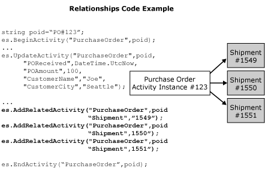

# Activity Relationships
An activity relationship exists when an activity relates to one or more other activities. An example of this is having multiple Shipment activities related to a single Purchase Order activity, or one Shipment activity containing items from two Purchase Order activities.  
  
 To indicate that two activities are related, you need to know both names and have the corresponding ActivityIDs in memory in order to call AddRelatedActivity. This API creates the link between the corresponding activity records.  
  
 In the following figure, the highlighted lines of code show how you make a relationship between Purchase Order activity instance #123, and Shipment activities #1549, 1550, and 1551.  
  
   
  
 The business end user looks at one Web page that shows the history of a purchase order. It may indicate that at 10 A.M. it arrives, two days later it receives approval, and the page provides a link to the actual documents. Because of the code in the previous figure, the page will also provide hyperlinks that take the business end user to the corresponding shipment Web pages.  
  
> [!NOTE]
>  All calls to `AddRelatedActivity` should happen between `BeginActivity` and `EndActivity`.  
  
## See Also  
  
 [Activity Continuation](../core/activity-continuation.md)   
 [BAM Dynamic Infrastructure](../core/bam-dynamic-infrastructure.md)   
 [BAM API (BizTalk Server Sample)](../core/bam-api-biztalk-server-sample.md)   
 [BAM API from an Orchestration Expression (BizTalk Server Sample)](../core/bam-api-from-an-orchestration-expression-biztalk-server-sample.md)