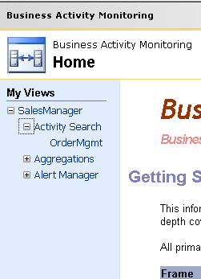
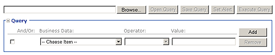
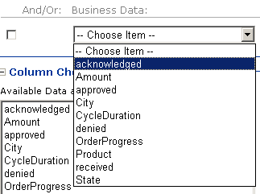
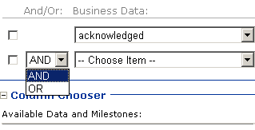
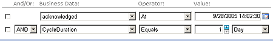

# Activity Searches in the BAM Portal
An activity search allows you to perform searches against BAM data to find activities that match the criteria you specify based on tracked values and items available in a BAM view, and to display these activities so that you can edit them or create alerts based on them.  
  
## Parts of the Query Builder  
 You build queries for your activity search by selecting items of business data against which you will create Boolean comparisons to extract data of interest. You start by selecting a BAM view from the **My Views** frame of the portal. From the selected view you select an activity on which to build the query.  
  
   
  
 When you have selected the activity, the content frame of the portal displays the Query builder, Column Chooser, and Results boxes. You can open an existing query or you can build a new one.  
  
   
  
 To build a new query you start by selecting a business data item from the **Business Data** drop-down list.  
  
   
  
 Next, you select your comparison operator in the Operator drop-down list. The comparison operator allows you to refine the results of the query.  
  
   
  
 The Value drop-down list is context-sensitive based on the type of data represented by the business data item. The user interface (UI) changes as the type of permitted data changes.  
  
 You can join clauses of the query with AND or OR operators to form more complex queries by clicking the **Add** button.  
  
   
  
> [!NOTE]
>  You cannot group clauses. A query is a simple string of individual clauses joined by AND/OR operators.  
  
 The following table describes the date and time fields.  
  
|Operator|Description|  
|--------------|-----------------|  
|**At**|Specifies an exact match. Equivalent to a Boolean Equals (=) operation. **Note:**  If you select the **At** operator and specify a date with no time part the portal uses midnight as the default value. If this is not your intent, use the **At or before** or the **At or after** operators to obtain the desired results.|  
|**On or before**|Specifies that only transactions on or before the specified date are matched. Equivalent to a Boolean less than or equals (≤) operation.|  
|**On or after**|Specifies that only transactions on or after the specified date are matched. Equivalent to a Boolean greater than or equals (≥) operation.|  
|**Before**|Specifies that only transactions before the specified date are matched. Equivalent to a Boolean less than (<) operation.|  
|**After**|Specifies that only transactions after the specified date are matched. Equivalent to a Boolean greater than (>) operation.|  
|**In the last**|Specifies that only transactions that occurred in the previous specified time period are matched. The time period can be specified in seconds, minutes, hours, or days.|  
|**Before the last**|Specifies that only transactions that occurred prior to the specified time period are matched. The time period can be specified in seconds, minutes, hours, or days.|  
|**Is empty**|Specifies that only transactions for which the business data item contains no data (the value of data field is NULL) are returned.|  
|**Is not empty**|Specifies that only transactions for which the business data item contains data (the value of data field is not NULL) are returned.|  
  
 The following table describes the numeric fields and the duration fields. Numeric fields contain data such as quantities or currency amounts. Duration fields specify a time period.  
  
|Operator|Description|  
|--------------|-----------------|  
|**Equals**|Specifies an exact match. Equivalent to a Boolean Equals (=) operation.|  
|**Greater than**|Specifies an exact match. Equivalent to a Boolean Greater Than (>) operation.|  
|**Greater than or equal**|Specifies an exact match. Equivalent to a Boolean Greater Than or Equals (≥) operation.|  
|**Less than**|Specifies an exact match. Equivalent to a Boolean Less Than (<) operation.|  
|**Less than or equal**|Specifies an exact match. Equivalent to a Less Than or Equals (≤) operation.|  
|**Not Equal**|Specifies an exact match. Equivalent to a Not Equals (≠) operation.|  
|**Is empty**|Specifies that only transactions for which the business data item contains no data (the value of data field is NULL) are returned.|  
|**Is not empty**|Specifies that only transactions for which the business data item contains data (the value of data field is not NULL) are returned.|  
  
 The following table describes the text fields.  
  
|Operator|Description|  
|--------------|-----------------|  
|**Is Exactly**|Specifies an exact match. Equivalent to a Boolean Equals (=) operation.|  
|**Contains**|Specifies that the text in the business data item contains the specified value. This allows you to do partial matches on the data.|  
|**Does not contain**|Specifies that the text in the business data item does not contain the specified value.|  
|**Is empty**|Specifies that only transactions for which the business data item contains no data (the value of data field is NULL) are returned.|  
|**Is not empty**|Specifies that only transactions for which the business data item contains data (the value of data field is not NULL) are returned.|  
  
## In This Section  
  
-   [How to Create a Query in Activity Search](../core/how-to-create-a-query-in-activity-search.md)  
  
-   [How to Set an Alert](../core/how-to-set-an-alert.md)  
  
-   [How to View the Results of an Activity Search](../core/how-to-view-the-results-of-an-activity-search.md)  
  
## See Also  
 [BAM Portal](../core/bam-portal.md)
