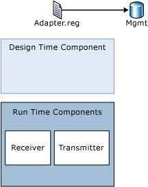

# Adapter Components
A custom adapter shares the standardized configuration, management, and setup mechanisms used by the native adapters. With the standardization to the Adapter Framework, a custom adapter is managed by using the [!INCLUDE[btsBizTalkServerNoVersion](../includes/btsbiztalkservernoversion-md.md)] Administration console.  
  
 The following figure shows the main components of a custom adapter: the adapter registry file, the adapter design-time component, and the adapter run-time component.  
  
   
  
## Adapter Registry File  
 Certain information about adapters must be registered in the registry and the BizTalk Management database. Information such as an adapter's alias, receive hander, receive location, and transport type is called metadata. These metadata entries are created during manual adapter registration using the [!INCLUDE[btsBizTalkServerNoVersion](../includes/btsbiztalkservernoversion-md.md)] Administration console. Alternatively, you can run the Adapter Registry Wizard (AdapterRegistryWizard.exe) SDK utility to generate a registry file for your custom adapter. Double-clicking this registry file or clicking **Import** on the **File** menu using the registry editor (regedit32.exe) writes the metadata into the registry.  
  
> [!NOTE]
>  Running this registry file does not add adapter information to the BizTalk Management database. You must do this manually by using the [!INCLUDE[btsBizTalkServerNoVersion](../includes/btsbiztalkservernoversion-md.md)] Administration console.  
  
## Design-Time Component  
 The user interface (UI) for a custom adapter is implemented by using the Adapter Framework. This is a productive approach to UI development because the UI is rendered from an XML schema provided as part of the adapter's assembly. A small amount of code is required to transform the contents of the schema into a UI to configure the adapter's properties.  
  
 For an orchestration needing to communicate with an application adapter such as the SQL adapter, the Add Adapter Metadata Wizard enables you to add adapter metadata, such as schemas, message types, and port types, to a BizTalk project. Use the Add Adapter Metadata Wizard with application adapters to pull corresponding schemas into the system. To invoke this wizard from within a BizTalk (non-adapter) project, right-click the project, point to **Add Generated Items**, click **Add Adapter Metadata** and then select from the list of registered adapters to import the adapter metadata.  
  
## Run-Time Component  
 Typically an adapter consists of two public run-time components: the component that implements the message receiver and the component that implements the message sender. These components may be deployed in the same assembly or in two different assemblies.  
  
#### Receive Adapter  
 A receive adapter is responsible for creating a new BizTalk message by attaching the network/data source stream to the message body. It also adds any metadata pertinent to the endpoint over which the data was received, and then submits that message to the Messaging Engine. The adapter deletes the data from the receive endpoint or sends the appropriate acknowledgment message to the client indicating that the data was accepted into [!INCLUDE[btsBizTalkServerNoVersion](../includes/btsbiztalkservernoversion-md.md)].  
  
#### Send Adapter  
 A send adapter is responsible for sending a BizTalk message to the specified endpoint using its specific transport protocol.  
  
## See Also  
 [What Is the Adapter Framework?](../core/what-is-the-adapter-framework.md)
