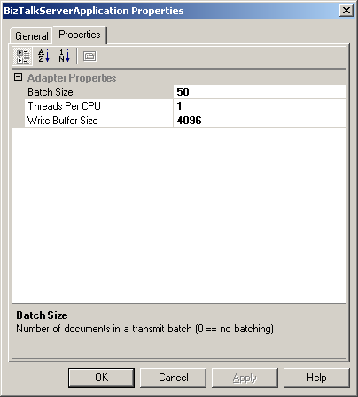
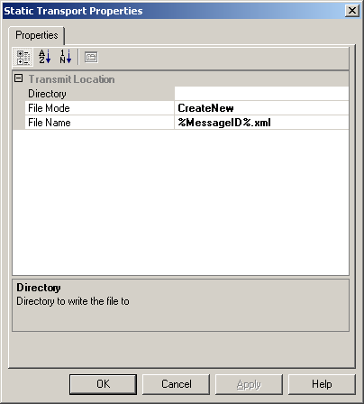

# Adapter Configuration Schemas
Different types of schemas are used in design-time configuration of an adapter. Depending upon the visibility and scope of property values, different schemas are modified and used.  
  
## Handler Schemas  
 Adapter configuration that comes from a handler applies to the adapter and all its consumers on a global scope. An administrator can statically alter handler configuration at design time by using the [!INCLUDE[btsBizTalkServerNoVersion](../includes/btsbiztalkservernoversion-md.md)] Administration console to expand the adapter's receive or send handler and bring up the properties of the specified host.  
  
 The sample file adapter included in the SDK has a set of XSD files used to configure its receive location, send port, receive handler, and send handler. Modify these XSD files so that your custom adapter receives the configuration properties it requires. The files included with the sample file adapter that you need to modify are the TransmitHandler.xsd and ReceiveHandler.xsd schema files. These files configure the send handler and receive handler, respectively, by controlling the property pages used to configure the handlers in the [!INCLUDE[btsBizTalkServerNoVersion](../includes/btsbiztalkservernoversion-md.md)] Administration console.  
  
 Using your adapter requirements, create a list of configuration properties required for each of the endpoints. If all of your configuration properties are global, you may only need to modify the send and receive port configurations. If the adapter properties need to be set for each send port or receive location, you have to modify the receive location and send port configuration files as well.  
  
 The Adapter Framework provides schema extensions and advanced configuration options to support common adapter configuration requirements. It also provides extensions that are not in the schema included with the sample file adapter. For more information about the Adapter Framework schema extensions, see [Adapter Framework Configuration Schema Extensions](../core/adapter-framework-configuration-schema-extensions.md). For more information about advanced configuration options such as custom drop-down editors and custom type converters, see [Advanced Configuration Components for Adapters](../core/advanced-configuration-components-for-adapters.md).  
  
 The code at the end of this topic is from the TransmitHandler.xsd file, and produces the following property page.  
  
   
Send handler property page created by the TransmitHandler.xsd file  
  
 Note the use of the \<baf:designer\>, \<baf:displayname\>, and \<baf:description\> tags in the TransmitHandler.xsd code that is shown below. These are custom decorations provided by the Adapter Framework to make the generation of these property pages faster.  
  
 For a list of all of the decorations available for use within the Adapter Framework, see [Adapter Framework Configuration Schema Decoration Tags](../core/adapter-framework-configuration-schema-decoration-tags.md).  
  
 Note that the schema has only one element and does not contain a URI element.  
  
> [!IMPORTANT]
>  Do not store sensitive customer data in the default adapter schema. For security reasons, configure user name and password information only after you deploy an adapter. This ensures that the information gets stored in the Enterprise Single Sign-On (SSO) database. For more information about the SSO database, see [Using SSO](../core/using-sso.md).  
  
```  
<?xml version="1.0" encoding="utf-16"?>  
<xs:schema xmlns:baf="BiztalkAdapterFramework.xsd"   
xmlns:b="http://schemas.microsoft.com/BizTalk/2003"   
xmlns="http://tempuri.org/XMLSchema1.xsd"   
elementFormDefault="qualified" targetNamespace="http://tempuri.org/XMLSchema1.xsd"   
id="TransmitHandler" xmlns:xs="http://www.w3.org/2001/XMLSchema">  
  <xs:element name="Config">  
    <xs:complexType>  
      <xs:sequence>  
        <xs:element default="50" name="sendBatchSize" type="xs:int" >  
      <xs:annotation>  
         <xs:appinfo>  
            <baf:designer>  
               <baf:displayname _locID="sendBatchSizeName">Batch Size</baf:displayname>  
               <baf:description _locID="sendBatchSizeDesc">Enter the   
maximum number of files to be transmitted per batch</baf:description>  
            </baf:designer>  
         </xs:appinfo>  
      </xs:annotation>  
   </xs:element>  
  
        <xs:element default="4096" name="bufferSize" type="xs:int" >  
      <xs:annotation>  
         <xs:appinfo>  
            <baf:designer>  
               <baf:displayname _locID="bufferSizeName">Write Buffer Size</baf:displayname>  
               <baf:description _locID="bufferSizeDesc">Enter the size of   
the buffer used to write the file</baf:description>  
            </baf:designer>  
         </xs:appinfo>  
      </xs:annotation>  
   </xs:element>  
  
        <xs:element default="1" name="threadsPerCPU" type="xs:int" >  
      <xs:annotation>  
         <xs:appinfo>  
            <baf:designer>  
               <baf:displayname _locID="threadsPerCPUName">Threads Per CPU</baf:displayname>  
               <baf:description _locID="threadsPerCPUDesc">Enter the   
number of threads per CPU to execute in the thread pool</baf:description>  
            </baf:designer>  
         </xs:appinfo>  
      </xs:annotation>  
   </xs:element>  
  
      </xs:sequence>  
    </xs:complexType>  
  </xs:element>  
</xs:schema>  
```  
  
## Send Port and Receive Location Schemas  
 To set port-specific properties for your adapter, modify the receive location and send port configuration schemas. The TransmitLocation.xsd and ReceiveLocation.xsd schema files configure the send port and receive location, respectively.  
  
 The Adapter Framework provides schema extensions and advanced configuration options to support common adapter configuration requirements. For more information about the Adapter Framework schema extensions, see [Adapter Framework Configuration Schema Extensions](../core/adapter-framework-configuration-schema-extensions.md). For more information about advanced configuration options such as custom drop-down editors and custom type converters, see [Advanced Configuration Components for Adapters](../core/advanced-configuration-components-for-adapters.md).  
  
 The code that follows is from the TransmitLocation.xsd file, and produces the following property page.  
  
   
Illustrates the send port property page for the sample file adapter  
  
 Note in the TransmitLocation.xsd file below that the send port configuration contains the \<baf:designer\>, \<baf:displayname\>, and \<baf:description\> tags, just like the send handler, and it also uses the \<baf:category\> tag. The category tag enables you to group properties together. If you have more than one category, the category is expandable and collapsible and appears in gray as a header above the properties in that category. For more information, see [Adapter Framework Configuration Schema Extensions](../core/adapter-framework-configuration-schema-extensions.md).  
  
 This schema also contains a URI field. This is populated on the page that appears after you enter all of the field information on the send port property page during the validation processing by the adapter.  
  
```  
<?xml version="1.0" encoding="utf-16"?>  
<xs:schema xmlns:baf="BiztalkAdapterFramework.xsd" xmlns:b="http://schemas.microsoft.com/BizTalk/2003" xmlns="http://tempuri.org/XMLSchema1.xsd" elementFormDefault="qualified" targetNamespace="http://tempuri.org/XMLSchema1.xsd" id="TransmitLocation" xmlns:xs="http://www.w3.org/2001/XMLSchema">  
  <xs:element name="Config">  
    <xs:complexType>  
      <xs:sequence>  
        <xs:element name="directory" type="xs:string">  
      <xs:annotation>  
         <xs:appinfo>  
            <baf:designer xmlns:baf="BiztalkAdapterFramework.xsd">  
               <baf:displayname _locID="sendDirectoryName">Directory</baf:displayname>  
               <baf:description _locID="sendDirectoryDesc">Directory to write the file to</baf:description>  
                         <baf:category _locID="transmitLocationCategory">Transmit Location</baf:category>  
                    </baf:designer>  
         </xs:appinfo>  
      </xs:annotation>  
        </xs:element>  
  
        <xs:element default="%MessageID%.xml" name="fileName" type="xs:string">  
          <xs:annotation>  
            <xs:appinfo>  
              <baf:designer xmlns:baf="BiztalkAdapterFramework.xsd">  
                <baf:displayname _locID="fileNameName">File Name</baf:displayname>  
      <baf:description _locID="fileNameDesc">The name of the file that will be written</baf:description>  
                <baf:category _locID="transmitLocationCategory">Transmit Location</baf:category>  
              </baf:designer>  
            </xs:appinfo>  
          </xs:annotation>  
        </xs:element>  
  
        <xs:element default="2" name="fileCopyMode" type="CopyMode">  
          <xs:annotation>  
            <xs:appinfo>  
              <baf:designer xmlns:baf="BiztalkAdapterFramework.xsd">  
                <baf:displayname _locID="fileCopyModeName">File Mode</baf:displayname>  
                <baf:category _locID="transmitLocationCategory">Transmit Location</baf:category>  
              </baf:designer>  
            </xs:appinfo>  
          </xs:annotation>  
        </xs:element>  
  
        <xs:element name="uri" type="xs:string">  
          <xs:annotation>  
            <xs:appinfo>  
              <baf:designer xmlns:baf="BiztalkAdapterFramework.xsd">  
                <baf:browsable show="false" />  
              </baf:designer>  
            </xs:appinfo>  
          </xs:annotation>  
        </xs:element>  
  
   <!-- An example of how an SSO affiliate application would be configured for this endpoint: -->  
   <!--  
   <xs:element name="ssoAffiliateApplication" type="baf:SSOList">  
      <xs:annotation>  
         <xs:appinfo>  
            <baf:designer>  
               <baf:displayname _locID="ssoAffiliateApplicationName">SSO Affiliate</baf:displayname>  
               <baf:description _locID="ssoAffiliateApplicationDesc">The Single Sign On (SSO) Affiliate Application</baf:description>  
               <baf:category _locID="ftpCategory">FTP</baf:category>  
            </baf:designer>  
         </xs:appinfo>  
      </xs:annotation>  
   </xs:element>  
   -->  
  
      </xs:sequence>  
    </xs:complexType>  
  </xs:element>  
  
  <xs:simpleType name="CopyMode">  
    <xs:restriction base="xs:int">  
      <xs:enumeration value="0">  
        <xs:annotation>  
          <xs:appinfo>  
            <baf:designer xmlns:baf="BiztalkAdapterFramework.xsd">  
              <baf:displayname _locID="appendName">Append</baf:displayname>  
            </baf:designer>  
          </xs:appinfo>  
        </xs:annotation>  
      </xs:enumeration>  
      <xs:enumeration value="1">  
        <xs:annotation>  
          <xs:appinfo>  
            <baf:designer xmlns:baf="BiztalkAdapterFramework.xsd">  
              <baf:displayname _locID="createName">Create</baf:displayname>  
            </baf:designer>  
          </xs:appinfo>  
        </xs:annotation>  
      </xs:enumeration>  
      <xs:enumeration value="2">  
        <xs:annotation>  
          <xs:appinfo>  
            <baf:designer xmlns:baf="BiztalkAdapterFramework.xsd">  
              <baf:displayname _locID="createNewName">CreateNew</baf:displayname>  
            </baf:designer>  
          </xs:appinfo>  
        </xs:annotation>  
      </xs:enumeration>  
    </xs:restriction>  
  </xs:simpleType>  
</xs:schema>  
```