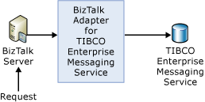
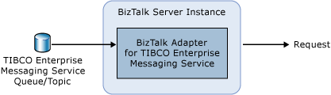

# TIBCO EMS Adapter Features
Microsoft BizTalk Adapter for TIBCO Enterprise Message Service (EMS) enables you to publish and subscribe to queues and topics managed by TIBCO EMS, using BizTalk Server and the TIBCO SDK. The adapter integrates TIBCO EMS messages in a fast, easy, and reliable way. It exchanges XML data formats between TIBCO EMS servers and Microsoft [!INCLUDE[btsBizTalkServerNoVersion](../includes/btsbiztalkservernoversion-md.md)] to provide a tightly integrated and reliable application infrastructure. It provides transmit and receive adapter integration operations providing end-to-end business-process management using XML schemas.  
  
## Data Validation  
 BizTalk Adapter for TIBCO EMS runs in-process with the BizTalk Server host as a native, tightly integrated adapter and validates port configuration at the time of configuration. It validates the data as much as possible--for example, valid name, valid number, valid in range. It does not try to make a connection. Therefore, the host, port destination, user, and password are not validated until there is a run-time call, in which case an error is logged.  
  
## Message Delivery  
 BizTalk Adapter for TIBCO EMS guarantees one-time-only delivery of messages. Messages that do not reach EMS are marked as retryable when suspended. There can be some exceptions to this, for example, when an invalid port configuration exists at the time of execution.  
  
 The adapter accepts text EMS message types.  The adapter supports transactions for messages going to EMS, and the transaction support is controlled by [!INCLUDE[btsBizTalkServerNoVersion](../includes/btsbiztalkservernoversion-md.md)].  
  
> [!NOTE]
>  The connection between BizTalk Adapter for TIBCO EMS and the EMS server is not secure. It is not supported by the provided TIBCO EMS SDK.  
  
 The adapter supports all standard JMS properties and EMS extensions. These properties are put in the BizTalk message context to be available to an orchestration.  
  
## General Adapter Features  
 BizTalk Adapter for TIBCO EMS provides a means to exchange real-time business data between TIBCO EMS systems and BizTalk Server. The adapter allows for interaction between an XML application and TIBCO EMS. It enables XML applications for inbound and outbound processing with TIBCO EMS.  
  
 The adapter accepts XML messages to enable BizTalk Server applications to communicate with TIBCO EMS using one of the following:  
  
-   Transmit Adapter, which uses a Static One-Way Send port to send a message to TIBCO EMS.  
  
-   Receive Adapter, which uses a Static One-Way Receive port to receive messages from TIBCO EMS.  
  
### Transmit Adapter Architecture: Send – Static One-Way  
 In the one-way send scenario, the send port is configured to send messages to a queue/topic. BizTalk Adapter for TIBCO Enterprise Message Service forwards the request to the TIBCO EMS server on the specified queue/topic. The adapter sends the message to the TIBCO EMS system using TIBCO EMS communication protocol. The TIBCO EMS system receives the requests and executes the business logic. To make calls into TIBCO EMS, you must provide the adapter with the configuration information to access the TIBCO EMS server.  
  
 The following image shows the adapter's one-way send operation.  
  
   
  
### Receive Adapter Architecture: Receive – Static One-Way  
 In the one-way receive scenario, the receive location is configured to receive messages on an EMS queue/topic. BizTalk Adapter for TIBCO EMS listens for messages on a specified queue/topic and submits the received messages to BizTalk Server.  
  
 The following image shows the adapter's one-way receive operation.  
  
   
  
## See Also  
 [Developing Applications](../core/developing-applications5.md)   
 [Getting Started](../core/getting-started-with-biztalk-adapter-for-tibco-enterprise-message-service.md)
