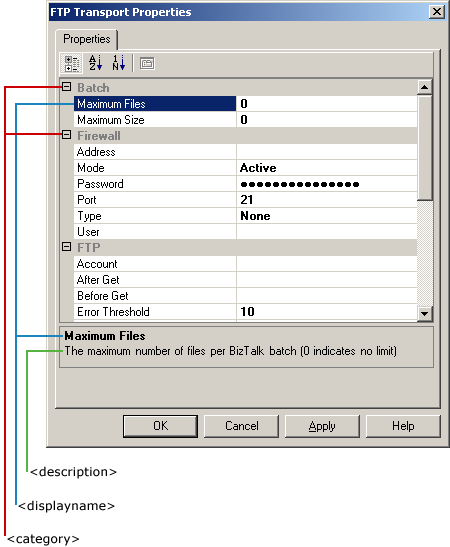

# Adapter Framework Configuration Schema Decoration Tags
You can use the tags described in this topic within the configuration schema files to display and organize data on the adapter property pages.  
  
 The following figure shows how the FTP receive location property page implements some of these tags.  
  
   
The \<description>, \<displayname>, and \<category> tags in the FTP adapter property page  
  
## \<designer>  
 The BizTalk Adapter Framework decorations appear between a \<baf:designer> tag and \</baf:designer> end tag. The \<baf:designer> tag helps distinguish between Adapter Framework \<appinfo> and other adapter-supplied \<appinfo> information.  
  
## \<category>  
 The \<category> decoration contains the string used to separate entries in the property grid into groups. The decoration displays all entries with the same category string as subordinate entries of the category.  
  
 You can localize \<category> entries.  
  
## \<description>  
 The \<description> decoration contains the string used to provide descriptive text for entries at the bottom of the property grid.  
  
 You can localize \<description> entries.  
  
## \<displayname>  
 The \<displayname> decoration contains the string used for displaying the name of an entry. This enables you to use spaces, phrases, and so on, when they would not be allowed for an \<element> or \<attribute> name.  
  
 You can localize \<displayname> entries.  
  
## \<readonly>  
 The \<readonly fixed=""> decoration controls whether a field may be edited. A "fixed" attribute value of `true` (the default) makes a field read-only.  
  
 When implementing an external editor, implement an external **TypeConverter** class and override the **GetStandardValuesExclusive(ITypeDescriptorContext)** method instead. Returning `true` makes a field read-only but preserves access to the custom editor.  
  
## \<browsable>  
 The \<browsable show=""> decoration controls whether a field appears in the property grid. A "show" attribute value of `True` (the default) makes a field appear in the grid.  
  
## \<converter>  
 The \<converter assembly=""> decoration specifies the desired **TypeConverter** class name for the \<element> or \<attribute>. The optional "assembly" attribute value specifies the path to the assembly containing the desired **TypeConverter**. With no "assembly" value specified, the class name must include the global assembly cache's assembly name, key, culture, and version values.  
  
## \<editor>  
 The \<editor assembly=""> decoration specifies the desired **UITypeEditor** class name for the \<element> or \<attribute>. The optional "assembly" attribute value specifies the path to the assembly containing the desired **UITypeEditor**. With no "assembly" value specified, the class name must include the global assembly cache's assembly name, key, culture, and version values.  
  
## Null Values for Optional Enumerations  
 When using an optional enumeration, one of the values should be \<none> to denote a null value. This is not a built-in tag, but may be achieved by providing an enumeration value that is treated as none if the enumeration is derived from xsd:string. This is not possible for enumerations derived from xsd:int, because the integer must hold a value.  
  
## See Also  
 [Adapter Framework Configuration Schema Extensions](../core/adapter-framework-configuration-schema-extensions.md)