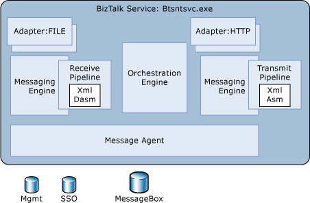
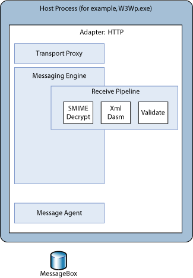

# Adapter Hosting Model
In general BizTalk adapters are hosted in the BizTalk service, Btsntsvc.exe. This means that [!INCLUDE[btsBizTalkServerNoVersion](../includes/btsbiztalkservernoversion-md.md)] manages the lifetime of the adapter. There are also situations, described below, where other processes manage the adapter.  
  
## In-Process Adapters  
 Adapters that are managed by [!INCLUDE[btsBizTalkServerNoVersion](../includes/btsbiztalkservernoversion-md.md)] are called in-process adapters. [!INCLUDE[btsBizTalkServerNoVersion](../includes/btsbiztalkservernoversion-md.md)] does the following for these adapters:  
  
- Instantiate the adapter when [!INCLUDE[btsBizTalkServerNoVersion](../includes/btsbiztalkservernoversion-md.md)] is started  
  
- Passes the adapter's transport proxy to the adapter during initialization  
  
- Services the adapter's requests  
  
- Terminates the adapter on shutdown of the [!INCLUDE[btsBizTalkServerNoVersion](../includes/btsbiztalkservernoversion-md.md)] service  
  
  [!INCLUDE[btsBizTalkServerNoVersion](../includes/btsbiztalkservernoversion-md.md)] delivers handler configuration and endpoint configuration information to the adapter at run time. Other aspects of configuration are specified, such as service windows that define specific time periods during which the adapter is enabled to actively handle requests.  
  
  The BizTalk service may be manually shut down by using the [!INCLUDE[btsBizTalkServerNoVersion](../includes/btsbiztalkservernoversion-md.md)] Administration console or by using the service control manager. If connectivity to the [!INCLUDE[btsBizTalkServerNoVersion](../includes/btsbiztalkservernoversion-md.md)] databases is lost the service automatically recycles itself.  
  
  In the typical hosting model, receive-side adapters and send-side adapters are hosted in the same process as the BizTalk service, along with the Messaging Engine and the Orchestration Engine. The hosting model is flexible enough to allow for separation of receive, send, and orchestration hosts and combinations of these. In the following figure, the host is executing all three in the same process.  
  
  Because of the rich hosting model, it is important when developing adapters to remember that the send and receive adapters may never be configured in the same host. They may even be configured to run on different computers.  
  
    
  The in-process adapter hosting model  
  
## Isolated Adapters  
 There are scenarios when hosting receive adapters in the BizTalk service is not possible. For example, the Internet Information Services (IIS) process model is such that IIS manages the lifetime of ASP.NET applications and ISAPI extensions. The BizTalk SOAP adapter must run within the same process space as IIS, thus making it impossible for [!INCLUDE[btsBizTalkServerNoVersion](../includes/btsbiztalkservernoversion-md.md)] to control the lifetime of any instances of the SOAP adapter.  
  
 For these types of adapters there is another hosting model referred to as isolated receive adapters, or simply isolated adapters. There is no concept of an isolated send adapter.  
  
 Because [!INCLUDE[btsBizTalkServerNoVersion](../includes/btsbiztalkservernoversion-md.md)] cannot create an isolated adapter, the adapter must acquire its own transport proxy and register itself with that transport proxy.  
  
 The following figure illustrates the [!INCLUDE[btsBizTalkServerNoVersion](../includes/btsbiztalkservernoversion-md.md)] hosting architecture. For the sake of performance, the isolated host architecture tries to eliminate any unnecessary interprocess communication. Because the isolated adapter and the BizTalk Messaging Engine stack are in the same process, there is no interprocess communication when the adapter is calling the Messaging Engine. In that scenario the only interprocess communication is between the Messaging Engine and the database, which is unavoidable.  
  
   
The isolated adapter hosting model  
  
## See Also  
 [What Is the Adapter Framework?](../core/what-is-the-adapter-framework.md)