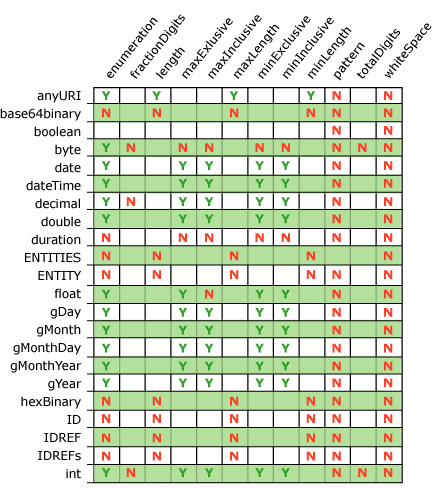
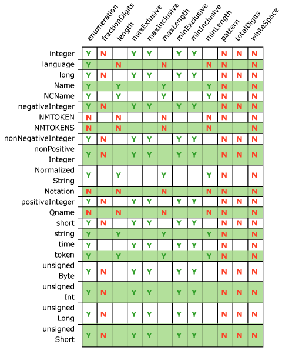

# Adapter XSD Data Type-Facet Constructs
The following tables list XSD data type-facet constructs supported by the Adapter Framework. The vertical axis contains the supported data types, and the horizontal axis contains the valid facets for each data type.  
  
> [!NOTE]
>  Data types that do not have common language runtime analogs are not validated during property type validation.  
  
> [!NOTE]
>  The fixed attribute with Enumeration facet is not supported.  
  
   
Supported XSD data type-facet constructs  
  
   
Supported XSD data type-facet constructs  
  
## See Also  
 [Adapter Design Issues](../core/adapter-design-issues.md)
